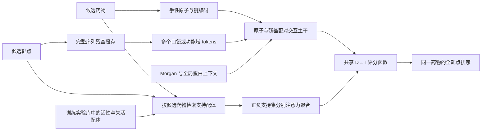

**BioMaster 架构与算法升级方案：以药物→靶点选择性为主任务**

日期：2026-09-05。根据本轮明确的开发重点，优先升级模型表示、交互主干和学习算法。本文保留设计阶段的决策依据；初版现已完成12次正式训练与测试，工程记录见[构建、训练与测试记录](BIOMASTER_V3_BUILD_TRAIN_TEST_20260905_ZH.md)。**实验支持保留配体支持信息，但没有支持当前局部主干替代全局路径；下面的方案属于实验前假设，最新方向以[完整结果与下一步分析](BIOMASTER_V3_RESULTS_AND_NEXT_DIRECTION_20260905_ZH.md)为准。**

**建议下一代主模型采用“正负配体支持集增强的局部交互网络”。开发分两步：V3A 先学习如何使用已有的活性/失活化学证据，V3B 再把原子—多口袋/功能域交互升为主干。两步共同优化同一个 D→T 分数。**

V3A 是当前投入胜率更有本项目证据支持的第一步；V3B 面向表示能力与远邻泛化，技术不确定性更大。先做这两步的可归因实验，优先级高于继续给旧分数叠融合权重或直接扩大参数量。

**当前模型能力的主要限制**

| 部位 | 实际实现 | 对能力的限制 | 升级动作 |
|---|---|---|---|
| 分子输入 | 当前全面重训主干使用 Morgan 2048；分子预训练辅助输入关闭 | 不能按候选靶点重新关注原子/基团；当前配置还有立体化学信息损失 | 保留 Morgan 化学先验，新增明确手性的原子/键 tokens |
| 蛋白输入 | ProtBERT 1024 + pooled ESM2 1280；残基输入关闭 | 药物进入交互前，具体位点信息已经压缩；缺少显式的药物条件位点匹配 | 完整序列残基缓存，多口袋/功能域表示 |
| 交互主干 | 192 维实体表示，低秩 FiLM + pair MLP，6 个共享表征上的线性专家 | 学习全局向量组合，缺少保留原子—残基配对状态的主路径 | 小规模 pair-state 交互主干，直接产生 D→T 表征 |
| 方向训练 | 主干 `drug_rank_weight=0`；随后默认冻结主干训练两个残差头 | D→T 监督主要修正已有分数，难以改变上游表征 | 新投影、交互、支持集注意力、评分层共同接受 D→T 梯度 |
| 已知化学知识 | 强信号之一是训练阳性配体的最大 Tanimoto，主要在下游排序使用 | 一个最大值不能表示多个活性系列、相似失活配体和证据冲突 | 正、负配体分别组成支持集，由候选药物条件化读取 |

上述输入和配置来自[全面重训摘要](../outputs/retrain_20260901/comprehensive_balanced_full_fit_v2/FULL_FIT_2026_COMPREHENSIVE_BALANCED__seed_20260816/FULL_FIT_RUN_SUMMARY_V2.json)，主干参数量为 3,517,940；冻结逻辑见[方向训练器](../scripts/train_biomaster_bidirectional_v6.py)。冻结预训练 ESM 与冻结整个 DTI 交互主干是两件事：首期可以继续缓存 ESM，但新模型的交互和投影需要训练。

这里不能把“全局池化”解释为完全没有位点信息，也不能仅凭 350 万参数断言欠拟合。较明确的问题是：当前网络没有直接保留和使用局部匹配状态，D→T 的主要训练阶段又限制了表征更新。

还有一项可直接修复的表达限制：[原子特征构建器](../scripts/build_biomaster_odti_local_graph_features_v1.py)只编码“是否手性”，没有区分 R/S；键类型没有 E/Z。此前的[输入探针](reports/project_audit_20260905/SCORE_AND_STRUCTURE_PROBES.json)也确认当前 Morgan 配置下的示例对映异构体指纹相同。对输入完全相同的异构体，后面的 MLP 再大也不能产生基于立体化学的区分。这是表示限制，不是对某个具体候选预测错误的归因。

**已有实验对升级选择的约束**

当前仓库已经有多种增强实验，不能把这些组件当成从未尝试过的新方向。

| 已尝试方向 | 本地结果 | 对本轮的含义 |
|---|---|---|
| 原子图 + 口袋图 + 双向 cross-attention 残差 | 正式两种子实验，S3 drug-macro AP 0.61243 → 0.59951；S5 增量约 +0.00003 | 单纯增加同类局部分支没有支持；新设计必须改变表示、主干位置或训练方式 |
| 解冻旧 interaction | 同 seed 密集时间测试：MRR 0.2262 → 0.1999，positive retrieval AP 0.1723 → 0.1443；Recall@20 0.3333 → 0.3583 | 已经出现指标权衡，不能把打开解冻开关当成确定突破 |
| query-balanced 训练屏幕 | 文档记录 S3 drug-macro AP 0.6790 → 0.6130 / 0.6048 | 不能原样重复“提高药物排序权重 + 查询采样” |
| 更换/叠加预训练表示 | MoLFormer 未晋级；ESMC 部分协议有增益，但组合没有普遍协同 | 预训练模型更大、模态更多，都应是独立变量 |

证据：[局部图配对结果](../outputs/biomaster_odti_local_graph_formal_v1/formal_audit_v1/LOCAL_GRAPH_PAIRED_METRICS_V1.csv)、[interaction 结果](../outputs/biomaster_bidirectional_joint_interaction_screen_v1/seed_20260816/STAGE_A_SUMMARY_V6.json)、[对应 heads-only 结果](../outputs/biomaster_bidirectional_v6_stage_a_dense/seed_20260816/STAGE_A_SUMMARY_V6.json)、[已有差距审计](BIOMASTER_DTIAM_GAP_AND_OPTIMIZATION_AUDIT_20260827_ZH.md)、[预训练表示实验](BIOMASTER_PRETRAINED_REPRESENTATION_SCREEN_20260819_ZH.md)。这些表的基线和协议不同，不能把不同表的绝对数值拼成模型进步曲线。

局部图正式实验训练 15 epoch、前 4 epoch 冻结 base，并非只有一次短烟雾训练。S5 平均局部门控约 0.0104，是需要解释的现象；它既可能反映优化受抑制，也可能反映输入确实没有增量，不能直接当成失败原因。

**V3 的目标结构**

这个结构应学会两类互补判断：一是分子的局部化学是否适合该蛋白的某个区域；二是已有活性与失活配体对当前分子的判断提供了什么证据。支持集不存在时，仍由交互主干给分。

**V3A：先把正负配体证据变成可学习表征**

对候选药物 `d`、靶点 `t`，建立两个支持集：

- `S+(d,t)`：训练库中在该靶点有明确活性证据的相似配体。
- `S−(d,t)`：训练库中在该靶点有可比实测失活/弱活性证据的相似配体。

首版各取最多 16 个；不足时使用实际数量与缺失掩码，不重复填充成假样本。先以 Morgan 检索保证候选质量，后续单独比较 Morgan 与学习向量检索的并集。初版不需要同时训练一个全新的检索系统。

每个支持项保留分子表示、与 query 的表示差异、Tanimoto、证据类型以及有效掩码。用 `drug + target` 作为 query，分别对正、负集合做注意力聚合，得到 `m+` 和 `m−`。共享评分函数可以写为：

\[
s(d,t)=f_\theta(u_{dt})+a_{dt}\,\sigma(r_\theta(u_{dt},q_S))\,
h_\theta(u_{dt},m^+,m^-,m^+-m^-),
\]

其中 `u_dt` 是可训练的 drug–target 交互表征，`a_dt` 表示是否有有效支持，`q_S` 表示支持相似度、有效性与多样性等信息。两类集合都空时令 `a_dt=0`；只缺一类时保留对应缺失状态。初期不使用接近零的支持门控初始化，避免新模块在开始训练时几乎没有梯度。

同一预测任务内的靶点共用这个评分函数，按同药不同靶点的监督共同训练。不能先为各靶点独立训练分类器，再直接比较未经约束的不同 logit 尺度。统一分数指同一任务内的跨靶点可比排序；生化结合与功能抑制可共享表征，但使用相应任务头，首轮不假设不同 endpoint 分数天然同尺度。支持集数量应通过抽样随机化和掩码处理；不把靶点 ID 或原始关系度数作为分数捷径。

这相对现有最大 Tanimoto 的实质增量是：允许多个活性化学系列参与判断，显式读取相似失活配体，并学习什么时候近邻证据与蛋白表征冲突。梯度更新支持注意力、分子投影和交互层；离散 Top-K 检索本身首期不声称可微。可以缓存固定输入特征和检索索引，但 query 与支持项的可训练分子投影应共享参数并在训练中重新计算，避免使用过期的投影缓存。

为何优先做它：在此前复核的相同 75 个 S5 query 上，旧神经原分数 drug-macro AP 为 0.7010，阳性配体最大 Tanimoto 为 0.7220，既有独立线性组合为 0.7521，见[复核结果](reports/project_audit_20260905/SCORE_AND_STRUCTURE_PROBES.json)。这支持“化学近邻包含值得学习的强信号”，没有证明加入负支持集或注意力后必然提升。

支持集丰富分子表示已有 [MHNfs 原论文](https://arxiv.org/abs/2305.09481)作为方法先例；本方案增加靶点条件、正负分路及统一 D→T 排序，属于本项目需要验证的设计，不能直接移用该论文的 benchmark 成绩。

**V3A 的关键算法是 episodic 支持集训练**

每个 episode 模拟“查询一个没有直接答案可查的药物”：

1. 选取 query 药物，为每个 query 独立排除该药物的全部关系及同一化学实体的重复记录，再检索支持项。训练时可以额外遮蔽其他 query 的支持记录，但将其定义为支持集 dropout；评估与推理使用固定支持快照和逐 query 排除，结果不依赖 batch 中还有哪些药物。
2. 使用 query 的实测关系计算监督；支持项的标签仅来自该训练折允许使用的记录。
3. 随机使用无支持、少量支持、较充足支持的条件，训练模型在不同证据密度下工作。
4. 部分 episode 进一步排除同骨架近邻，减少对极近邻复制的依赖。
5. 无支持 episode 中持续训练交互主干；冷靶点有标签支持时应另称 few-shot 条件，不混成 zero-shot。

这里的排除规则是支持集算法正确工作的必要组成，不需要把整套项目治理作为模型开发前置任务。支持库先限制在本轮固定训练折内即可开展对照实验。

第一步复用现有 Morgan、pooled 蛋白缓存和全局交互拓扑，开放投影、交互层和新评分模块训练；旧方向残差头不再是 D→T 梯度的唯一入口。这样可以先验证支持集学习的增量，再承担局部主干重构的不确定性。

**V3B：把局部相互作用升为主干**

当前局部分支已在 [odti_v2.py](../biomaster/odti_v2.py) 实现两个 96 维、2 层图编码器及一次双向 MHA，随后分别池化，生成门控残差。V3B 至少应有以下结构差异：

| 部件 | V3B 初始设计 | 原因 |
|---|---|---|
| 分子图 | 明确 R/S、未指定手性及 E/Z；3–4 层消息传递，宽 192 | 避免输入端丢失选择性相关信息，保留原子身份和邻域 |
| 蛋白 tokens | 复用完整序列的 ESM 残基缓存，投影到 192 | 先保留残基信息，再由 query 决定关注区域 |
| 位点集合 | 每靶点 2–4 个可用候选口袋/功能域；缺结构时使用序列窗口或学习的局部摘要 | 单个 top pocket 无法覆盖不同结合位点；结构缺失也需要可训练路径 |
| 局部交互 | 首版 2 个 block，4 heads，低秩配对通道如 32；跨层保留 atom×residue 状态 | 避免一次交互后立即平均而丢失局部对应关系 |
| 位点聚合 | 由药物条件化，使用归一化质量权重聚合各位点 | 避免候选口袋越多分数天然越高 |
| 输出位置 | 局部主干直接构成 `u_dt`；全局向量提供上下文和缺失回退 | 使 D→T 学习真正作用于局部表征 |

参数是首轮工程起点，不是已调优结论。每个局部区域的计算预算可从 64–128 个残基开始，但需要围绕候选区域做选择或分块，不能简单截掉长蛋白后半段。现有局部构建器只取 top pocket、对超限口袋隔离、映射固定链 A；这些读取逻辑需要随表示升级一起调整。完整序列缓存脚本已经存在，仍需核实并补齐本轮靶点面板的覆盖。

一种可实施的配对更新是：先从原子 `a_i`、残基 `r_j` 和全局上下文建立低维状态 `z_ij`，每层使用原子、残基的内部邻接上下文更新 `z_ij`，再从配对状态回写两侧 tokens；评分由配对证据聚合产生。采用低秩通道、局部窗口及分块控制 `原子数×残基数` 的成本，首期没有必要引入完整的大型复合物生成网络。

没有可信配体 pose 时，只使用分子内部键与口袋内部相对几何。学习的 atom–residue 权重称为相互作用表征；真实接触预测需要额外的复合物接触监督。[DrugBAN](https://www.nature.com/articles/s42256-022-00605-1)提供局部双线性交互的先例；[MONN](https://www.sciencedirect.com/science/article/pii/S2405471220300818)将非共价接触监督与亲和力学习结合。它们支持模块设计的合理性，不直接证明本项目的 D→T 改进。

局部模块应先接受独立的 observed-pair 训练或探针评估，再接入联合排序。若局部独立分支在同等输入覆盖下都没有有效信号，就需要处理表示或预训练问题，不能把调大门控当成解决方案。独立分子图预训练、可对齐的预训练 atom tokens、复合物接触教师可以作为后续选项；pooled 分子向量不能直接冒充 atom tokens。

**训练目标：D→T 主导，排序公式保持克制**

主要学习对象是同一个药物下的选择性差值：

\[
s(d,t^+)-s(d,t^-),
\]

其中正、负靶点有可比较的实测证据。药物间等权，药物内部按真实阳性和阴性集合归一化；优先使用同家族、可比实验条件下的实测对比。未知组合不直接作为明确失活标签。

**现有 pairwise 已经约束多个阳性，不能把“逐阳性学习”包装成旧模型缺失的能力。** 数值核验 `logits=[10,-5,0]`、标签 `[1,1,0]` 时，旧 listwise 的弱阳性梯度约为 `−1.39e−11`，但旧 pairwise 对它的梯度约为 `−0.49665`；旧总 loss 并没有完全忽略弱阳性。

因此首轮可以保留现有逐正负 pair 的 softplus 排序，主要改变它作用的网络层级、query 组织和支持集学习。一个后续候选是按每个阳性聚合困难负例：

\[
L_{\mathrm{hard}}
=\frac{1}{|D|}\sum_d\frac{1}{|P_d|}\sum_{p\in P_d}
\log\left[1+\sum_{n\in N_d}
\exp\left(\frac{s(d,n)-s(d,p)+m}{\tau}\right)\right].
\]

它与现有平均 pairwise 的差异是多负例下的困难负例聚合；只有一个负例且 `m=0, τ=1` 时，两者完全相同。负例数和噪声会影响梯度，必须固定/控制采样数量后比较，不能宣称这个公式直接优化完整候选面板的 Recall@K。

实测负例可混合均匀抽样、同家族抽样和当前高分负例。首轮不全部选最难负例，以免错误或条件不匹配的实测标签占据梯度。真实密集测量面板上可后续比较 [LambdaLoss](https://research.google/pubs/the-lambdaloss-framework-for-ranking-metric-optimization/) 的 NDCG 权重；二行 query 无法通过复杂 Top-K 公式获得更多排序信息。

总目标先控制为：

\[
L=L_{\mathrm{D2T}}+\lambda_{\mathrm{obs}}L_{\mathrm{observed}}
+\lambda_{\mathrm{endpoint}}L_{\mathrm{endpoint}}.
\]

`observed` 使用完整实测关系覆盖，帮助只有一条记录的药物参与学习；定量 endpoint 只在可比条件下使用对应的辅助头。起点可设 `λobs=0.25`，定量辅助从 `0` 与 `0.05` 中先选一个固定配置进行小规模开发，不同时堆入 PU、InfoNCE、蒸馏和梯度修正。未知项首轮可以不承担监督。

**训练组织与计算范围**

| 阶段 | 学习内容 | 初始组织 |
|---|---|---|
| 短 warm-up | 新支持集、投影和交互模块；V3B 单独检查局部路径 | 用 observed pair 监督，支持查询必须排除自身 |
| 主训练 | 统一 D→T 分数与表征 | 一个优化周期混合关系覆盖批次与药物 query 批次，初始各占一半 |
| 可选适配 | 编码器顶部/adapter | 新交互已经有效后，再单独比较少量解冻 |

关系覆盖流采用无放回遍历，确保大部分单关系药物不会被查询采样长期遗漏。query 流只使用真实不同的关系；有两个靶点就训练两项，有实测较密面板才使用 16–32 项，不把两项重复扩成 16 项。每个药物的总权重归一化，避免稀疏 query 高频回放。

第一轮固定相同 query/关系批次序列与总更新数；局部版还报告实际 token 数和计算成本，避免把更多训练曝光误当成架构收益。旧模型蒸馏不是默认项，否则可能把新模型继续约束在旧模型的错误排序附近；训练内交叉拟合教师可在主模型成立后单独比较。

预训练蛋白缓存可以继续复用，V3A 无需在线反传完整 ESM；V3B 也先训练残基投影和交互模块。几百靶点规模下先对同一药物的整个指定面板分批打分，暂不增加 Top-K 粗筛，避免引入额外召回上限。具体 batch 大小须按 atom/token 长度实测峰值显存，再确定；当前没有跑吞吐 benchmark，本文不提供虚构的训练耗时或显存保证。

**最小实验矩阵与决策**

V3A 先固定现有全局输入与交互拓扑，进行四格对照。四格共享数据、批次、可训练主干范围和更新预算；A/B 的 query 批次只计算 observed 目标，C/D 加入 D→T 主排序。这里比较的是支持集和任务目标，不同时改变分子 PLM、局部主干或损失公式。

| 实验 | 支持集 | D→T 主排序 | 用途 |
|---|---|---|---|
| A | 无 | 无 | 可训练全局交互的受控基线 |
| B | 正负支持 | 无 | 支持集本身是否改善预测 |
| C | 无 | 有 | D→T 梯度贯穿投影/交互的独立效果 |
| D | 正负支持 | 有 | 两者是否有互补收益 |

再保留当前选定模型、原始阳性 Tanimoto 和相应的现有组合为固定锚点。新增一个使用完全相同支持候选的简单正负近邻基线，例如用正/负最大相似度与集合统计量训练小型共享评分器，检验注意力模块是否超过“增加了负近邻输入”本身。先在固定开发划分完成筛选，对保留候选使用相同多种子配置确认；过去反复开发过的 S5 只作历史回归参考，不能再作为全新独立证据。

若 D 有效，追加“去负支持”“去蛋白输入”“空支持”“排除同骨架”四项小消融。它们分别回答：模型是否学到失活证据、是否仍在使用蛋白信息、冷靶点是否能工作，以及收益是否只来自极近邻。

V3B 再固定支持集与训练算法，比较：旧全局主干、局部独立模型、局部残差、局部主干。额外用错误/随机口袋和全局上下文遮蔽检查模型是否使用局部匹配；错口袋至少包括同家族/相近靶点的局部区域替换，避免模型仅凭家族差异通过测试。分别关闭支持和局部路径，检查两者各自的贡献；用原子/残基一致重排与结构平移旋转一致性检查表示的正确性。

V3A 受控开发首要指标固定为实测正负子集的 drug-macro AP；完整候选面板另报 positive retrieval AP、Recall@5/20 和 NDCG@20，不把前者与后者视为同一个 AP。按有支持/少支持/无支持、化学近邻/远邻拆开时保持同一候选范围。部分标注面板的召回只解释为已知阳性召回，不能等同于真实完整靶点召回。进入完整面板模型替换阶段前，再预先固定该阶段的主指标与其他指标可接受的退化幅度，防止事后挑选有利数字。

组件研究成立的条件是带来可复现增量：V3A 需要超过同协议的神经、近邻及简单正负支持锚点，并证明负支持有用；V3B 需要在局部信息可用或化学远邻场景证明增量。替换当前完整排序器的门槛更高：还应超过同协议、同候选面板下最强的冻结现有组合，并满足预设的 Recall@K 等条件，不能仅超过其中较弱的单个分支。若增益只出现在近邻层，应诚实定位为近邻迁移增强，而不宣称通用相互作用泛化已解决。

**代码落点与开发顺序**

以下为设计阶段确定的模块划分；对应初版实现已经落地，实际文件及训练状态见[实施记录](BIOMASTER_V3_BUILD_TRAIN_TEST_20260905_ZH.md)：

| 顺序 | 建议文件/组件 | 具体工作 |
|---|---|---|
| 1 | `biomaster/odti_support_v3.py` | 正负支持集编码、候选条件注意力、共享 D→T score、空支持行为 |
| 2 | `scripts/build_biomaster_support_store_v3.py` | 训练折支持库、实体排除、正负候选检索、稳定索引 |
| 3 | `scripts/train_biomaster_selectivity_v3.py` | episodic 训练、关系覆盖/query 双流、V3A 四格对照 |
| 4 | `biomaster/odti_local_v3.py` | 保留配对状态的局部主干、多位点聚合，与 V3A 共用评分接口 |
| 5 | 局部特征构建 V3 | 手性与键立体信息、完整残基映射、多位点与长区域处理 |
| 6 | 独立评分入口 | 输出原始 V3 D→T score，用同一函数评估及候选排序 |

模型正确性测试应覆盖：query 无法检索自身标签；空支持无 NaN；padding 不影响分数；支持集排列不改变结果；query 分批与候选顺序不改变逐对分数；端到端梯度到达新交互模块；手性区分；几何不变性。性能验证使用上述受控训练，单元测试通过不代表模型更强。

当前最高优先级投入是第 1–3 项，随后推进第 4–5 项。大 PLM 全量微调、全量对接/复合物生成、更多 MoE 专家和复杂融合均属于后续独立选项；在支持集与局部主干的增量明确之前，不同时引入。
