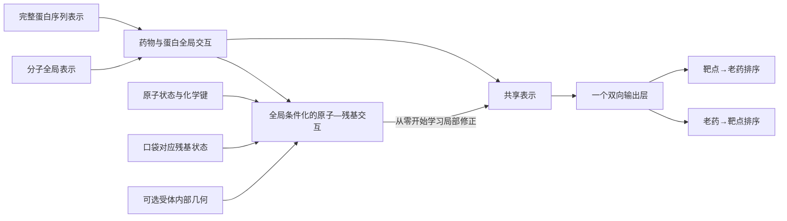

# 最佳模型交付：持续执行协议

**本轮训练、选型、回归与独立模型包已完成。** 最终交付和当前架构统一见[选定模型报告](BIOMASTER_SELECTED_MODEL_20260906_ZH.md)，下文保留执行期间的协议及阶段记录，不再用其中“正在运行”描述当前状态。最终配置为DrugCLIP＋Morgan＋ESM2共享全局网络、EMA训练；24次局部消融未支持保留局部模块。三种子时间重训和全量部署拟合严格区分，验证与完成审计记录均由最终报告链接。

目标：交付一个结构清晰、可独立推理、具有可重复比较依据的最佳老药双向排序模型。当前状态：执行中，尚未完成交付。

**全局选择已冻结，局部消融正在运行。** 54次全局开发训练覆盖9种候选、2个时间窗口和3个种子，选中DrugCLIP＋Morgan＋EMA，1,235,604个可训练参数。综合分0.437493，双向AP均值0.421109／0.286688，双向R@20均值0.667383／0.597708。原G对应为0.400161、0.356583／0.273265；等容量基线综合分0.406337。新全局方案在两个窗口的综合分分别0.438722／0.436263。选择未读取新的时间测试或KIRHub成绩，尚未决定是否保留局部模块。

| 全局输入与训练 | 两窗口三种子综合分 | 药物→靶点 AP | 靶点→药物 AP |
|---|---:|---:|---:|
| 原G | 0.400161 | 0.356583 | 0.273265 |
| 扩容量G | 0.406337 | 0.349570 | 0.277212 |
| G＋EMA | 0.410301 | 0.357903 | 0.293245 |
| 再加实测查询排序 | 0.412343 | 0.351740 | 0.313578 |
| 再加同实验排序 | 0.410299 | 0.349464 | 0.300409 |
| BerMol＋EMA | 0.369044 | 0.350421 | 0.240586 |
| BerMol＋Morgan＋EMA | 0.409230 | 0.390833 | 0.263045 |
| Morgan＋EMA | 0.370385 | 0.352600 | 0.255112 |
| **DrugCLIP＋Morgan＋EMA** | **0.437493** | **0.421109** | **0.286688** |

表中按预设双向AP和R@20综合分选型，不能说新全局方案在每一个指标上都最好：实测查询排序的逆向AP更高。同实验排序没有继续提高平均综合分，BerMol本身也未优于当前DrugCLIP表示。为分清指纹与预训练的作用，在第一组分子表示结果出现后补充了Morgan单独和DrugCLIP＋Morgan两组对照；这是披露的开发阶段扩展，不伪称整个54次比较从最开始就一次预注册。

同轮次诊断进一步支持输入表示增益：统一取第6轮时，DrugCLIP＋Morgan＋EMA综合分0.426401，原G为0.379635，G＋EMA为0.392765。各候选在同种子、同窗口的BCE与已有关系检索样本暴露一致。该诊断在全局选择之后进行，不重新选择模型或轮次。证据：[完整全局结果](../outputs/biomaster_best_model_20260906/ALL_GLOBAL_RUNS.csv)、[冻结选择](../outputs/biomaster_best_model_20260906/GLOBAL_PARENT_SELECTION.json)、[同轮次结果](../outputs/biomaster_best_model_20260906/MATCHED_EPOCH_6_SUMMARY.csv)。

局部阶段固定比较继续训练G、增加等容量MLP、原子—位点残基交互、再加受体CA几何，共24次。四组对同一真实父检查点的初始FP32预测完全相同；site为2,372,516参数，geometry为2,447,205参数，容量对照为2,447,390参数。全部额外训练4轮并取最终EMA，不在四轮之间挑结果。全局选型、额外曝光、局部信息、几何信息和最后的独立推理均分别留有证据。32项性质测试通过；真实预检包括无分子3D特征和无受体几何的样本。见[局部协议](../configs/biomaster_best_model_refinement_20260906.json)、[实际预检](../outputs/biomaster_best_model_20260906/ANCHORED_PREFLIGHT.json)。

选中的全局方案在历史获批子集上，≤2018窗口的双向AP为0.348416／0.321319，≤2020窗口为0.413791／0.229282。它们分别只有33和36条验证阳性，不能与完整720目录的表格混用。该敏感性不改变已经冻结的全局选择。

独立推理格式已扩展为只保留选中的网络类别。DrugCLIP＋Morgan测试包约14.47 MB，BerMol＋Morgan测试包约15.41 MB；二者均通过原始特征轴上的FP32输出一致性、重新加载、错误输入和目录外CPU独立推理检查。它们仍是明确标注的短训练测试包，不是最终权重。最终架构、≤2022重训回归、全量部署拟合和最终模型卡仍未完成。

第一轮已经证明特征与交互路径可用，但单种子不能支持最终选择。简单G的时间回归较强，等容量全局模型在早期验证与KIRHub逆向更强，完整几何尚无独立净增益。本轮不把第一轮的一次最高测试分数直接定为最终模型。

工作顺序：先用原始冻结训练代码补齐全局基线种子，再增加≤2018训练/2019–2020验证的滚动窗口；在早期数据上比较更稳健的优化、查询监督和从全局表示初始化的局部交互。需要参照证据时，只保留一个明确的表示接口，并验证其增量。未知关系不进入实测阴性BCE，同assay监督必须有实际assay来源。

最终模型按两个早期验证窗口、三个种子的双向AP/R@20共同选择，并报告方向权衡、容量和计算开销。2023–2025与KIRHub继续作为已观察过的回归集合，不作新前瞻或SOTA确认。公共预训练年代与重叠未认证的限制持续保留。

交付不是一堆候选权重：需要一个清楚的部署检查点、配置、推理入口和模型卡，验证目录映射、异常输入、结构缺失及重新加载一致性。研究历史留档，最终推理不依赖不必要的旧实验脚本。覆盖范围须与当前靶点登记目录核对，不能静默更换排序分母。

完整协议与完成条件：[配置](../configs/biomaster_best_model_program_20260906.json)。执行产物：`outputs/biomaster_best_model_20260906/`。第一轮冻结证据：[首轮报告](BIOMASTER_UNIFIED_INTERACTION_FIRST_ROUND_20260906_ZH.md)。

追加复现已完成：原始冻结代码的另外两个种子，共8次开发训练/≤2022重训。2021–2022开发验证三种子综合分，G为0.443748、0.397766、0.377660，均值0.406392；capacity为0.459707、0.418805、0.410202，均值0.429571。单窗口结果仍不构成最终选型。

新增≤2018训练集242,684条，2019–2020首次合格测量验证49,889条，其中老药阳性60条，覆盖42个药物查询、44个靶点查询。原特征库缺少的109个分子在独立补充库中完成生成，没有据此删掉训练样本。当前720药目录包含较晚获批或缺获批年份药物；正式报告仍须区分完整当前目录与各截点前已获批子集。

同实验排序监督已完成提取：≤2018为2,916组/50,208条，≤2020为3,291组/58,923条，≤2022为3,729组/66,864条。分组严格使用assay编号、靶点、测量类型和单位；只取每个重复均≥6的实测阳性和每个重复均≤5的实测阴性，并与截点内聚合关系标签一致。它监督同靶点的药物排序，不冒充同实验的跨靶点亲和力比较。

第二轮固定消融为G→G＋EMA→再加实测正负查询排序→再加同assay排序。新局部结构在同一个全局表示上做残差修正，再通过原共享输出头；其初始预测与已训练G完全相同，所有权重随后联合训练。额外4轮训练时比较继续训练G、等容量残差MLP、原子—位点残基、再加受体CA几何。几何是受体内部相对距离，不含未对齐配体—受体距离，也不作为接触真值。

26项算法与时间/交互性质测试以及真实GPU短训练已通过。正式开发队列包含6个更早窗口基线与18个优化实验；完整计入原2020窗口三种子基线后是30个开发结果。局部正式消融、最终选型、冻结回归及独立模型包仍待完成。进度：[状态](../outputs/biomaster_best_model_20260906/DEVELOPMENT_STATUS.json)；完成任务的聚合：[结果表](../outputs/biomaster_best_model_20260906/DEVELOPMENT_BY_ROLL.csv)。

两窗口三种子基线已全部完成：G综合分均值0.400161，capacity为0.406337；对各种子先平均两个窗口后的标准差分别0.020964和0.020047。容量优势较小，且在更早窗口方向相反，不能由一次最好成绩决定模型。

历史获批敏感性已落地：按本地ChEMBL first_approval精确InChIKey匹配，≤2018可确认517药、33条验证阳性，≤2020为560药、36条验证阳性。这里不是独立认证的FDA首批年份。目录内另外78药缺日期，不当作早期已获批。敏感性只报告，不改变已启动消融的720药选择口径；见[范围审计](../outputs/biomaster_best_model_20260906/EARLY_AGE_COVERAGE.json)。

补充分子表示对照已冻结并完成GPU短训练：将DrugCLIP全局分子表示替换为BerMol，或BerMol＋Morgan指纹，保持原全局交互主干和EMA训练方式。在两个时间窗口、三个种子上追加12次实验，并明确报告输入投影参数差异；不是多个模型分数集成。协议：[分子表示比较](../configs/biomaster_best_model_representation_20260906.json)。该队列等待当前优化队列完成后自动运行。

独立推理原型已验证，但不代表最终模型交付。全局测试包约6.99 MB，几何测试包约129.15 MB，各仅含一个模型和必要目录特征。19个实际配对在FP32下与原始轴模型输出完全相同，重新加载逐位一致；在项目目录之外用CPU成功双向检索，6类错误输入被拒绝，缺失几何与显式关闭几何输出完全相同。这些包的metadata和README明确标注SMOKE_ONLY，不将短训练权重冒充最佳模型。新增分子表示测试后，相关性质测试共28项通过。

正在验证的局部结构如下；它尚未被选为最终模型：

