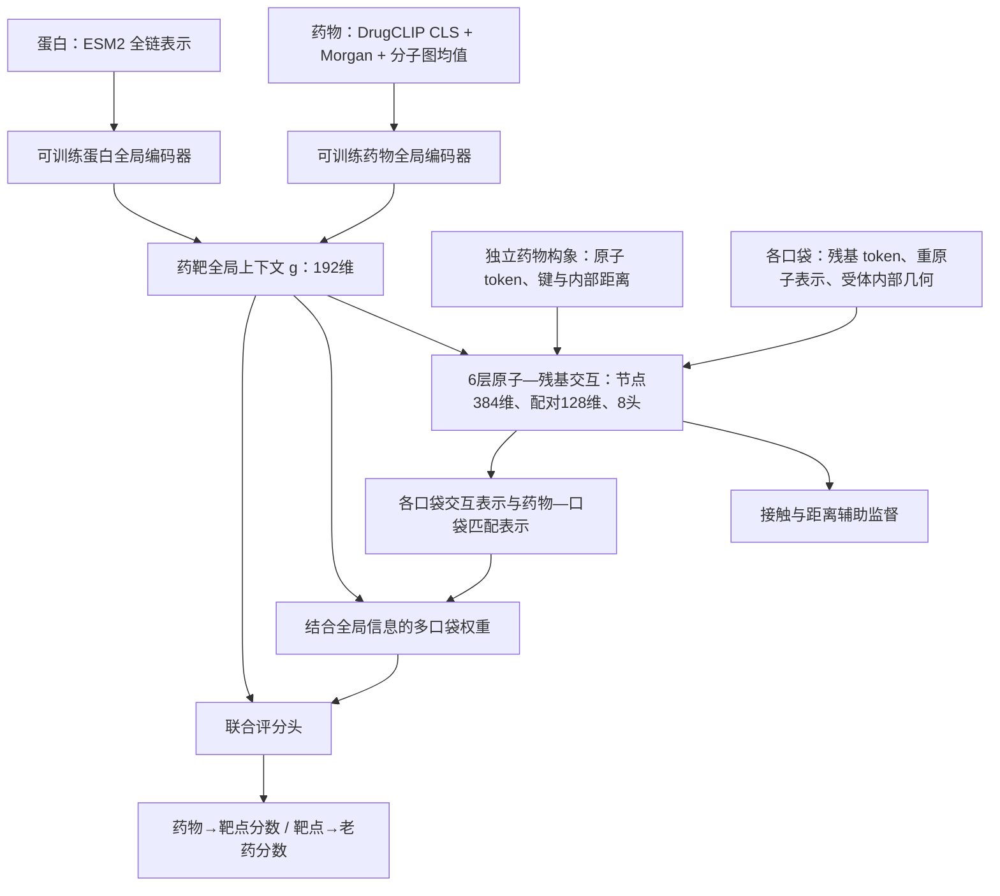

# ContextPocket 正式训练版：实现、验收与 ETA

> **2026-09-08 07:58 UTC状态更新：** 全量数据准备已完成，正式训练在第25/2,532次更新触发结构保持门停止（`STOPPED_STRUCTURAL_RETENTION_GATE`），未完成首轮训练后完整排序评估，无晋级模型。固定64个结构样本的原生口袋距离MAE从1.466636 Å升至2.078296 Å，超过允许增加0.25 Å。初始化全量排序已有，但不能视为训练后成绩。下文ETA为启动时估计，现已失效。见[实际结果](../outputs/biomaster_context_full_20260908/training/cutoff_2020/seed_20260921/RESULT.json)和[各阶段路线与结果总梳理](BIOMASTER_PHASE_ROADMAP_AND_RESULTS_20260908_ZH.md)。

日期：2026-09-08。此文描述本次正式训练工程；训练进度以
[STATUS.json](../outputs/biomaster_context_full_20260908/STATUS.json) 为准。
**完整训练工程、全量数据准备任务、训练完成、质量达标是四个不同状态。现在没有新模型的完整排序成绩。**

## 1. 模型到底是什么

实现：[context_pocket_full.py](../biomaster/context_pocket_full.py)。
配置：[biomaster_context_full_20260908.json](../configs/biomaster_context_full_20260908.json)。

- 可训练参数 **36,154,261**。全局任务编码器、6层交互主干、上下文投影、口袋门控、排序头、接触/距离头从第1步共同学习。
- 旧全局模型仅提供表示层初始化；旧任务评分头不进入新模型，没有冻结旧分数再加 Δg 的路径。
- DrugCLIP 与 ESM2 仍是缓存的预训练特征提取器。本轮没有对其完整大模型做端到端微调；“任务网络联合训练”不能写成“所有预训练参数都更新”。
- 结构训练和评测必须传入真实全局输入，缺失时直接报错。零上下文只存在于旧结构教师对照的既有接口中，不进入新模型的结构训练或新模型评测。
- 全局药物输入为真实 DrugCLIP CLS 512维、Morgan 2048维、图均值40维和可用标记；蛋白为 ESM2 全链均值1280维。不会把原子均值冒充 CLS，也不会把口袋均值冒充全链上下文。
- 多链实验受体使用去除相同序列重复副本后的全链残基加权均值；单链时退化为单链全序列均值。异源多聚体的这个汇聚仍较粗糙，后续可做逐链上下文注意力消融。
- 配体输入是独立 ETKDG 构象。结合态配体坐标只用于构造实验接触/距离标签，不计算两个独立坐标系之间的伪跨分子距离。

## 2. 本次补齐的数据路径与仍然存在的边界

| 用途 | 受体来源 | 口袋来源 | 接触/距离标签 | 新模型全局上下文 |
|---|---|---|---|---|
| 原生结构监督与保留能力评测 | 实验复合物受体 | 实验配体周围口袋 | 实验结合态 | 真实 |
| 预测口袋结构监督与评测 | 同一实验受体，输入中去除配体 | P2Rank 独立预测 | 预测结束后按链和残基编号映射实验标签 | 真实 |
| 药靶排序训练与验证 | 精确序列匹配的 AlphaFold 受体 | 已准备的 P2Rank 口袋 | 年份过滤后的已测关系及排序监督 | 真实 |

新增结构口袋预测使用 P2Rank 2.5.1 的 alphafold 配置，不使用 B-factor 特征。选择规则固定为概率≥0.2、残基集合 Jaccard 去重阈值0.5，保留全部符合要求的多样口袋。结构样本口袋预算为5–256个完整残基、最多2048个重原子；超限或缺失重原子的口袋记录排除原因，不偷偷截断。

**受体是否预测、口袋是否预测是不同属性。** 六个显式质量字段分别为 occupancy、pLDDT、P2Rank 概率、实验受体标记、预测受体标记、预测口袋标记。实验 occupancy 不再冒充 AlphaFold pLDDT。

预测口袋没有覆盖结合位点时，仍进入覆盖率与位点命中率分母。仅在存在接触正例的预测口袋样本上计算条件 contact AP，并同时报告该分母；不能把条件 AP 当成端到端发现结合位点的成功率。一个复合物可有多个正确预测口袋，位点监督支持多正例；该姿态下没有接触不等于该药靶组合无生化活性。

**这次新增的是“预测口袋在实验受体上的有监督训练”，并没有完成真实 apo/AlphaFold 受体到 holo 实验标签的配对监督。** 后者需要额外的结构获取、序列/链映射、构象对齐与误差审计。PLINDER 提供此类关联资源，但资源可用不等于本地已准备好，见[官方数据说明](https://plinder-org.github.io/plinder/dataset.html)。本轮用真实 AlphaFold 口袋参与药靶关系训练，能检验部分任务迁移，不能据此宣布结构域差异已经解决。

## 3. 数据规模和实际训练预算

| 数据 | 可用规模 | 使用方式 |
|---|---:|---|
| ≤2020年唯一已测药靶关系 | 292,408 | 其中4,782条老药已测关系、287,626条通用关系，分流遍历 |
| 老药双向排序 | 234个药物查询、188个靶点查询 | 每轮422步；每个查询保留384个靶点或720个老药候选 |
| 同 assay 对比 | 58,923行、3,291组 | 组遍历，组内抽取4个阳性和4个阴性；不声称每行都已消费 |
| 实验结构训练池 | 9,903个复合物、489个簇 | 按簇均衡，每步4个复合物；记录真实消费的唯一复合物数 |
| 内部结构验证 | 1,223个复合物、162个簇 | 完整结构验证，另用固定64簇样本检查训练中的退化 |
| 部署侧预测口袋 | 352/384个靶点、1,187个口袋 | 缺失口袋有显式标记，由联合模型的全局输入继续评分 |

计划单种子6轮，共 **2,532 次优化更新**。每步含完整排序查询、16条老药已测关系、128条通用已测关系、一个同 assay 组，以及4个复合物的原生/预测口袋监督。通用关系预算324,096行次，遍历采样保证训练按计划完成时覆盖287,626条通用关系至少一次。

结构按簇均衡，完整6轮也不保证9,903个复合物每个都访问。数据“可用量”、样本“行次”和“唯一消费量”分别记录，避免把库存量写成已经训练过的量。不同查询的 loss 不直接连成收敛结论。

训练采用 BF16 前向和 FP32 损失；全局/交互主干/新头最大学习率分别为1e-5、1e-6、1e-4，100步预热后余弦衰减。查询损失使用两遍完整候选梯度计算，不以截断 top-k 替代完整候选排序。

## 4. 完整评测与验收

开发协议：≤2020年训练，2021–2022年新关系验证。包含 **34个药物查询、39个靶点查询、53条唯一阳性关系**。完整查询的候选并集需要评分 **39,810个唯一药靶组合**，不再只检查首个查询。

每轮使用 FP32 权重、FP32 输入和运算，关闭 TF32，固定候选批量1；同时重新运行同协议旧模型。保存每查询 AP、Recall@5/10/20、每个阳性的具体排名、分数及逐查询 bootstrap 差值区间。候选背景中的未知关系用于检索评估，不被解释为实验阴性。

可信旧基线来自旧模型同口径 FP32 审计：

| 指标 | 药物→靶点 | 靶点→老药 |
|---|---:|---:|
| macro AP | 0.476484 | 0.202568 |
| Recall@5 | 0.524510 | 0.239316 |
| Recall@10 | 0.571078 | 0.380342 |

正式版会复算这组基线，而不是未经校验地直接引用历史分数。

选择条件预先固定：两个方向 AP 均不低于匹配旧基线、四个 Recall@5/10 相对旧基线下降不超过0.02，且结构保留检查通过；满足条件的模型按双向平均 AP 选择开发集最佳检查点。这个0.02是工程容忍边界，不等于已证明统计非劣。

开发集既用于选模型，其 bootstrap 区间只能作为开发诊断。升级现有交付模型还需要重复种子、消融和独立测试确认，不因一次开发集最高分自动替换。2023–2025关系、KirHub与冻结SPR候选不作为本轮结构准备或优化的监督标签；当前回顾性协议的公共预训练时间与老药登记时间仍未完全认证。

## 5. 预期效果与 ETA

合理预期是先得到可信的完整学习曲线，检验真实上下文和有监督预测口袋是否带来稳定增益。**目前不能承诺超过旧模型、DTIAM或DrugCLIP。**

研发目标可设为药物→靶点 AP 约0.50以上、靶点→老药 AP 约0.23以上，同时保持前5/10名召回和结构能力。这是目标线，不是已经观测到的指标，也不是基于两步训练推算出的可靠预测。

当前实测：12个CPU工作进程的口袋准备约1个复合物/秒；正式配置的前两个优化步骤分别约72秒与87秒。样本结构大小、口袋数和CPU竞争会影响速度，以下给区间而非承诺时刻：

| 阶段 | 初始预算（从本次启动算起） |
|---|---|
| 11,126个复合物的预测口袋及真实上下文准备 | 约4–6小时 |
| 首轮完整双向排序与结构验证结果 | 约12–18小时 |
| 单种子6轮训练与验证 | 约60–84小时 |

数据预测于2026-09-08 04:00 UTC左右启动。预计首轮结果窗口约为9月8日16:00–22:00 UTC；6轮窗口约为9月10日16:00至9月11日16:00 UTC。若完整结构迁移或退化检查失败，流程会停止并记录原因，届时以上不再是完成有效训练的 ETA。编码阶段和首个完整查询轮结束后应重估吞吐。

## 6. 运行与恢复

启动核验已完成：24项测试通过；真实数据两步中断恢复与连续运行的模型、优化器、调度器、随机状态和采样完全一致，最大参数差为0。最终训练器增加了待完成验证标记与验证期随机状态保护，并补测了真实优化步骤和完成检查点恢复。新评测聚合器从不可变的历史FP32分数精确复现旧基线，尚不代表新模型已完成一次全量推断。

- 数据准备：[prepare_biomaster_context_full_20260908.py](../scripts/prepare_biomaster_context_full_20260908.py)。数据清单包含原始数据、编码器、脚本与缓存校验身份；可恢复已完成的记录。
- 正式训练：[train_biomaster_context_full_20260908.py](../scripts/train_biomaster_context_full_20260908.py)。保存模型、优化器、调度器、CPU/GPU随机状态、查询顺序、数据游标、验证状态和源代码快照；用 `--resume` 恢复。
- 监督进程：[run_biomaster_context_full_20260908.py](../scripts/run_biomaster_context_full_20260908.py)。全量数据与启动检查通过后进入训练，质量检查失败则停止。
- 运行目录：[biomaster_context_full_20260908](../outputs/biomaster_context_full_20260908/)。旧交付模型、旧训练记录和冻结实验候选保持原有身份。

工程短跑中的3个结构复合物仅用于通路、恢复和计时，不是验证集。不能将它们的结构 AP、两步训练 loss 或梯度存在，写成正式模型质量已经提高。
