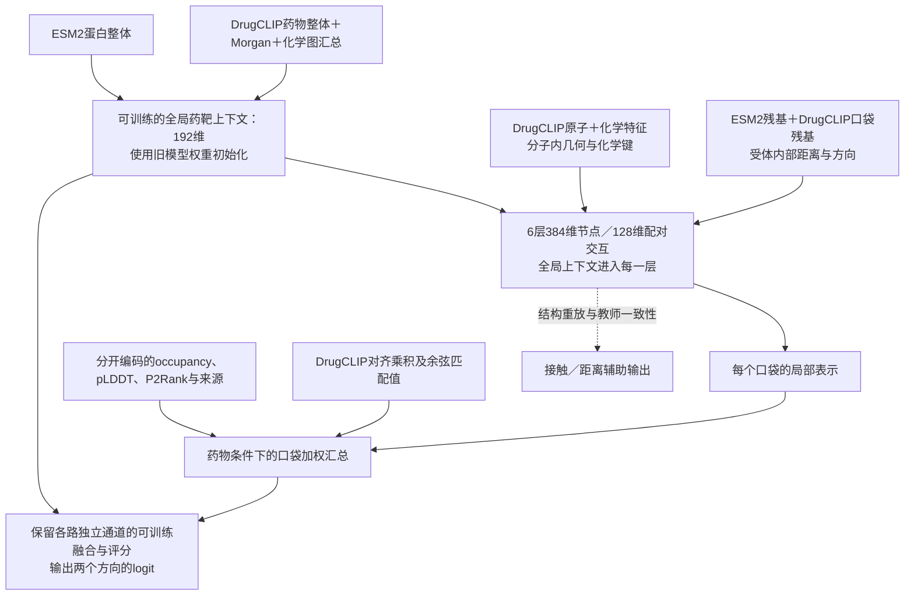

# 新架构ContextPocket：训练准备与验收

**本次任务是准备新的训练方案。旧PocketPrecision运行保持停止；本目录的新模型、配置和检查点单独保存。** 新架构已实现，数据索引已准备，适配与完整主干两条训练路径均完成真实数据检查，每条各2次更新，检查后自动结束。完整状态见[本次状态入口](../outputs/biomaster_training_preparation_20260908/STATUS.json)。正式长训练尚未启动，候选未选中。

[原实验候选质量复核](BIOMASTER_SPR_CANDIDATE_QUALITY_20260908_ZH.md) · [旧架构停止复盘](BIOMASTER_STOP_AND_RETROSPECTIVE_20260907_ZH.md)

## 1. 实际实现的结构

模型总参数为**36,153,229**，不包含生成缓存的DrugCLIP和ESM2编码器。原结构主干仍为6层、8头、节点384维、原子—残基配对128维；没有用缩小网络代替真实训练检查。

与旧模型的连接变化是：

| 旧候选 | 新实现 |
|---|---|
| 全局药靶网络永久冻结 | 用旧权重初始化，但全局任务网络参与更新 |
| 局部主干不读取全局表示 | 每层对原子、残基和配对状态加入全局条件投影 |
| 局部输出投影成Δg，与旧隐状态相加 | 全局、局部、匹配和可用性作为独立输入通道融合 |
| 使用冻结旧shared/readout | 使用新的可训练双向评分网络，不包含旧评分层 |
| DrugCLIP余弦主要影响口袋softmax | 余弦及对齐向量乘积还直接进入评分证据；单口袋仍保留这条路径 |
| 微调只优化关系与稀疏排序 | 每次更新有完整查询排序，并使用实测BCE、同assay对照、结构重放及教师一致性 |

口袋仍独立计算；缺失局部输入时，局部证据通道清零并显式标记可用性，评分网络使用全局信息。这条缺失路径不承诺精确等于旧模型分数。

使用原结构预训练检查点初始化交互层、池化和接触/距离头；没有继承已经退化的下游第一轮或10,400步权重。新评分层、全局条件投影及口袋门控需要学习，不因主干预训练完成就自动具有成熟排序能力。

## 2. 分阶段训练的边界

适配阶段只暂时冻结已预训练的结构主干，训练全局任务编码、上下文注入、口袋门控和新评分网络，共2,662,187个可训练参数。它验证接入能否学习并保留结构读出。

联合阶段开放全部36,153,229个模型参数；全局、结构、新模块的学习率分别为1e−5、1e−6、1e−4。两个阶段都没有冻结旧评分器，因为模型中已不包含它。基础DrugCLIP/ESM2编码器仍是缓存特征来源，端到端更新这些基础编码器尚未实现。

有限步数的适配与联合检查分别从相同初始权重开始，互为训练路径检查；联合检查不是在适配检查点后续跑。两次检查均不作模型选择。

## 3. 数据与训练组织已准备到什么程度

当前开发窗口为≤2020关系训练、2021–2022新关系验证，种子20260921；该窗口此前已用于开发，不是新的外部确认集。

| 数据 | 可用数量／作用 |
|---|---|
| 实测关系 | 292,408条，保持来源和时间切分 |
| 其中老药关系 | 4,782条，单独组成实测辅助批次 |
| 其他关系 | 287,626条，低权重辅助批次 |
| 老药→靶点训练查询 | 234个，每个使用完整384靶点候选 |
| 靶点→老药训练查询 | 188个，每个使用完整720老药候选 |
| 一个查询遍历周期 | 422次更新，每个合格查询恰好出现一次 |
| 同assay实测对照 | 58,923条、3,291组，全部具备所需分子输入并已接入训练 |
| 结构重放训练 | 9,903个复合物，先均匀选簇、再选簇内复合物 |
| 内部结构验证 | 全量1,223个；另固定64个不同簇的工程探针 |

训练的主要单位已从“随机通用关系batch”改为“一个完整老药或靶点查询”。422次查询更新是一个查询周期，不等于把29.2万条关系全部遍历一次。

每次更新的损失单独记录，权重暂定为：完整查询1.0、老药实测BCE 0.25、通用实测BCE 0.05、同assay对比0.1、结构重放0.2、预测口袋教师一致性0.1。这些权重是待开发验证的初始协议，不宣称已经最优。每次更新同时记录实际查询、assay组、重放复合物与簇、各参数组梯度范数。

未知候选只用于检索背景，没有变成实验阴性；教师的接触/距离输出仅是软一致性目标，也不当作实验接触真值。同assay监督与开发验证pair无交集。

## 4. 训练前已修正和仍未解决的数据问题

occupancy、pLDDT和P2Rank概率已作为不同字段，并显式记录结构来源。旧几何输入中混合occupancy/pLDDT乘积的最后一维被替换成“有效残基对”指示值。缓存文件未覆盖；这是明确的输入协议变化，因此迁移后的结构基线重新测量。

**实验配体裁剪口袋与AlphaFold/P2Rank预测口袋之间的分布差异仍存在。** 本次源字段修正、在实际预测口袋上的教师一致性及结构重放，都不能代替真实的apo/预测结构迁移数据。PLINDER提供对应链接，但具有正确映射的成对增强数据尚未整理完。[PLINDER官方数据结构](https://plinder-org.github.io/plinder/dataset.html)

因此仍需建立这一迁移因素的受控验证，或者完成映射与缓存后再评估。不能因为工程检查通过就宣称口袋几何已经在真实应用中有效。

原冻结SPR名单只用于核查没有测量监督交集，未用高／中／低排名制造标签。390个pair可映射当前384目录且没有关系/assay训练交集；另90个pair的靶点在当前目录外。扩展这些靶点的预测能力需要另行准备数据，当前模型不宣称覆盖全部原实验靶点。

## 5. 已完成的验收和证据范围

18项相关测试通过，包括新架构的全局→局部信息流、阶段梯度、结构参数继承、源字段隔离、口袋顺序不变性、缺失输入处理、单口袋匹配通道，以及新模型完整查询梯度缓存与直接反向传播的一致性。

适配阶段实际完成2次更新：一次384候选的药物查询、一次720候选的靶点查询。不是仅做随机张量前向。每次均消费老药/通用实测关系、同assay对照、结构重放和教师一致性；两次更新均保存完整检查点。

| 同一64复合物工程探针 | 真实口袋接触AP | 距离MAE |
|---|---:|---:|
| 原结构教师 | 0.503201 | 1.659574Å |
| 新模型接入、更新前 | 0.503161 | 1.659552Å |
| 适配阶段2次更新后 | 0.503329 | 1.659217Å |

这支持输入迁移与短程适配没有立即破坏原结构读出；不是完整训练后的稳定性证明。其样本不同于全量1,223个结构验证集，不能拿这里的0.503直接与旧全量0.567比较。

另执行了每方向各1个固定开发查询的FP32前后推理检查；仅用于证明候选轴、风险掩码和评分执行路径正常。极小查询集上的AP波动不作为性能结论，不用于选择模型或修改上述检查阈值。

完整主干检查也已完成，使用全量1,223个结构验证复合物：

| 同一完整结构验证集 | 真实口袋接触AP | 距离MAE |
|---|---:|---:|
| 原结构教师 | 0.567126 | 1.247875Å |
| 新模型接入、更新前 | 0.567114 | 1.247864Å |
| 联合阶段2次更新后 | 0.567152 | 1.246771Å |

全局、结构和新增模块均有非零、有限梯度。完整主干2步检查约138秒结束；这验证了真实模型训练路径和极短程结构保持，仍不能推断完整周期后的性能。结果保存在[joint_preflight_2updates/RESULT.json](../outputs/biomaster_training_preparation_20260908/context_pocket/joint_preflight_2updates/RESULT.json)。准备阶段预先设定的停止条件是接触AP绝对下降超过0.03，或距离MAE增加超过0.25Å；这些是工程保护阈值，不是模型晋级标准。

结构保持评测还有一个必须明确的条件：`structural_forward`使用实验口袋，并将全局上下文置零，因为当前结构缓存没有配套的完整全局分子/蛋白输入。因此上述指标衡量这条辅助路径上的结构读出保持，尚未覆盖“真实全局上下文＋预测口袋”的实际评分路径。后者目前只有梯度、前向及教师一致性检查，没有对应的实验接触真值验证；后续成对迁移数据与评价需要补上这一缺口。

## 6. 正式长训练前的剩余要求

完整结构集的短程保持检查已通过。还需补齐全量统一FP32排序评测入口及匹配父模型基线，并为holo→预测口袋迁移完成明确的数据或受控实验方案。模型晋级还需要预先确定实际有意义的AP/前排召回幅度、多窗口多种子对照及配对区间；不能从本次2步检查推断新模型优于旧模型。

当前运行器强制给出正的更新次数和时间预算，支持明确选择适配或联合阶段，每次更新保存模型、优化器和随机状态；完成预算后自动退出，没有后台接续训练。检查点已经保留，但运行器尚未提供自动恢复参数；正式长训练前还需补齐并验证恢复入口。

实现与配置：[模型](../biomaster/context_pocket.py) · [训练协议](../configs/biomaster_context_pocket_20260908.json) · [数据准备](../scripts/prepare_biomaster_context_pocket_20260908.py) · [有限步数训练器](../scripts/train_biomaster_context_pocket_20260908.py) · [数据清单](../outputs/biomaster_training_preparation_20260908/context_pocket/MANIFEST.json)。
