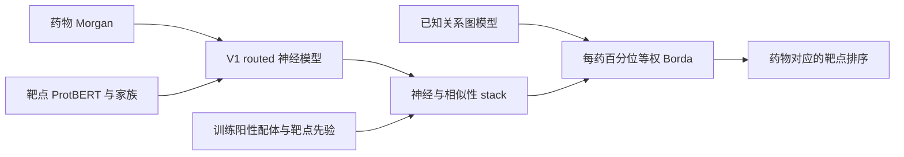
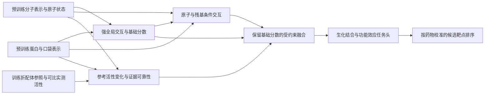

**BioMaster 当前模型架构、各类测试表现与全面加强方向**

核对日期：2026-09-05。本文先描述已实现、已训练和当前使用的模型，再汇总测试，最后给出升级判断。依据是本地代码、检查点配置和预测产物；本次没有启动新训练或更换生产模型。

**总体判断：已有模型具备一定的实测活性识别和近邻配体迁移能力；新靶点泛化、完整候选面板上的选择性排序、连续亲和力预测仍是主要短板。最新 V3 尚未形成整体能力升级。需要同时加强预训练表示、药物—靶点交互主干和直接服务于药物中心排序的学习算法。**

本文对后续工作的排序以用户明确的“架构和算法升级优先”为准：强预训练主干与交互建模应进入下一轮核心对照；配体证据约束同时修复。此前 V3 结果报告中“预训练放在第二阶段”的建议不再作为本轮默认顺序。

**一、当前已有架构：实际上有五类对象**

| 对象 | 实际组成 | 状态 |
|---|---|---|
| 冻结生产系统 | V1 routed 神经分数＋训练配体相似性/先验 stack，再与已知关系图分数做 Borda | 当前默认独立排序系统 |
| V2 正式基准模型 | Morgan＋ProtBERT＋双线性交互＋19维结构上下文；部分协议加入 pooled ESM2 | S1–S5 多种子结果；与生产 V1 分开 |
| 9月1日综合重训及双向候选 | Morgan＋ProtBERT＋ESM2＋低秩 FiLM＋19维结构上下文，再训练 D→T/T→D 小残差头 | 三种子候选，未替换生产 |
| 9月5日 V3 | 全局主干、训练折正负配体支持集、原子—局部蛋白交互的六组消融 | 12次训练完成，未晋级生产 |
| KIRHub 功能专项 | 冻结 BerMol＋ESM2，训练功能抑制适配器 | 激酶功能场景专项候选 |

DTIAM、DrugCLIP 是另外的对照或候选证据来源。默认独立生产分数不使用 DTIAM 分数；另有明确包含 DTIAM 的 system 分数，必须单列。

**1. 冻结生产系统：V1 神经模型与证据排序的组合**

神经部分的具体实现见 [RoutedInteractionRanker](../scripts/train_biomaster_odti_routed_ranker_v1.py)。

| 层级 | 实际实现 |
|---|---|
| 药物输入 | 2048维 Morgan 指纹，经 2048→512→192 的 MLP |
| 靶点输入 | 1024维 ProtBERT 池化表示，经 1024→512→192 的 MLP |
| 家族上下文 | 24维可训练 family embedding |
| 交互输入 | 拼接药物、靶点、逐元素乘积、绝对差及家族向量 |
| 交互主干 | 两层、256维 pair MLP，含 LayerNorm、GELU、Dropout |
| 分数输出 | 共享线性头＋6个线性专家头的门控和＋缩放余弦相似度 |
| 专家门控 | 由靶点与家族决定；V1 门控没有药物条件 |
| 辅助任务 | 亲和力线性头；BCE、同靶点内排序及亲和力辅助监督 |

这里的“6专家”共享整个 pair 主干，各自只有一个线性输出头；模型容量和知识来源不能按六个独立大模型理解。冻结 CORE 路线关闭 ConPLex。

神经模型之外，存在两层后处理：stack 使用神经分数、训练阳性配体最大 Tanimoto 和靶点训练先验；生产默认 `biomaster_independent_borda_score` 则对旧 routed stack 与图分数分别计算每药百分位后等权平均。选中图分支是 `HGB_KNOWN_GRAPH_ONLY_SAFE`，利用已知关系度数、相似近邻及传播等图特征。



当前冻结比较产物覆盖720药物×384靶点。项目另外已完成745靶点登记范围的候选评分，但450主路由、42特殊体系、8探索和245登记靶点的语义不同；450范围仍需要跨路由校准，不能把745统一当成正式生产排名分母。相关定义见[当前合同](CURRENT_PROJECT_CONTRACT_ZH.md)和[实际 Borda 构建代码](../scripts/build_biomaster_drug_centric_ranker_v1.py)。

**2. V2：增强了全局交互，但不同检查点的配置不同**

[ODTIV2](../biomaster/odti_v2.py) 在 V1 的全局向量交互上增加向量双线性项，拼接宽度成为 `5×192＋24`；专家门控加入药物条件。结构分支是由靶点上下文驱动的门控残差，缺失时可以精确回退。

本次直接读取了各正式套件的代表性检查点，避免把当前代码默认值当成历史训练配置：

| 检查点系列 | 蛋白表示 | 交互方式 | 网络规模约数 |
|---|---|---|---:|
| 本文 S1–S3 的 `v21_*_formal` | ProtBERT；未接入 ESM2 辅助输入 | 完整 `Bilinear(192,192,192)`＋19维结构分支 | 9.63M |
| 本文 S4–S5 的 `*_esm2_formal` | ProtBERT＋ESM2 1280维池化表示 | 完整双线性＋19维结构分支 | 10.42M |
| 9月1日 comprehensive balanced | ProtBERT＋ESM2 1280维池化表示 | 秩48低秩双线性＋FiLM＋19维结构分支 | 3.518M |

前两行按检查点权重张量元素数统计，不含离线预训练编码器；第三行训练摘要明确记录3,517,940个参数。完整双线性层单独占约7.1M参数，因此不能将所有 V2 都描述成同一个350万参数模型。配置证据见[检查点汇总](reports/current_architecture_20260905/ARCHITECTURE_CHECKPOINTS.json)。

9月1日候选用交叉条件 FiLM 小幅调制药物和靶点表示，再做低秩乘性交互。它降低了旧完整双线性层的参数负担，但低秩本身不提供额外化学知识。药物端仍是 Morgan 投影；蛋白端 PLM 表示来自冻结缓存。原子、残基、口袋几何没有进入该候选的主要 pair 表示。

19维结构信息包含口袋概率、体积、残基数、结构质量和口袋中心绝对坐标等。它表达“这个靶点的结构上下文”，没有针对当前配体的结合姿态或接触图。代码还支持额外蛋白表示、残基 token、局部 pair 和观测倾向头；9月1日实际配置中 `target_extra_input_dim=0`、`target_token_input_dim=0`、局部输入维度为0、`observation_weight=0`。模块存在不代表该能力已训练。

**3. 双向排序候选：在冻结共享表示上增加小头**

9月1日综合 FULL_FIT 有437,248条训练关系、296,108个药物和843个索引靶点；用于评估的训练快照另行排除留出关系，不能把 FULL_FIT 检查点用于其原训练样本上的泛化证明。

该代主干配置以 BCE 和同靶点内药物排序为主：`rank_weight=0.12`、`drug_rank_weight=0`、亲和力回归0.06、同靶点亲和力排序0.08、D→T亲和力排序0、contrastive 0.05。之后通过[双向训练脚本](../scripts/train_biomaster_bidirectional_v6.py)在256维共享隐状态上增加两个64维残差头，分别修正 D→T 和 T→D 分数。

heads-only 阶段共约33,282个可训练参数，主干冻结。D→T 每药采4条实测关系，T→D 每靶点采16条，使用分类、pairwise、listwise 和残差约束。它能改变已有表示的读出方式，但这阶段不能重新学习分子和蛋白交互表示。相应代码已具备更深层适配选项，不能据此声称当前头部训练已经完成主干升级。

**4. V3：支持集与局部交互已经真实训练，但还没有继承强分子—口袋预训练**

V3 全局路径使用 Morgan2048＋ProtBERT1024＋ESM2池化1280，低秩 FiLM 主干从随机初始化开始训练。这样避免旧项目检查点见过本轮留出药物，但分子投影及交互层也没有继承公共预训练的药物—靶点对齐知识。V3 未使用旧19维结构分支，未启用旧 InfoNCE；本轮只训练明确二元活性，未训练定量亲和力和功能专项任务。

支持分支只检索训练折：每个候选靶点最多16个阳性、16个阴性配体，以 Morgan Tanimoto 检索，共享可训练药物编码器，再用查询药物/靶点条件注意力、门控和 MLP 输出分数修正。训练包括支持集、支持项和同骨架遮蔽。已有全缓存审计确认没有训练外支持、自实体支持和正负归属错误。

局部分支具备显式 R/S、E/Z 分子图、两层消息传递、两层原子×局部蛋白 pair 更新；pair维度32，最多128原子、4个区域×32个蛋白 token。索引靶点中438个使用最多3个 P2Rank 口袋加完整序列区域，375个使用完整序列区域回退，30个走全局回退。这些覆盖数以843个索引靶点为分母；本轮二元完整面板另为495靶点。

需要明确当前局部模型的能力边界：

- 原子消息没有充分使用“具体邻居—具体键”的联合条件；分子编码器是从头训练的浅层网络。
- 蛋白 CA 坐标只用于映射核验，没有把口袋内部距离、方向或接触图输入网络；没有配体—口袋结合姿态。
- 口袋置信度和区域类型没有进入可学习融合。
- 局部输入可用时，局部头直接替换全局主分数和隐状态；没有同时保留完整全局交互上下文。

因此，它当前是原子—局部序列交互模型，尚未形成 DrugCLIP 类的几何预训练及分子—口袋联合对齐。带支持全局模型约3.74M参数，带支持局部模型约4.65M；新增参数量不等于新增预训练知识。

数据为342,031训练、43,331验证和42,032测试二元关系，按药物实体80/10/10哈希留出。每轮覆盖全部训练关系，同时加入药物查询训练流。六配置×两种子×六轮共12个正式任务，首轮 warm-up；按验证实测 drug-macro AP 选检查点。架构与训练详细记录见[V3构建文档](BIOMASTER_V3_BUILD_TRAIN_TEST_20260905_ZH.md)。

**5. KIRHub 与外部预训练模型的角色**

KIRHub 专项确实使用了 BerMol768＋ESM2 1280 的冻结表示，并训练小型功能抑制适配器；它针对固定浓度功能读数，并非全靶点通用 DTI/DTA 模型。不能因为该专项接入 BerMol，就称 V3 通用分子主干也已使用它。

DTIAM 的方法重点是分子和蛋白自监督预训练表示，以及下游自动机器学习集成；它不依赖我们当前这类局部 pair 主干。DrugCLIP 路线提供分子—口袋检索对齐，官方项目另提供几何模型与权重资源。它们给下一代模型提供可复用起点，但本地调用过其分数与实际继承其编码器、投影空间并训练适配是不同的工作。[DTIAM原论文](https://www.nature.com/articles/s41467-025-57828-0)、[DrugCLIP官方项目](https://github.com/THU-ATOM/Drug-The-Whole-Genome)、[ProFSA官方实现](https://github.com/THU-ATOM/ProFSA)。

**二、各类测试表现**

下文 AP 指 average precision。micro AP 把关系合并，target-macro AP 先对每靶点评价再平均，drug-macro AP 则先对每药评价再平均。实测宏指标只覆盖同时有明确正负样本的查询。完整面板的已知阳性 AP 则把未测候选放进检索背景；未测关系没有因此成为实验阴性。这些指标不能跨分母直接比较。

**1. S1–S5：V2 的正式多种子基准**

本表明确使用 `v21_s1/s2/s3_formal` 和 `s4/s5_esm2_formal` 的五种子预测平均。DTIAM 使用同一冻结关系、官方预训练表示的兼容环境重训结果；不是直接搬运论文成绩，也不是原始 AutoGluon 0.5.2 环境的逐位复现。

| 协议 | 实测关系／双类药物 | BioMaster micro AP | DTIAM micro AP | BioMaster 靶点宏AP | DTIAM 靶点宏AP | BioMaster 药物宏AP | DTIAM 药物宏AP |
|---|---:|---:|---:|---:|---:|---:|---:|
| S1 药物骨架冷启动 | 86,673／1,163 | 0.9307 | 0.8829 | 0.8812 | 0.8386 | **0.8551** | 0.8413 |
| S2 同源簇靶点冷启动 | 86,673／1,163 | 0.7899 | 0.8145 | 0.7543 | 0.7769 | 0.5503 | **0.5787** |
| S3 药物与靶点双冷启动 | 17,732／171 | 0.6425 | 0.6517 | 0.6750 | 0.6903 | 0.6213 | **0.6597** |
| S4 首见时间关系2023–2025 | 7,839／83 | 0.8325 | 0.7962 | 0.7832 | 0.7653 | 0.8251 | **0.8333** |
| S5 老药实体冷启动 | 2,556／75 | 0.5569 | 0.3988 | 0.6415 | 0.6061 | **0.7759** | 0.7365 |

S1–S3 是多折预测汇总，S4–S5 是固定留出上的五种子平均。86,673不是单个测试折大小。本次将两方预测逐关系对齐，确认标签、药物、靶点一致，并重算 AP/AUROC，见[指标表](reports/current_architecture_20260905/V2_DTIAM_S1_S5_METRICS.csv)与[复核记录](reports/current_architecture_20260905/VERIFICATION.json)。本表各点估计没有统一的新配对显著性结论；不能仅凭加粗宣称全面获胜。

这组结果说明：V2 对新药物的一些场景有竞争力；冷靶点和双冷启动仍落后本地 DTIAM 对照；S4 的总体分类改善没有转化成更好的每药靶点排序。V2 S5 药物宏AP高于DTIAM，但其 Recall@20 为0.9302，仍低于DTIAM的0.9481，单一 AP 不能代表所有检索指标。

另一个重要限制是 S2 pooled OOF：同一药物对不同靶点的预测可来自不同折模型，跨靶点排序叠加了折间分数可比性问题。保存汇总的药物宏AUROC为0.3534，必须连同该限制解释，不能据此认定一个固定部署模型在完整候选面板上已测得同样结果。本次重算各折内部排序，BioMaster药物宏AUROC为0.4966–0.5861，DTIAM为0.5335–0.6942，五折均是DTIAM较高；所以冷靶点短板并非只由跨折汇总造成。各折涉及的双类药物和候选子集不同，不应将范围解释为置信区间。见[各折内部诊断](reports/current_architecture_20260905/S2_WITHIN_FOLD_DIAGNOSTIC.csv)。后续冷靶点评价应同时提供单模型、同候选分母的每药排序。

S3和S4的实测 Recall@20 达到1.0，也不能解释为全靶点检索完美：其每药已测候选列表很短。S4“首见时间”不等于严格按历史快照重建所有训练信息；下述9月1日时间聚合问题提示需要另做来源审计，本文不把S4作为完全无未来信息的前瞻证明。

**2. 冻结 V1 路线的 S5 成绩：区分神经、stack 与融合**

同为2,556条实测关系、302个测试药物，其中75个双类药物参与药物宏AP：

| 分数函数 | 药物宏AP | Recall@20 |
|---|---:|---:|
| V1 原始神经五种子分数 | 0.7010 | 0.9337 |
| 训练阳性最大 Tanimoto | 0.7220 | — |
| DTIAM | 0.7365 | 0.9481 |
| V1 神经＋相似性 stack | 0.7574 | 0.9040 |
| 独立 validation rank | 0.7521 | 0.8990 |
| 含 DTIAM 的 system validation rank | 0.7933 | 0.9311 |

独立 validation rank 相对 DTIAM 的 AP 差为+0.0156，药物配对95%区间为[−0.0250,+0.0586]，优势未获统计确认。含 DTIAM 的 system rank 的差为+0.0568，区间[+0.0282,+0.0892]，但这是融合增益。

**0.7010、0.7521和上表V2的0.7759分别属于不同模型/分数函数。0.7521也不能直接赋给默认生产Borda。** 这些差异解释了旧文档中看似互相矛盾的“BioMaster成绩”。完整记录见[冻结路线 S5 表](reports/current_architecture_20260905/FROZEN_LINEAGE_S5_METRICS.csv)。

**3. 完整候选面板：9月1日三种子 D→T 候选**

已保存测试使用20个药物、27条2024–2025新增阳性，剔除先前已知关系后检索。名义384核心平均每药377.9个候选，扩展范围另计：

| 候选范围 | 已知阳性平均排名↓ | MRR↑ | 已知阳性AP↑ | Recall@20↑ |
|---|---:|---:|---:|---:|
| 384冻结核心 | 79.28 | 0.1945 | 0.1521 | 0.4333 |
| 450主路由，校准前 | 91.86 | 0.1847 | 0.1446 | 0.4333 |
| 500含特殊/探索，诊断 | 105.95 | 0.1814 | 0.1393 | 0.3833 |
| 745登记范围，诊断 | 182.98 | 0.1634 | 0.1198 | 0.2333 |

同一核心范围内，方向头相对共享 pair 集成只小幅改善平均排名，MRR和AP没有同步改善，Recall@20不变；配对差异区间跨0。把每药训练采样从2行增至4行也没有改善核心 Recall@20。

**这些是已保存的回顾性诊断，当前不能称为干净的严格前瞻结果。** 9月5日原始ChEMBL审计确认：训练先全时间聚合、再按最早年份划分；实际训练保留的1,839条可核查跨年关系中，63条标签、1,668条均值受后续证据影响。需要按截止日期先截原始活动记录再聚合，并重训重测，才能量化影响。此缺陷不自动否定另一个实体留出的S5。

即使暂只看记录值，候选范围扩展后的衰减也暴露出跨靶点和跨路由分数可比性不足。证据见[面板结果表](reports/current_architecture_20260905/TEMPORAL_SCOPES_DIAGNOSTIC.csv)和[原始时间审计](reports/project_audit_20260905/TEMPORAL_RAW_AUDIT.json)。

**4. KIRHub 功能抑制：有一定信号，尚无通用优势证明**

冻结 strict 回顾性集合含2,823个实测pair、202个阳性、78药物，33药物有正负两类。阳性定义为1 μM下抑制≥70%，它衡量功能终点。

| 模型/系统 | 药物宏AP | Recall@20 |
|---|---:|---:|
| DTIAM | 0.3867 | 0.6283 |
| V1 routed stack | 0.3764 | 0.5275 |
| 已知关系图分支 | 0.3978 | 0.6775 |
| 当前独立 Borda | 0.4124 | 0.6196 |
| 含 DTIAM 的 system Borda | 0.4377 | 0.6576 |

独立 Borda 相对 DTIAM 的AP差+0.0257，95%区间[−0.0918,+0.1385]，不能称已证实优胜。后续4行采样方向候选在同集合AP约0.4027，也未带来明显突破。该集合已反复用于方法回顾，不能持续当作全新外部测试。

扩展功能适配器在30,973个pair、92药物、345靶点的五折骨架OOF上，micro AP=0.1904、药物宏AP=0.3240、Recall@20=0.2908，涉及80个双类药物。这是不同候选范围，不能把0.3240与上表0.4124直接相减。

历史专项共同范围融合报告药物宏AP=0.5619，但9月5日确认二阶段融合选权存在外折标签经其他折模型回流的路径。因此0.5619仅保留为有缺陷的开发诊断，不能作为干净嵌套OOF的模型质量证据。基础adapter的外折预测与二阶段融合的隔离问题应分开。见[专项原始摘要](../outputs/retrain_20260901/kirhub_expanded_functional_adapter_v1/KIRHUB_EXPANDED_FUNCTIONAL_ADAPTER_SUMMARY_V1.json)及[审计解释](BIOMASTER_FUNDAMENTAL_PROJECT_MODEL_AUDIT_20260905_ZH.md)。

**5. 连续亲和力与反向找药：分类尚可，精细强弱预测偏弱**

9月1日三种子候选的 BindingDB exact-target-cold 集合仅325条关系、8个靶点：

| 种子 | 靶点宏强/弱AP | 靶点宏Spearman |
|---|---:|---:|
| 20260816 | 0.7361 | 0.0415 |
| 20260817 | 0.7473 | 0.0705 |
| 20260820 | 0.7444 | 0.1550 |

强弱分类分离有信号，但连续亲和力排序相关性很低。靶点宏NDCG约0.854–0.864，不能掩盖相关性不足；其数值还受连续相关度定义影响。现有证据不足以支持精确的跨靶点Kd预测或选择性倍数预测。

同一批共享候选的目标→720药物时间检索，三种子MRR约0.0313、0.0344、0.0183，阳性中位排名178、146、113；属于同一时间数据链，也受上述历史聚合问题限制。局部 recovered double-warm 子集可以取得较高关系分类和检索分数，例如seed20260816在37条关系上的AP=0.9464，但这个小型熟悉场景不能代表新靶点泛化。

亲和力结果来源见[三种子表](reports/current_architecture_20260905/BINDINGDB_COLD_TARGET_METRICS.csv)。当前未发现能够证明所提候选已经完成盲法湿实验验证的结果产物；SPR候选方案与模型计算测试是不同阶段。

**6. 预训练和局部结构的历史消融**

| 升级尝试 | 已有结果 | 能支持的判断 |
|---|---|---|
| ESM-C残差，匹配两种子正式训练 | S3 micro AP 0.6247→0.6364；S5 0.5396→0.5691 | 更强蛋白表示可能有增量；尚不能据此保证完整面板药物排序改善 |
| MoLFormer分子表示，3轮短筛 | S3 micro AP约+0.0061，S5约−0.0320 | 直接拼接新表示未显示一致收益；短筛不证明该预训练路线无效 |
| 较早局部原子/蛋白分支，两种子正式消融 | 药物宏AP：S2 0.5727→0.5685；S3 0.6124→0.5995；S5 0.73668→0.73671 | 曾经实际训练过局部交互，主排序增益仍不成立 |

上述基线和训练预算各自匹配，只能在行内比较，不应与S1–S5五种子汇总混算。原始来源：[预训练正式对照](../outputs/biomaster_odti_pretrained_formal_audit_v1/PRETRAINED_RESIDUAL_FORMAL_PAIRED_METRICS_V1.csv)、[局部图正式对照](../outputs/biomaster_odti_local_graph_formal_v1/formal_audit_v1/LOCAL_GRAPH_PAIRED_METRICS_V1.csv)。

**7. 最新 V3：实测分类高分没有转化为完整面板检索**

实测药物宏AP在772个双类测试药物上计算；面板检索固定64个药物×495靶点，84条已知阳性。神经结果为两种子各自选中检查点的指标均值，不是两种子分数集成。

| 配置 | 实测药物宏AP | 完整面板已知阳性AP | 面板Recall@20 | 单次训练及评估平均耗时 |
|---|---:|---:|---:|---:|
| A 全局分类 | 0.9313 | 0.2361 | 0.5658 | 1.9分钟 |
| B 全局＋正负支持 | 0.9496 | **0.6630** | 0.8727 | 3.0分钟 |
| C 全局＋D→T排序 | 0.9348 | 0.2072 | 0.5191 | 3.0分钟 |
| D 全局＋支持＋排序 | 0.9511 | 0.6400 | 0.8355 | 4.1分钟 |
| E 局部主干＋排序 | 0.9278 | 0.0597 | 0.2293 | 75.2分钟 |
| F 局部＋支持＋排序 | **0.9517** | 0.3553 | 0.7867 | 79.1分钟 |
| 阳性最大Tanimoto | 0.9209 | **0.9663** | **0.9844** | — |
| 正负相似度Logistic | **0.9574** | 0.8797 | 0.9578 | — |

支持集明显改善本轮神经模型；当前局部主路径则造成很大的检索退化，计算耗时约为匹配全局配置的19–25倍。E两种子均选第6轮且验证仍上升，因此只能判定当前实现和预算组合未成功，不能认定所有局部建模都无效。B与D的一个种子甚至选中完全相同的第1轮warm-up检查点，该次不能归功于排序损失。

阳性近邻0.9663也有适用范围：84条面板阳性中最近训练阳性配体的相似度中位数0.8174，80.95%≥0.7。这是近邻丰富的实体留出，尚未证明新骨架、低相似度和冷靶点质量。剔除精确指纹匹配涉及的7药物后，近邻AP仍为0.9636，差距主要不是这些匹配造成。

一个已定位的失败机制发生在F的seed20260905：XPO1占33/64个Top1。本轮该靶点仅有1条阴性支持、没有阳性支持；它实际走全局回退，支持门控中位数0.9979，支持分支中位加分+5.4266 logit。只在机制探针中去掉这项支持修正，其Top1降为0。该例直接说明支持分支能把单侧稀疏证据变成巨大正向修正；并不证明这些未测组合一定无活性，也不表示XPO1在项目外没有阳性配体。

详细逐种子区间、分数归因、支持分布及数据曝光核查见[V3完整结果报告](BIOMASTER_V3_RESULTS_AND_NEXT_DIRECTION_20260905_ZH.md)。该面板目前适合作为严重退化的回归诊断，查询数量不足以代表全项目泛化；已用于本轮分析，后续不能当作未触碰的新测试。

**8. DrugCLIP 在项目中的实测表现与证据边界**

本地官方六折模型推理覆盖722分子×307口袋、221,654个分数。556个已知控制pair在每药跨口袋排序中的覆盖率：Top10为7.91%、Top50为28.42%、Top100为46.58%。这是目标标准化后、按控制pair计的覆盖，并非与V3同候选集合的药物宏AP。

该结果显示现有接入方式的跨口袋排名尚不理想，但控制关系可能与公开预训练重叠，也不是干净留出测试。它不能证明DrugCLIP整体质量差，更不能证明当前V3超过了它。需要在一致药物、靶点/口袋映射、候选范围和缺失处理上做完整对照；保留官方基础分数后再检验适配增量。来源：[本地推理摘要](../outputs/affinity_first_remote_discovery_v1/drugclip_inference_v1/DRUGCLIP_PROJECT_INFERENCE_V1_SUMMARY.json)。

工程方面，V3构建阶段全项目207项测试及合同检查已通过，12次真实训练、独立评分和断点恢复已有验证。这证明软件链路具备可运行性；本次报告没有重复跑全部测试，也没有把软件测试通过当成模型质量证明。

**三、哪些需要全面加强，以及为什么**

**1. 药物预训练与联合表示：下一轮的首要架构工作**

蛋白端已经使用大型预训练模型的缓存，但通用药物端仍主要是Morgan投影，局部药物端是从头训练的浅层图网络。当前主干缺少经过大规模学习的化学表示，更缺少分子—口袋共享空间里的相互作用对齐。这是可以从代码确认的能力来源缺口，具体性能贡献还要靠消融测量。

下一轮应直接建立两条强基线：一条以可复用的BerMol/分子预训练表示加ESM为基础；另一条继承兼容的几何分子、口袋编码器及联合投影，例如DrugCLIP/ProFSA路线。先保存官方编码和打分行为，再做项目任务适配，避免随机重建交互层后丢掉已获得的知识。蛋白端的ESM-C候选有局部实验证据，可在药物端固定后单独比较。[DTIAM方法依据](https://www.nature.com/articles/s41467-025-57828-0)、[DrugCLIP资源](https://github.com/THU-ATOM/Drug-The-Whole-Genome)、[ProFSA资源](https://github.com/THU-ATOM/ProFSA)。

新分子模型必须保留手性和键类型；几何模型考虑多个构象。先冻结编码器验证表示增量，再按相同预算逐步解冻投影或上层。不能把“更大模型＋更多模块”本身当作优胜依据。比较时记录公共预训练数据边界，将公共预训练迁移与项目监督数据隔离分别说明。

**2. 全局、局部与几何交互：需要重做融合方式**

全局向量压缩和浅层MLP难以分辨具体的官能团—残基匹配；当前局部模型又在可用时替换了全局信息，两条路径没有形成稳定互补。应保留强全局分数和上下文，让原子/子结构与残基/口袋进行条件交互，以从零初始化、有界的修正输出逐步贡献增量。

分子消息应显式联合邻居和边属性；口袋输入应包括内部几何、区域类型、置信度和缺失掩码，多口袋由查询配体条件聚合。几何特征使用平移/旋转不变量或等变网络。9月1日固定检查点对受体整体沿x平移100Å后，128个pair的logit平均绝对变化0.4177、最大1.4984，确认绝对坐标依赖；这不是性能下降幅度估计，但已足以要求重做坐标表示。

显式配体—残基空间距离需要有来源明确的结合姿态；不能直接使用两个独立构象坐标系的距离。计算上采用强全局模型做第一阶段评分，局部交互对需要精排的候选进一步评分，并检查第一阶段召回上限；当前几百靶点也可缓存靶点表示后全量精排。需先定位图构建、数据搬运和pair张量耗时，再增加局部模型规模。

**3. 配体证据融合：保留有效证据，限制无依据的加分**

近邻在当前实体留出很强，支持分支却可任意破坏它，XPO1探针提供了直接机制证据。下一版应让明确阳性近邻证据保留到分数中；负支持单独学习“可靠反证”，缺失阴性不产生正向奖励。支持数量、相似度、实测终点一致性和是否单侧缺失应影响可信度。

强近邻区域以参考配体为条件学习活性变化和选择性；低相似度、无支持或新靶点区域交给强预训练全局/口袋路径，并在训练中模拟这些条件。二元标签可以提供同靶点的相对强弱监督，定量活性差值只能来自终点和条件可比的实测数据。不能把近邻先验永久锁死，否则仍难以超越近邻的能力边界。

**4. 训练目标与选模：必须直接优化每药全靶点选择性**

V2主干的D→T排序权重为0，而冻结小头难以补足表示缺口；V3已使D→T梯度进入主干，但只在稀疏实测列表上训练并选模。训练药物233,730个中只有6,450个同时有正负靶点，约2.76%。关系总数不是有效选择性监督的数量。

应把同药跨靶点实测排序、同靶点参照配体比较、分类监督同时纳入主干训练，围绕同家族难区分靶点和实测反例构造查询，避免仅增加容易的负例。完整验证候选面板需要逐轮评价，兼顾drug-macro AP、Recall@K、低相似度和无支持分层；先前用于诊断的测试面板只做回归。

对未测组合保持标签语义：不能全部当阴性。若使用对比学习，应处理重复实体和所有已知阳性掩码；9月1日的InfoNCE存在未知组合隐式负竞争及重复靶点阳性掩码不完整问题，V3已关闭该项。弱监督/教师排序可以约束分数尺度，但需显式权重、训练折内构建和假设消融。

V3的每轮全覆盖已经修复旧重采样覆盖不足，不应重复投入解决已完成的问题。下一轮需要补上完整验证面板早停、合适训练预算及局部模型效率，而不是只延长现有全部配置。

**5. 生化亲和力、功能效应和观测条件：需要独立任务头与有效标签**

BindingDB低Spearman说明精细活性排序仍弱。Ki、Kd、IC50和固定浓度抑制不是同一个终点，跨实验均值/极值也不能自动成为删失区间。应保留assay、终点、单位、浓度和上下界关系，分别建模生化结合、功能效应及方向，允许共享表示但使用任务条件化输出。

药物中心排序最终应回答“在规定终点下更可能作用于哪些靶点”；跨路由比较要有共同标尺。适配激酶功能分支可以保留，但需加入同家族选择性监督，并以嵌套外折重新验证融合。可靠置信度应来自校准和分布外验证；多个线性头或预测方差本身不足以提供它。

**6. 结果归属与可比评估：与架构开发同步修复**

下一轮固定模型、特征、支持快照、打分函数、候选范围为一个整体比较单位。分别报告强预训练裸模型、交互增量、支持增量和完整系统；更换架构后必须实际接入受测分数链，不能继续让新模型训练结果与旧生产Borda并行而缺乏归因。

时间原始记录聚合与KIRHub嵌套融合的修复应同步进行，以便新模型得到可信验收。正式比较同时覆盖冷药、骨架冷、靶点同源冷、双冷、低近邻相似度、支持缺失和完整候选面板；至少三个种子，按药物及靶点家族评估不确定性。评价增强的目的，是分辨模型究竟在哪个泛化问题上变强。

**四、建议下一代主架构与开发顺序**



| 阶段 | 具体工作 | 必须回答的问题 |
|---|---|---|
| 第一阶段 | 强分子/联合预训练基线；保留官方基础分数；完整验证面板及支持符号约束 | 表示本身是否优于当前Morgan主干；能否消除严重外推加分？ |
| 第二阶段 | 保留全局信息的局部交互；几何和口袋可靠性；逐步解冻 | 对同家族选择性、低相似度和冷靶点是否产生稳定增量？ |
| 第三阶段 | 同药跨靶点与同靶点参考差异联合训练；终点专项头 | 改善是否同时体现在完整面板检索、实测反例和连续活性排序？ |
| 晋级评估 | 固定完整分数链，比较DTIAM、DrugCLIP、近邻、当前生产系统 | 能否在相同数据边界和候选范围内取得可复现的实际增益？ |

这些是待验证的升级方案，不能预先保证超过现有方法。下一轮应先得到强预训练基线，再逐项添加交互与证据增量；完整组合获得稳定收益后才扩大训练和替换生产系统。

**核验与复现**

本次新增的证据汇总脚本只读取历史预测与检查点，不拟合、不选择模型：

```bash
python docs/reports/current_architecture_20260905/collect_evidence.py
```

它逐pair核对S1–S5双方标签与实体，并重算两方micro AP、靶点/药物宏AP与AUROC；CSV序列化导致的微小并列差异采用2e−6容差。输出含分版本指标表、S2折内诊断、实际架构配置和输入SHA256，见[证据目录](reports/current_architecture_20260905/)与[来源清单](reports/current_architecture_20260905/SOURCE_MANIFEST.json)。V3面板指标沿用此前从12次NPZ复算的[核验记录](reports/v3_results_20260905/RESULTS_VERIFICATION_V3.json)。
