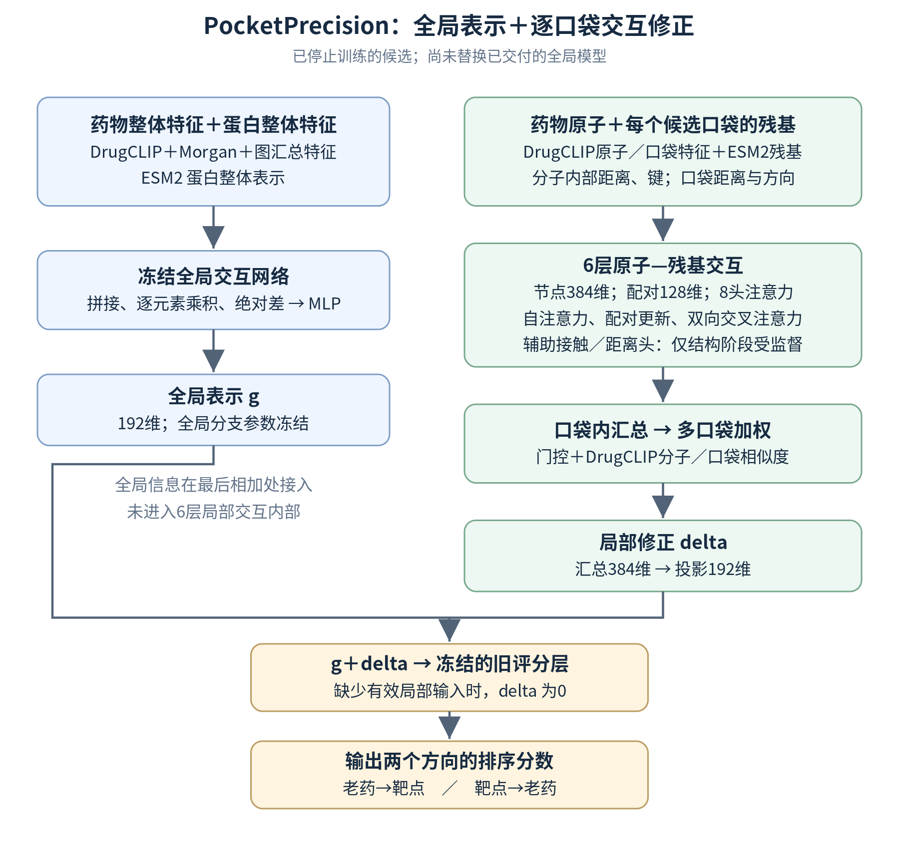

# 当前数据、训练与模型架构审查

> **本候选已于2026-09-07 05:08:47 UTC按用户要求停止，未完成训练、未选中。** [停止记录与执行复盘](BIOMASTER_STOP_AND_RETROSPECTIVE_20260907_ZH.md)。下方改进建议未实施，不是正在执行的计划。

审查对象是本次已停止的PocketPrecision候选：≤2020训练、2021–2022开发验证、种子20260921。结论基于代码、数据清单、首轮冻结权重、统一FP32排序复核，以及关系微调后的结构能力复测。

**结论：数据清洗、结构映射和时间切分有合理基础，但目前的任务配比、结构预训练到关系微调的衔接、局部输出与全局读出的连接，还不足以构成合理的最终老药排序方案。最严重的问题已有实测证据：微调一轮后，原结构预测能力明显退化，而排序AP的增益区间仍跨零。**

## 1. 最新实测：结构能力没有被充分保留下来

用同一1,223个按簇留出的复合物、相同诊断程序及BF16单体系batch，比较结构预训练检查点和下游第一轮检查点的局部模块：

| 指标 | 结构预训练后 | 关系微调一轮后 | 变化 |
|---|---:|---:|---:|
| 已知真实口袋内接触AP | 0.567126 | 0.355525 | **−0.211601** |
| 包含真实口袋和远端区域的接触AP | 0.566430 | 0.257090 | −0.309341 |
| 真实口袋内距离MAE，32Å截断 | 1.2479Å | 2.4593Å | **+1.2114Å** |

真实口袋AP下降的95%按簇重采样区间为[−0.235206，−0.188201]，距离MAE变化区间为[+1.0560Å，+1.3912Å]；162个簇、5,000次重采样。下降不能解释为单个batch波动。

参数核查确认，微调后的接触头和距离头与预训练时**逐元素完全相同**，交互主干和池化模块则已改变。这说明原接触/距离读出所依赖的表示没有被保持；不能进一步断言所有潜在几何信息都已彻底消失。[配对结构保持审计](../outputs/biomaster_pocket_precision_20260906/system_audit_20260907/RESULT.json)

统一FP32、关闭TF32、相同batch=1和完整风险候选集合的排序结果：

| 开发验证指标 | 冻结旧模型 | 新模型第一轮 | 新−旧的95%查询重采样区间 |
|---|---:|---:|---|
| 老药→靶点AP | 0.476484 | 0.478581 | **[−0.000784，+0.006391]** |
| 靶点→老药AP | 0.202568 | 0.209722 | **[−0.004920，+0.022961]** |
| 老药→靶点Recall@20 | 0.662745 | 0.662745 | 未在本表估计 |
| 靶点→老药Recall@20 | 0.581197 | 0.606838 | 未在本表估计 |

逆向Recall@5和Recall@10仍分别由0.239316/0.380342降到0.213675/0.341880。FP32并未把小幅AP提高变成一致、可靠的前排排序增益。这里只是一个窗口、一个种子的首轮开发结果，不是外部测试，也不是多种子确认。[FP32完整指标与逐查询区间](../outputs/biomaster_pocket_precision_20260906/downstream_diagnostics/epoch1_fp32_20260907/RESULT.json)

## 2. 本次训练使用的实际架构

当前是“冻结全局模型＋可训练的逐口袋交互残差”。DrugCLIP和ESM2产生缓存特征，编码器不参与这次反向传播。局部模块有33,652,451个参数，全局父模型有1,235,604个冻结参数。



架构流程：

```text
药物整体特征 + 蛋白整体特征
  → 冻结全局网络 → 192维全局表示 g

药物原子 + 每个口袋的残基、内部距离与方向信息
  → 6层原子—残基交互（节点384维、配对128维、8个注意力头）
  → 每个口袋汇总 → 多口袋加权 → 192维局部修正 delta

全局表示 g + 局部修正 delta
  → 冻结旧评分层 → 老药到靶点、靶点到老药两个方向的分数
```

交互层另有接触概率和64档距离分布辅助头，仅在结构预训练阶段受到监督。

[架构图与详细说明](BIOMASTER_CURRENT_ARCHITECTURE_20260907_ZH.md) · [纯文本说明](BIOMASTER_CURRENT_ARCHITECTURE_PLAIN_20260907_ZH.txt) · [本页浏览器预览](previews/pocket_precision_20260907/BIOMASTER_DATA_TRAINING_ARCHITECTURE_AUDIT_20260907_ZH.html)

实际模块与限制如下：

| 部分 | 当前实现 | 对理解架构的影响 |
|---|---|---|
| 全局交互 | 两个全局向量的拼接、乘积和绝对差，经MLP融合 | 不是药物所有原子与蛋白全序列联合注意力 |
| 局部交互 | 药物原子×口袋残基的配对张量，6层更新 | 比旧CA邻域模块完整，但粒度仍是原子—残基 |
| 口袋原子信息 | 原始重原子经DrugCLIP编码，再在残基内部求平均 | 保留了侧链的编码信息，但不显式区分最终与哪个侧链原子成键/接触 |
| 几何传播 | AA和RR内部几何形成注意力偏置，沿AA-R和A-RR路径传播AR状态 | 不同于显式求解复合物坐标，也不能自动保证所有预测交叉距离几何一致 |
| 全局与局部连接 | 局部主干不读取g，最后才把Δg加到g | 是后融合残差结构；全局上下文未直接调制每层局部交互 |
| 最终评分 | 继续使用冻结旧共享层和两个方向读出 | 保底对照合理，但局部信息必须适配旧判别空间 |
| 预训练更新范围 | 主干和结构头接受结构损失；refine残差桥接未接受梯度 | 权重核查证实refine与随机初始化完全相同，需在下游重新学接入 |
| 下游更新范围 | 优化器只包含local；接触、距离头因不进入loss而无更新 | 主干改变时，原结构读出失去约束 |

DrugCLIP配对余弦目前显式进入**口袋选择门控**，没有作为受保护的直接药靶评分项。对于只有一个有效口袋的关系，softmax权重恒为1，这条余弦门控路径不起区分作用；配对表示仍通过local输入存在，不能说DrugCLIP信息全部消失。352个有口袋靶点中，104个只有一个口袋。

这种连接不代表数学上必然无法学好，但需要与“可训练融合/评分头”“显式局部匹配评分”做同条件消融，不能凭借模块数量推断性能必然优于原模型。[主干代码](../biomaster/pocket_precision.py) · [冻结父模型连接](../biomaster/pocket_precision_training.py)

## 3. 数据准备：哪些合理，哪些与任务不匹配

值得保留的工程工作包括：先按年份截断再聚合关系标签；训练/验证关系去重；未观测关系不当作BCE阴性；原子身份、立体化学、完整重原子和链/残基映射校验；分子独立构象作为输入、实验结合构象只作监督；口袋分开处理；来源及权重哈希校验。没有证据把这些工作整体判为无效。

### 3.1 下游主要在训练普通化合物分类，项目老药监督比例很低

| 数据切片 | 关系数 | 化合物数 | 靶点数 | 阳性比例 |
|---|---:|---:|---:|---:|
| ≤2020全部训练 | 292,408 | 209,659 | 358 | **80.41%** |
| 其中项目老药 | **4,782** | 307 | 240 | **16.10%** |
| 2021–2022全部开发关系 | 59,319 | 34,811 | 312 | 69.91% |
| 其中项目老药 | 116 | 49 | 77 | 45.69% |

老药只占训练关系的**1.635%**，其阳性分布又与整体相反。167,607个训练化合物只有一个已测靶点记录，不能把29.2万条关系视为同等丰富的选择性排序监督。使用通用化合物增强表示合理；在面向老药排序的微调中仍按全部关系等权随机采样，则需要专门的任务配比和查询覆盖控制。

首轮实际排序开发验证只有53条阳性，构成34个药物查询、39个靶点查询。它衡量2021–2022新报道关系的风险集合排序，不能代表整个720老药的全部已知靶点回收能力。

局部输入可用的训练关系有275,076条，其余17,332条走全局回退；老药训练4,759/4,782条可用，老药开发验证116条全部可用。因此“缺口袋”不是本轮53条老药验证阳性小增益的直接解释。[数据统计](../outputs/biomaster_pocket_precision_20260906/system_audit_20260907/DATA_COUNTS.csv)

### 3.2 结构预训练与下游口袋存在明显分布差异

预训练有9,903个训练复合物、1,223个内部验证复合物，来自官方train划分后按簇再留出，结构发布日期≤2020。选的是高质量非共价单配体有机小分子体系，不能代表所有药理体系。

预训练的真实口袋用实验配体周围6Å残基定义，另取同一受体远端区域；下游口袋来自**单链AlphaFold结构上的P2Rank预测**，共1,187个口袋覆盖352/384靶点。真实口袋与一个容易排除的远端区域之间的辨别，不等价于从多个预测口袋中定位真正结合位点，更不等价于跨药物/蛋白的选择性检索。初始口袋识别准确率已经97.87%，证明这一辅助任务在当前输入上很容易。

还有一个明确的字段语义不一致：实验结构的`atom_quality`来自**occupancy**；下游AlphaFold的同一字段来自**pLDDT/100**，并进入几何特征和门控。预训练的口袋元数据第一项固定为1，下游则为P2Rank概率。这些数值不能不加来源区分地当作同一种置信度。

应使用一致的口袋候选生成流程，并加入有审计映射的apo/预测结构迁移；PLINDER本身提供holo对应的apo及预测结构链接，现流程尚未利用。[PLINDER官方数据结构](https://plinder-org.github.io/plinder/dataset.html)

### 3.3 过严实体排除与应用目标需要分开

下载前排除项目同UniProt的3,353个候选和同药物连接关系的263个候选；映射后又排除蛋白序列相似的1,460个及Morgan相似度≥0.8的17个体系。这有利于做严格迁移控制，但会排除已知老药/靶点上合法的历史结构支持，与熟悉实体的新关系发现目标不完全一致。

建议保留当前数据作为严格迁移对照，再单独建立应用时间窗口数据：允许截止前同药物或同靶点的合法支持，但必须按**跨来源最早关系证据**定义未见关系；若预训练结构已经显示某药靶结合，就不能再把同一关系当作后来才发现的测试阳性。公开预训练编码器的时间重叠仍未认证，所以当前是回顾性关系时间切分结果。

### 3.4 结构样本数不等于独立多样性

训练集中5,279/9,903个复合物属于同一内部连通簇c0，占53.31%；验证集最大簇占11.77%。同簇不等于重复结构或单一蛋白家族，但均匀按复合物采样会给大簇很高权重，且按10%体量预算选择验证簇会使大簇只留在训练侧。需补充按簇/家族/化学骨架分层指标和采样对照，不能只报告总复合物数量。

现有cluster字段本身也不是对一切蛋白、局部口袋、配体相似性均无泄漏的证明；官方资源分别维护聚类和划分信息。[PLINDER划分字段说明](https://plinder-org.github.io/plinder/dataset.html)

## 4. 训练：问题在哪里

### 4.1 结构保持约束缺失，且已经看到退化

结构预训练优化“距离分类＋接触BCE＋0.2×口袋识别”。关系微调只优化关系BCE和稀疏触发的双向排序，没有结构数据重放、接触/距离辅助损失或教师一致性约束。参数和实测结果共同支持：主干迁移后，原结构读出性能明显下降。此前仅凭结构预训练AP评价接入后的模型过于乐观。

### 4.2 排序监督的覆盖不足

每轮9,138次更新，每100次才各抽取一个正向查询和一个逆向查询。因此第一轮每方向只有91次有放回抽样；候选正向查询有234个，逆向188个。在当前抽样机制下，期望仅覆盖约75.5个不同药物查询和72.3个不同靶点查询，不能把这些期望数误写成已记录的实际覆盖数。

“99%的更新没有排序项”是调度事实，不等于排序梯度只贡献1%。不过对于目标就是双向检索的模型，这种调度与29.2万条分类记录的配比缺乏充分依据，应改为以查询覆盖为主的训练组织方式。[实际训练调度](../scripts/train_biomaster_pocket_precision.py)

### 4.3 更干净的排序数据已经准备，但当前未使用

≤2020的同assay对照已有58,923行、3,291组、310靶点，使用同assay、同终点/单位的实测正负，并要求阈值间隔和重复测量一致。当前训练器没有加载这些对照。

关系BCE标签则按药物—靶点聚合多项测量；虽有先截时间、排冲突和灰区的保护，依旧不能消除不同assay及Ki/Kd/IC50的差异。应把严格实测对照用于辅助训练，并保留老药查询的主要权重，不能随意把未知候选改成实验阴性。[同实验数据清单](../outputs/biomaster_best_model_20260906/data/ASSAY_MANIFEST.json)

### 4.4 接触监督没有直接训练新模块的跨药靶匹配能力

结构阶段主要学习“这个已知复合物内哪些原子接近哪些残基”，没有跨药物/口袋的显式匹配对照，远端无接触只表示当前实验姿态没有接触。原DrugCLIP以分子—口袋对比学习服务检索；借用其编码并不等于新增交互模块已经继承了同等检索能力。[DrugCLIP原论文](https://arxiv.org/abs/2310.06367)

### 4.5 评测、日志和效率尚未达到稳定训练标准

BF16结果受批量/执行设置影响，现已完成独立FP32复核；排名函数又用候选ID字符串打破同分，因此阈值召回及AP需要明确同分处理，不能比较不同评测设置的细小差值。

分类步和“分类＋排序”步混在同一个loss字段，且每20步只记一个batch，不能恢复单独排序loss，也没有固定验证loss。需要分别记录各损失、老药/非老药、正负样本、每方向查询覆盖、局部分数贡献和梯度范数。

microbatch=1并逐候选运行完整局部模型使每轮约需12–13小时，完整验证约15分钟。全候选两遍梯度缓存的数学设计合理；效率应通过按原子/残基数量分桶、批处理和数据供给优化改善，同时保持同样的完整候选与梯度定义。

结构预训练还有一个较低优先级的调度细节：`stale`在轮末验证未超过历史最佳时递增，即使同一轮中途曾提高最佳值。它不完全等于“连续两个完整epoch都没有任何改善”，后续应明确按验证次数还是按整轮统计早停。当前实验来源已冻结，审查没有修改运行协议。[结构早停实现](../scripts/pretrain_biomaster_structural_interaction.py)

## 5. 建议的修正顺序

| 优先级 | 改动 | 需要看到的证据 |
|---|---|---|
| P0 | 固化统一FP32对照和同分规则；每次关系验证同时测结构保持 | AP差异与区间可比较，结构退化能及时发现 |
| P0 | 接入阶段先训练局部池化/融合/评分，再逐步解冻上层主干；加入结构重放或教师约束 | 原接触/距离能力保持，且老药排序有收益 |
| P1 | 以双向老药查询组织训练，保证覆盖；通用关系与同assay实测对照作明确配比辅助 | 两方向AP及前排召回一致改善，而非只降总体BCE |
| P1 | 对照冻结旧读出、可训练融合头、显式局部匹配评分；保留全局模型作基线 | 确认瓶颈在任务、融合还是交互主干，而非只比较参数量 |
| P1 | 预训练采用与下游一致的预测口袋，加入apo/预测结构，拆分occupancy与pLDDT等质量字段 | 从真实口袋到预测口袋的性能损失减小 |
| P2 | 分开构建应用时间窗口数据与严格实体隔离对照，增加查询覆盖和多窗口/多种子检验 | 可重复、可归因的增益 |
| 后续 | 在上述链条有效后，再增加底座容量、编码器微调及更细侧链/构象建模 | 额外精细度确实提高下游排序，且成本可接受 |

这些是待分别验证的修正方案，不应一次全部堆入再宣布“新架构更强”。审查阶段只新增了只读数据审计、参数比较和结构保持复测，没有更改模型权重或训练器。随后用户要求停止，训练与调度已退出，原协议产物作为历史证据保留；当前没有继续运行的对照实验。

可复现入口：[审计脚本](../scripts/audit_biomaster_pocket_data_training_20260907.py) · [审计结果及来源身份](../outputs/biomaster_pocket_precision_20260906/system_audit_20260907/RESULT.json) · [结构保持逐复合物结果](../outputs/biomaster_pocket_precision_20260906/system_audit_20260907/PAIRED_STRUCTURAL_RETENTION.csv) · [实时进度](BIOMASTER_STRUCTURAL_LIVE_PROGRESS_20260906_ZH.md)
