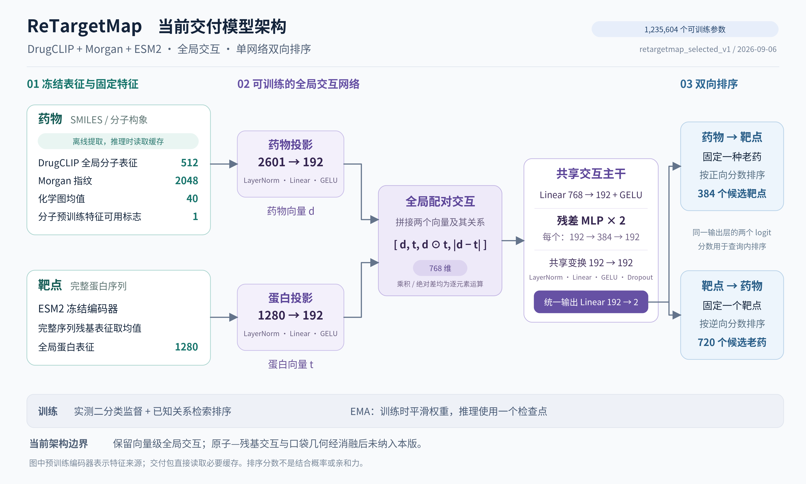

# ReTargetMap：老药找靶点相对 DTIAM 的当前结论

> **2026-09-07 05:08:47 UTC收束：结构交互候选已按用户要求停止，训练未完成且未选中。** 最新统一FP32复核未确认排序增益，关系微调后的原结构读出明显退化。[停止记录与完整复盘](BIOMASTER_STOP_AND_RETROSPECTIVE_20260907_ZH.md)。下方各版本及DTIAM比较均为各自协议下的历史结果。

**2026-09-07训练与架构审查**：[实际架构、数据配比、FP32复核与结构能力退化](BIOMASTER_DATA_TRAINING_ARCHITECTURE_AUDIT_20260907_ZH.md)。关系微调第一轮后，真实口袋接触AP由0.5671降到0.3555；统一FP32双向排序AP仅有小幅提高，两个增益区间均跨零。后续需要优先修正结构保持和老药查询训练，不能把早期结构AP当作已实现的老药排序升级。

**实时训练入口**：[每30秒更新的训练状态、验证曲线与下游进度](BIOMASTER_STRUCTURAL_LIVE_PROGRESS_20260906_ZH.md)。以下结果段落是历史快照；正在运行的结构升级以实时报告的采样时间和状态为准。

**结构预训练首个实测结果**：[数据准入、接触预测与原子级诊断](BIOMASTER_STRUCTURAL_PRETRAINING_FOLLOWUP_20260906_ZH.md)。9,903个复合物训练、1,223个按簇留出验证；400次更新后结构接触AP由0.0941升至0.4599。200次更新的真实口袋内AP为0.3916，原子对应关系打乱后为0.2712。结构训练仍在运行，老药双向排序AP尚待下游评测。[先前的数据准备记录](BIOMASTER_STRUCTURAL_TRAINING_FOLLOWUP_20260906_ZH.md)保留作历史过程。

**新的结构交互重建**：[完整配对预训练、独立重原子口袋与6层交互主干](BIOMASTER_POCKET_PRECISION_UPGRADE_20260906_ZH.md)。已实现3,365万参数局部主干并生成1,187个独立口袋，完成工程验证；已整理20,016个≤2020真实复合物候选。结构预训练和新模型质量评测尚未完成，不能把工程检查当作AP增益。

**局部交互效果不佳的专项分析**：[54项前向干预、训练退化与口袋输入审计](BIOMASTER_LOCAL_INTERACTION_FAILURE_ANALYSIS_20260906_ZH.md)。诊断针对开发窗口，不修改已交付模型；不能将当前实现失败推广为结构信息无用。

当前交付模型架构：[高清PNG](presentations/selected_model_20260906/RETARGETMAP_SELECTED_ARCHITECTURE_20260906_ZH.png) · [可编辑SVG](presentations/selected_model_20260906/RETARGETMAP_SELECTED_ARCHITECTURE_20260906_ZH.svg) · [矢量PDF](presentations/selected_model_20260906/RETARGETMAP_SELECTED_ARCHITECTURE_20260906_ZH.pdf)。

> **2026-09-06本轮独立模型已交付**：[最终架构、全部关键结果与模型下载](BIOMASTER_SELECTED_MODEL_20260906_ZH.md)。54次全局比较＋24次局部消融后选中DrugCLIP＋Morgan＋ESM2全局交互、EMA训练，1,235,604个参数。三种子≤2022重训的时间新关系AP为0.3332／0.1804、严格KIRHub为0.4165／0.3926；不是全面优于各基线，主要差异区间仍跨零。局部/几何未获重复增益而被移除。另交付一个≤2025拟合的独立包，其权重没有独立测试成绩。下方“执行中”和旧版架构图保留为历史过程，当前交付以新报告为准。

> **最佳模型收敛工作正在执行**：追加8次原代码复现已完成；补充2019–2020时间验证、109个分子特征及严格同实验排序数据，启动两时间窗口×三种子的优化消融。当前没有宣布最终最佳或替换生产。见[持续交付协议与实时产物](BIOMASTER_BEST_MODEL_PROGRAM_20260906_ZH.md)。

> **全局方案已完成54次开发比较**：选中DrugCLIP＋Morgan＋EMA，两个时间窗口、三个种子的综合分由原G的0.4002升至0.4375，双向AP均值由0.3566／0.2733升至0.4211／0.2867。正在进行24次局部交互和等曝光/等容量对照；最终模型尚未确定。以上是开发验证成绩，不是新一轮2023–2025或KIRHub测试结果。

> **2026-09-06统一交互首轮已完成**：已实现DrugCLIP原子、完整ESM2残基、映射口袋CA几何及共享pair主干，完成五组单种子对照与三组≤2022重训。2023–2025新关系全候选双向AP：简单G为0.3722/0.1828，完整geometry为0.2550/0.1789，同时间J为0.2806/0.1565。geometry在严格KIRHub为0.4055/0.4589，但等容量全局也达到0.3815/0.4543；尚不能归因于几何，坐标打乱也未使早期老药检索AP下降。早期选中capacity，未按后期G成绩回选。见[实际架构、全部消融与置信区间](BIOMASTER_UNIFIED_INTERACTION_FIRST_ROUND_20260906_ZH.md)及[原设计规格](BIOMASTER_UNIFIED_INTERACTION_REVISION_20260906_ZH.md)。这是回顾性首轮研究，未替换生产；下方架构图仍描述V3＋J。

当前已实现的 **V3＋J 模型架构图**：[高清 PNG](presentations/current_v3_j_architecture_20260906/BIOMASTER_CURRENT_V3_J_ARCHITECTURE_20260906_ZH.png) · [可编辑 SVG](presentations/current_v3_j_architecture_20260906/BIOMASTER_CURRENT_V3_J_ARCHITECTURE_20260906_ZH.svg) · [矢量 PDF](presentations/current_v3_j_architecture_20260906/BIOMASTER_CURRENT_V3_J_ARCHITECTURE_20260906_ZH.pdf)。图中标明两个冻结底座、三个增量模块、预训练交互、正负支持和双向输出；当前候选与时间重训版为同拓扑、不同权重。

> **2026-09-06 KIRHub与时间重训测试已完成**：当前升级J在严格KIRHub的双向AP为0.3816/0.4021，原V3为0.3380/0.3407，DTIAM为0.3867/0.3041。另将原始测量按年份截断、以≤2022数据从头训练，2023–2025首次合格测量的720药全候选AP由V3的0.1527/0.0815升至J的0.2806/0.1565；594个可确认早期获批药子集为0.2640/0.1768。J相对V3有增益，尚未可靠超过阳性近邻。这里的“首次”指本地数据库中满足协议的测量，非生物学首次发现。见[完整协议、置信区间和分年结果](BIOMASTER_V3_KIRHUB_TEMPORAL_20260906_ZH.md)。

> **2026-09-06旧版增量升级与33组消融已完成**：保留旧V3底座，验证集选中“已知关系检索监督＋正负证据＋预训练交互”。历史未见老药中，正向AP从0.4193升至0.6274，逆向从0.4854升至0.6201（逆向候选为54老药）；关系表缺席223老药也有提升。近邻蒸馏未纳入最终候选；尚未全面超过近邻，未替换生产。见[逐项消融、区间与模型产物](BIOMASTER_V3_INCREMENTAL_ABLATION_20260906_ZH.md)。这是冻结选择后的回顾性开发测试，不能改写成新的外部确认。

> **2026-09-06真实老药双向实测已完成**：使用项目720老药×384靶点、807条冻结已知关系，分别测试“老药→靶点”和“靶点→老药”。V3的已知关系宏AP为0.4495/0.3564，新V4 R1有符号证据为0.2655/0.1349，阳性近邻为0.6337/0.5111。另列未见老药、实测正负标签和DrugCLIP同覆盖比较；全量榜有训练接触，不能作为独立新靶点发现成绩。见[完整报告与双向排名](BIOMASTER_OLD_DRUG_BIDIRECTIONAL_TEST_20260906_ZH.md)。

> **2026-09-06评测口径更正**：上一轮R1的1,024×495是一般化合物的稀疏已知阳性检索：99.73%配对无观测标签，查询与项目720老药清单精确匹配为0，约90%的阳性与最近训练参照共享assay。不能据此评价老药新靶点发现或决定近邻主导架构。见[测试集审计与更正](BIOMASTER_ODTI_V4_TESTSET_AUDIT_20260906_ZH.md)。下文历史DTIAM基准仍按各自原协议解释。

> **2026-09-05首轮V4开发实验**：已完成R1全局预训练与有符号证据的9次训练，并在相同1,024药×495靶点面板上复测旧V3和简单基线。新证据模型面板AP为0.272，旧V3为0.661，正近邻为0.962，尚未达到升级目标。详见[训练与统一测试报告](BIOMASTER_ODTI_V4_R1_TRAIN_TEST_20260905_ZH.md)。完整[ODTI V4架构设计](BIOMASTER_ODTI_V4_ARCHITECTURE_AND_DATA_20260905_ZH.md)中的DrugCLIP三维交互尚未训练；本页冻结DTIAM比较结果仍按原协议解释。

> **2026-09-05架构与测试总览**：见[当前架构、全部主要测试与加强方向](BIOMASTER_CURRENT_ARCHITECTURE_TESTS_AND_STRENGTHENING_20260905_ZH.md)。该报告区分本页冻结V1路线、后续V2正式基准、综合重训与V3候选；S5的0.7521是独立验证排序头成绩，不是所有版本或默认生产Borda的通用成绩。

> **当前口径（2026-09-01）**：745个非GPCR靶点是完整登记目录，不是统一排名分母。450个主生产靶点中384个已有全空间评分、66个待补；42个特殊体系和8个高新颖性探索靶点单列。完整部署个案使用`rank/384`；S5指标只在冻结observed-pair测试切片内计算，KIRHub AUPRC/Recall@K只在实际测量并映射成功的pair子集内计算，二者都不能改写成完整384靶点Recall@K。总合同见`CURRENT_PROJECT_CONTRACT_ZH.md`。

> **重训候选更新**：2026-09-01已为全部745靶点补齐模型输入并完成720×745路由评分；450主路由仍缺跨生化/功能体系校准，因此冻结当前合同暂不改写。新4-row方向头及完整结果见`BIOMASTER_RETRAIN_RETEST_20260901_ZH.md`。

> 系统架构、数据来源、标签和所有评价指标的统一解释见`BIOMASTER_SYSTEM_DATA_METRICS_OVERVIEW_20260901_ZH.md`。

## 结论

目前已经构建出面向“给定老药找靶点”的独立排序系统；现有完整评分覆盖384个冻结比较靶点，下一版主生产空间为450个路由后可比较靶点。跨分支活跃设计空间共500个靶点，但专项42和探索8不与主榜混报。以下宏平均指标均以药物为query，但候选分母按各自冻结测试切片定义，并非都在完整384靶点上计算：

- 冻结 S5 药物实体冷启动中，无 DTIAM 的独立头为 **0.7521**，DTIAM 为 **0.7365**；点估计领先 0.0156，但药物级 95% CI 为 **[-0.0250, 0.0586]**，尚不能声称统计学确认的全面优越。
- 同一冻结 S5 测试中，允许利用 DTIAM 分数的统一系统头为 **0.7933**，相对 DTIAM 提高 0.0568；药物级 95% CI 为 **[0.0282, 0.0892]**，该内部提升成立。
- 严格 KIRHub 回顾性集合中，无 DTIAM 的独立生产排序为 **0.4124**，新4-row全量训练独立方向头为 **0.4027**，DTIAM 为 **0.3867**；最强统一系统为 **0.4377**。
- KIRHub 只有 33 个同时含正负样本的药物 query，且项目此前已多次查看该集合，因此这里只能称为“回顾性点估计领先”，不能作为新的外部确认性 SOTA 证据。

## 冻结 S5：未见老药测试

训练、验证、测试药物实体完全不重叠。排序权重和标准化参数只使用 S5 validation；302 个测试药物及其标签不参与拟合，其中 75 个药物 query 同时含正负样本。

| 方法 | 药物宏 AUPRC | Recall@5 | Recall@10 | Recall@20 | NDCG@20 |
|---|---:|---:|---:|---:|---:|
| DTIAM | 0.7365 | 0.7383 | 0.8291 | 0.9481 | 0.8107 |
| ReTargetMap 五种子独立栈 | 0.7574 | 0.7356 | 0.8193 | 0.9040 | 0.8213 |
| ReTargetMap 独立验证排序头 | 0.7521 | 0.7283 | 0.8200 | 0.8990 | 0.8164 |
| 统一系统排序头 | **0.7933** | **0.7658** | **0.8442** | 0.9311 | **0.8499** |

这里不能只看 AUPRC：独立头提高了前部排序精度和 NDCG，但 Recall@20 低于 DTIAM。统一系统头在 AUPRC、Recall@5/10 和 NDCG 上明显更强，Recall@20 略低且差异不显著。

## 严格 KIRHub：1 μM功能抑制实测子集

该集合含2,823个实测药物–靶点对、202个≥70%功能抑制pair、78个药物，其中33个药物同时含正负样本，可计算药物宏排序指标。下表AUPRC和Recall@K只在每种药物实际测量并映射成功的靶点子集内计算；它们不是完整384靶点Recall@K。完整`rank/384`只用于逐pair个案和全空间候选排序。KIRHub单浓度抑制也不是Ki/Kd亲和力。

| 方法 | 是否依赖 DTIAM 推理 | 药物宏 AUPRC | Recall@5 | Recall@10 | Recall@20 | NDCG@20 |
|---|---|---:|---:|---:|---:|---:|
| DTIAM | 是 | 0.3867 | 0.3066 | 0.3917 | 0.6283 | 0.4712 |
| ReTargetMap 图排序 | 否 | 0.3978 | **0.3915** | **0.5051** | **0.6775** | 0.4989 |
| ReTargetMap FULL_FIT 独立方向头（新4-row候选） | 否 | 0.4027 | 0.3564 | 0.4732 | 0.6543 | 0.4847 |
| ReTargetMap 独立双头 Borda | 否 | 0.4124 | 0.3001 | 0.4791 | 0.6196 | 0.4915 |
| 统一系统 Borda | 是 | **0.4377** | 0.3346 | 0.4610 | 0.6576 | **0.5226** |

不依赖DTIAM的独立Borda是当前通用候选排序的默认汇总分数，在该回顾性子集上的药物宏AUPRC最高；图排序则在Recall@5/10/20上更强。若允许DTIAM作为辅助证据，统一系统Borda的AUPRC和NDCG点估计最强，但必须明确标注“含DTIAM”，不能作为ReTargetMap独立模型结果。

## FULL_FIT 状态

- 已有 3 个随机种子的全量训练 checkpoint。
- 每个 checkpoint 使用 437,248 条可解析关系、296,108 个药物和 843 个靶点。
- 药物到靶点方向头使用 8,029 个可形成正负对比的药物 query 训练。
- 已完成历史核心 720 × 384 = **276,480** 对的全量打分，并分别生成独立排序、统一系统排序和 FULL_FIT 方向头的每药 Top20。
- 已建立745个非GPCR靶点的完整登记目录；其中主生产清单为720 × 450 = **324,000** 对，尚有66个主筛靶点需要补特征、推理和跨通道校准，因此暂不发布全局rank/450。
- 另有720 × 42个特殊体系专项候选和720 × 8个高新颖性探索候选；它们单独报告，不并入主榜。剩余245个特殊且无直接小分子证据的靶点只保留在登记目录。
- FULL_FIT 只用于生产排序；它在全量关系上重训后不再拥有无偏的内部测试估计。对其性能的判断必须依赖重训前冻结测试或新的外部来源。

## 当前可以怎么说

可以说：

> 在冻结药物中心评估中，ReTargetMap独立排序的药物宏AUPRC点估计高于DTIAM；含DTIAM统一系统在冻结S5测试上具有药物级bootstrap支持的提升。720×384比较核心排序已经生成；下一版主生产候选集为450个路由后可比较靶点，专项42和探索8单列，745只作为完整登记目录。所有结果同时注明是observed-pair、KIRHub measured-subset还是完整rank/384。

暂时不能说：

> ReTargetMap 已经在全外部数据上统计学显著、全面优于 DTIAM。

原因是 KIRHub 的有效药物 query 只有 33 个，置信区间仍跨 0，并且该集合已被项目反复审视。下一项确认性工作必须冻结当前方法，在新的、未查看标签的药物中心实验集合上一次性比较。

## 产物

- 详细审计：[BIOMASTER_DRUG_TO_TARGET_SUMMARY_V1.json](../outputs/old_drug_target_sota_v1/drug_centric_ranker_v1/BIOMASTER_DRUG_TO_TARGET_SUMMARY_V1.json)
- 完整 720×384 排序：[BIOMASTER_DRUG_TO_TARGET_720X384_V1.csv.gz](../outputs/old_drug_target_sota_v1/drug_centric_ranker_v1/BIOMASTER_DRUG_TO_TARGET_720X384_V1.csv.gz)
- 无 DTIAM 独立 Top20：[BIOMASTER_DRUG_TO_TARGET_TOP20_V1.csv](../outputs/old_drug_target_sota_v1/drug_centric_ranker_v1/BIOMASTER_DRUG_TO_TARGET_TOP20_V1.csv)
- 最强统一系统 Top20：[BIOMASTER_DRUG_TO_TARGET_SYSTEM_TOP20_V1.csv](../outputs/old_drug_target_sota_v1/drug_centric_ranker_v1/BIOMASTER_DRUG_TO_TARGET_SYSTEM_TOP20_V1.csv)
- FULL_FIT 方向头 Top20：[BIOMASTER_DRUG_TO_TARGET_FULL_FIT_TOP20_V1.csv](../outputs/old_drug_target_sota_v1/drug_centric_ranker_v1/BIOMASTER_DRUG_TO_TARGET_FULL_FIT_TOP20_V1.csv)
- 分层范围审计：[TARGET_DISCOVERY_SCOPE_SUMMARY_V3.json](../outputs/target_discovery_scope_ch37_v3/TARGET_DISCOVERY_SCOPE_SUMMARY_V3.json)
- 745靶点完整登记目录：[TARGET_REGISTRY_NON_GPCR_745_V3.csv.gz](../outputs/target_discovery_scope_ch37_v3/TARGET_REGISTRY_NON_GPCR_745_V3.csv.gz)
- 450靶点主生产清单：[TARGET_PRIMARY_DIRECT_SM_ASSAYABLE_450_V3.csv.gz](../outputs/target_discovery_scope_ch37_v3/TARGET_PRIMARY_DIRECT_SM_ASSAYABLE_450_V3.csv.gz)
- 720×450未评分主候选：[OLD_DRUG_TARGET_PRIMARY_720X450_V3.csv.gz](../outputs/target_discovery_scope_ch37_v3/OLD_DRUG_TARGET_PRIMARY_720X450_V3.csv.gz)
- 42靶点特殊体系分支：[TARGET_SPECIAL_DIRECT_SM_42_V3.csv.gz](../outputs/target_discovery_scope_ch37_v3/TARGET_SPECIAL_DIRECT_SM_42_V3.csv.gz)
- 8靶点高新颖性探索清单：[TARGET_EXPLORATORY_ASSAYABLE_NO_DIRECT_SM_8_V3.csv.gz](../outputs/target_discovery_scope_ch37_v3/TARGET_EXPLORATORY_ASSAYABLE_NO_DIRECT_SM_8_V3.csv.gz)
