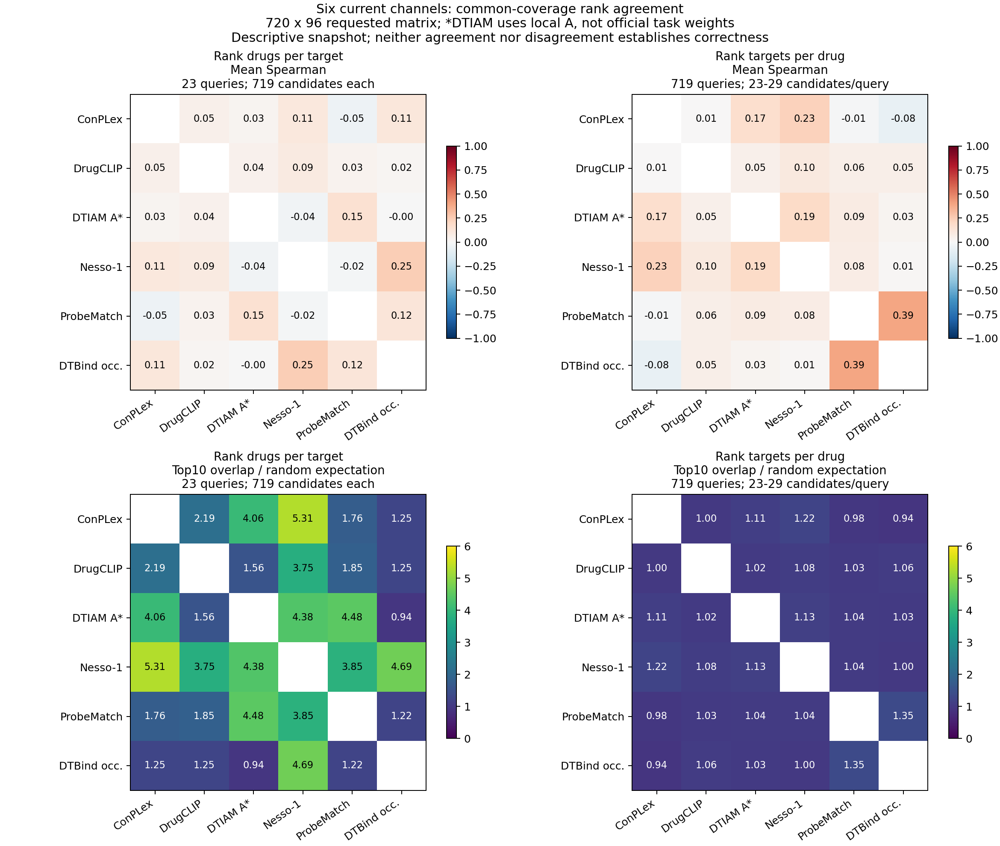

# 第一阶段六个现有通道：排序分歧初步结果

工作日期：2026-09-21。此报告只描述排序，不使用Davis或实测标签，不判断哪个模型正确。主矩阵为720药物×96靶点，完整720×384结果另表提供。DTIAM为已授权本地A，其余五个为现有官方权重通道；新增四个主模型尚未纳入，不能称为最终十模型结果。

## 覆盖先于相关性

| 通道 | 主矩阵已评分/69,120 | 覆盖率 |
|---|---:|---:|
| ConPLex | 69,120 | 100.00% |
| DrugCLIP | 68,400 | 98.96% |
| DTIAM_A | 69,120 | 100.00% |
| Nesso-1 | 21,684 | 31.37% |
| ProbeMatchDTI | 69,120 | 100.00% |
| DTBind_occurrence | 52,560 | 76.04% |

六通道共同覆盖视图中，靶点→药物方向只有23个查询达到至少20个共同候选，每个查询719个药物；药物→靶点方向有719个查询，每个23–29个靶点。这个交集不是完整96靶点矩阵，不具有相同的家族代表性。两两交集可以利用更多分数，但分母随模型对变化，不适合直接当成统一模型排行榜。

## 三个可进一步研究的现象

**整体相关性和头部偏好可以不同。** 两两覆盖中，ConPLex与DTIAM A在96个靶点、每靶点720个药物上，平均Spearman为0.061，平均Top10重合1.063个；独立随机Top10期望重合0.139个。整体秩相关较低，但头部仍存在高于随机参照的重合。这是描述性效应量，不是显著性检验，也不说明共同推荐就正确。

**模型关系随推荐方向改变。** 六通道共同候选视图中，ProbeMatchDTI与DTBind occurrence在药物→靶点方向平均Spearman为0.395，在靶点→药物方向为0.125。Nesso-1与DTIAM A分别为0.190和−0.037。两个方向的查询及候选空间不同，这些数字提示方向性规律，尚不能直接归因于网络架构。

**覆盖会影响表面结论。** ConPLex与DTIAM A在六通道交集的靶点→药物平均Top10重合0.565个，在其自身两两交集为1.063个；这是所含靶点范围改变后的统计差异，不是两个模型重新推理后发生了变化。需要同时给出共同交集和两两交集。

## 共同候选下的图示

图中上排为逐查询Spearman的均值；下排为平均Top10重合数/相同分母的随机期望。TopK边界同分按独立随机打破并列的期望交集处理。相关性遇常数输出记为未定义，分母在CSV中列出；药物→靶点719个查询中，涉及ConPLex的相关性有718个有效值。图中自身比较留空。

随机倍数的上限N/K仍随候选数量改变，因此不能仅凭两个方向的倍数大小宣布哪个方向更一致。补充CSV提供逐查询机会校正重合度：(实际交集−K²/N)/(K−K²/N)，再对查询求均值；0是随机参照，1是无并列且TopK完全相同。N=K时该指标未定义，单列有效查询数。并列边界含义与主表一致。

这张图展示描述性关系，不把模型分簇当作学习机制相同的证据。下一步补齐新增模型的原生推理核验与同矩阵评分，再完成家族、输入长度、并列分数及候选池的分层分析。若做置信区间或显著性判断，需要考虑查询间同源/化学相关性；本报告没有给出未经校正的显著性结论。

## 可复查文件

- [覆盖表](../outputs/dti_rank_agreement_20260921/COVERAGE.csv)
- [全部双向比较汇总](../outputs/dti_rank_agreement_20260921/RANK_AGREEMENT_SUMMARY.csv)
- [按家族汇总](../outputs/dti_rank_agreement_20260921/FAMILY_RANK_AGREEMENT_SUMMARY.csv)
- [机会校正TopK与相关性四分位数](../outputs/dti_rank_agreement_20260921/CHANCE_ADJUSTED_TOPK_SUMMARY.csv)
- [逐查询结果](../outputs/dti_rank_agreement_20260921/PER_QUERY_RANK_AGREEMENT.csv.gz)
- [固定分数快照与校验信息](../outputs/dti_rank_agreement_20260921/MANIFEST.json)
- [可导出PDF](../outputs/dti_rank_agreement_20260921/COMMON_COVERAGE_RANK_AGREEMENT.pdf)
- [当前研究范围](BIOMASTER_DTI_RANKING_SCOPE_20260921_ZH.md)
