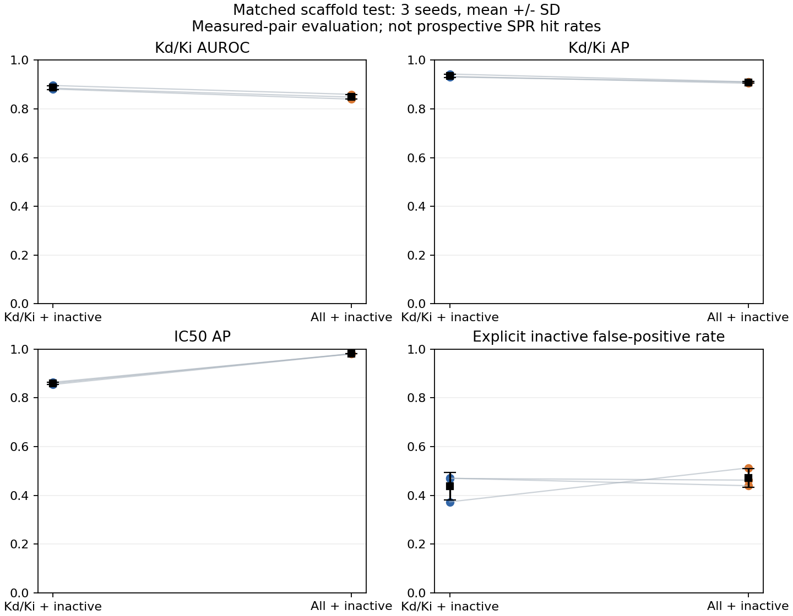

# Kd/Ki 与全端点训练对照结果

状态：全部6次训练与共同测试已完成。生产模型、网站分数和冻结湿实验清单保持原样。

## 训练数据和实际曝光

| 组别 | 训练配对 | 阳性 | 阴性 | 明确失活配对 |
|---|---:|---:|---:|---:|
| A：Kd/Ki＋明确失活 | 337,570 | 188,799 | 148,771 | 105,368 |
| B：全部端点＋明确失活 | 1,116,270 | 769,395 | 346,875 | 105,368 |

明确失活包含带数值端点的失活注释，两组共享同一批105,368对。来源明确失活与任一明确阳性矛盾时，两组一致隔离；全端点组另外隔离跨端点数值正负矛盾。每对只生成一个标签，不把重复来源作为更多票数。

两组使用相同DrugCLIP＋Morgan／ESM2全局交互架构，3个种子逐一匹配随机初始化。监督网络从头训练，公共编码器冻结。每次6000步、每步1024条，完整遍历后再打乱重复；因此是相同优化预算，A组遍历次数更多。使用明确标签的类别平衡BCE，没有未知负例或旧模型监督权重；本轮未使用生产训练中的检索损失，不能把它当作完全复刻生产训练方案。

## 共同测试结果

以下为3个种子均值；逐种子结果、标准差和分层结果在CSV中。AP应结合阳性比例解读。

| 测试任务 | 测试配对 | 阳性比例 | 组别 | AUROC | AP | Top 1%精确率 | Brier |
|---|---:|---:|---|---:|---:|---:|---:|
| Kd/Ki | 34,327 | 67.6% | B：全部端点＋明确失活 | 0.8494 | 0.9087 | 0.9700 | 0.1427 |
| Kd/Ki | 34,327 | 67.6% | A：Kd/Ki＋明确失活 | 0.8874 | 0.9357 | 0.9845 | 0.1294 |
| IC50 | 85,704 | 76.0% | B：全部端点＋明确失活 | 0.9465 | 0.9805 | 1.0000 | 0.0759 |
| IC50 | 85,704 | 76.0% | A：Kd/Ki＋明确失活 | 0.6919 | 0.8592 | 0.8819 | 0.2152 |
| EC50 | 11,957 | 71.4% | B：全部端点＋明确失活 | 0.9247 | 0.9617 | 0.9972 | 0.0953 |
| EC50 | 11,957 | 71.4% | A：Kd/Ki＋明确失活 | 0.6834 | 0.8286 | 0.8667 | 0.2443 |
| 全部端点合并 | 132,331 | 70.5% | B：全部端点＋明确失活 | 0.9163 | 0.9580 | 0.9957 | 0.1002 |
| 全部端点合并 | 132,331 | 70.5% | A：Kd/Ki＋明确失活 | 0.7423 | 0.8568 | 0.9136 | 0.2028 |
| 明确失活 | 10,649 | 0.0% | B：全部端点＋明确失活 | 不适用 | 不适用 | 0.0000 | 0.2986 |
| 明确失活 | 10,649 | 0.0% | A：Kd/Ki＋明确失活 | 不适用 | 不适用 | 0.0000 | 0.3174 |

## 主要结论与不确定性

本次共同Kd/Ki测试支持Kd/Ki＋明确失活获得更高AP；全端点混合在直接亲和力任务上出现负迁移。

全端点组减Kd/Ki组：逐种子AP均值差为-0.0270。先对3个种子的校准预测取均值，再按化学骨架配对bootstrap，AP差为-0.0266，95%区间[-0.0520, -0.0034]；AUROC差为-0.0404，95%区间[-0.0681, -0.0128]。这是对回顾性测试骨架的抽样不确定性，不包含所有训练/数据选择不确定性，也不是已部署的集成模型。

## 明确失活的误报

概率校准与F1阈值仅由共同Kd/Ki验证集拟合。下面的误报率使用该阈值，反映阈值迁移到明确失活测试的表现。明确失活测试只有负类，不计算AUROC/AP。

| 组别 | 明确失活测试对 | 误报率 |
|---|---:|---:|
| B：全部端点＋明确失活 | 10,649 | 47.13% |
| A：Kd/Ki＋明确失活 | 10,649 | 43.75% |

两组的Kd/Ki召回率约为93%，因此该F1阈值偏向保留阳性；低于另一组的误报率不表示已达到实验采购所需的高精确率。加入明确失活证据也没有消除误报。本实验两组都加入了失活，不能用它证明“加入失活”相对“不加入”的因果增益。

## 更严格的Kd/Ki分层

| 分层 | 测试配对 | 组别 | AUROC | AP |
|---|---:|---|---:|---:|
| 与训练/验证无共享文献 | 503 | B：全部端点＋明确失活 | 0.8627 | 0.9081 |
| 与训练/验证无共享文献 | 503 | A：Kd/Ki＋明确失活 | 0.8687 | 0.9113 |
| 两组均有该靶点监督 | 33,205 | B：全部端点＋明确失活 | 0.8601 | 0.9131 |
| 两组均有该靶点监督 | 33,205 | A：Kd/Ki＋明确失活 | 0.8988 | 0.9405 |
| 仅全端点组有该靶点监督 | 252 | B：全部端点＋明确失活 | 0.5679 | 0.7597 |
| 仅全端点组有该靶点监督 | 252 | A：Kd/Ki＋明确失活 | 0.5373 | 0.7359 |
| 两组均无该靶点监督 | 870 | B：全部端点＋明确失活 | 0.4931 | 0.6870 |
| 两组均无该靶点监督 | 870 | A：Kd/Ki＋明确失活 | 0.4833 | 0.6791 |

文献隔离子集仅503对，全端点减Kd/Ki的AP差为-0.0064，95%区间[-0.0315, +0.0183]。若区间跨零，不能把主测试上的优势升级为已证实的文献外泛化优势。

两组均未监督过的靶点子集区分能力接近随机。给全新靶点生成分数，不代表已证明这些分数可用于高可靠实验筛选。

## 查询内排序

以下仅纳入同一查询至少10个已测配对、且同时有正负标签的查询；候选池仍不是全未知空间。

| Kd/Ki排序方向 | 组别 | 查询数 | 宏平均AP | 宏平均AUROC |
|---|---|---:|---:|---:|
| 同分子内排靶点 | B：全部端点＋明确失活 | 54 | 0.5604 | 0.7695 |
| 同靶点内排分子 | B：全部端点＋明确失活 | 516 | 0.6584 | 0.7413 |
| 同分子内排靶点 | A：Kd/Ki＋明确失活 | 54 | 0.5760 | 0.7956 |
| 同靶点内排分子 | A：Kd/Ki＋明确失活 | 516 | 0.6796 | 0.7657 |

## 评价边界

- 数据按既有化学骨架/连接身份划分，冻结实验配对、对照和此前留出骨架不进入训练。
- 主测试可能共享论文/专利；`document_disjoint`另报与训练/验证均不共享引用的子集，不能省略其样本量。
- `targets_both_arms`与`targets_only_all`等分层说明两组靶点监督覆盖差异；这不是蛋白同源簇冷启动验证。
- Top百分位精确率来自有测量的测试候选池，不是完整未知药物×靶点空间的SPR命中率。
- 公共DrugCLIP/ESM2预训练成员重叠未经认证。IC50、EC50与失活注释不是Kd的物理等价量。
- 全端点混合是本次被检验的数据方案；不代表已经完成更复杂的多任务解耦模型优化。
- 本轮评估两种数据方案之间的差异，没有在同一严格未见测试集上直接比较旧生产模型，不能宣称已超过旧模型。

## 文件

[逐种子测试指标](../outputs/biomaster_endpoint_ablation_20260911/TEST_METRICS.csv) · [均值与标准差](../outputs/biomaster_endpoint_ablation_20260911/RESULT_COMPARISON.csv) · [查询内排序](../outputs/biomaster_endpoint_ablation_20260911/QUERY_MACRO_SUMMARY.csv) · [配对置信区间](../outputs/biomaster_endpoint_ablation_20260911/PAIRED_SCAFFOLD_BOOTSTRAP.json) · [冻结协议](../outputs/biomaster_endpoint_ablation_20260911/PROTOCOL.json)

逐对预测在本地 `outputs/biomaster_endpoint_ablation_20260911/TEST_PREDICTIONS.parquet`，每次研究权重在相应组别/种子目录的 `model.pt`。
