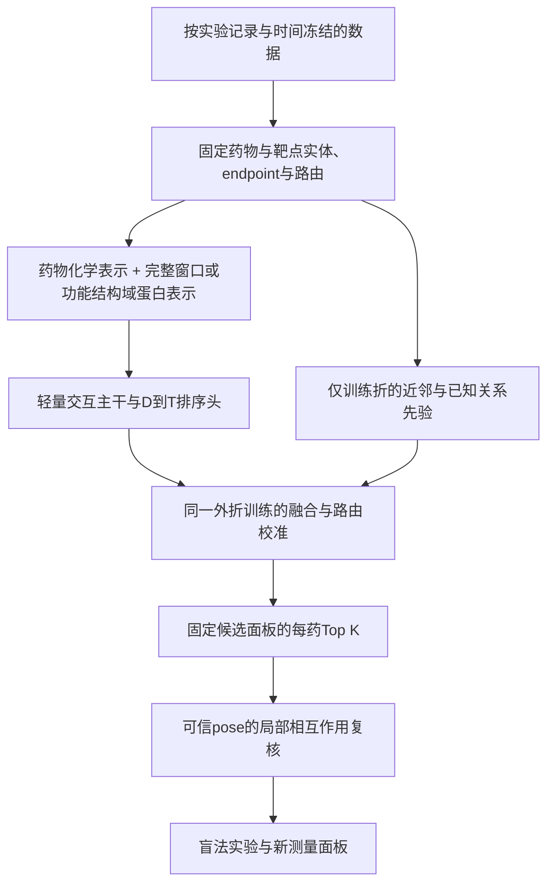

**BioMaster / ReTargetMap 项目、训练与模型架构根本问题审计**

审计日期：2026-09-05。对象为当前工作区代码、冻结当前合同、2026-09-01重训产物及2026-09-04 SPR512方案。本文是技术评估，不修改现行模型、候选名单或发布合同。

**总体判断：项目已经具备有价值的候选检索与证据整理能力，但训练目标、观测数据、最终排序器和验证场景之间仍有明显错位。根据用户随后明确的开发重点，当前先推进模型表示、交互主干与学习算法升级，具体见[架构与算法升级方案](BIOMASTER_ARCHITECTURE_ALGORITHM_UPGRADE_20260905_ZH.md)。本文保留审计事实和相关验证边界，原先“先完成全面审计修复、再升级模型”的开发顺序不再作为本轮建议。**

不能把问题简单归结为“模型太小”，也不能因下面的问题直接认定所有结果无效。已确认的缺陷分别作用于不同组件；时间信息混入的性能影响、结构坐标问题的性能影响，均需要修复后的受控重训才能量化。

**1. 审计依据和证据等级**

本次直接检查了综合数据构建、时间划分、平衡采样、共享神经网络、方向头、FULL_FIT、最终Borda排序、KIRHub专项融合、评分指标及实验方案。并完成以下检查：

| 检查 | 结果 | 说明 |
|---|---|---|
| 现有测试 `pytest -q` | 118 passed | 现有软件回归通过，不等价于科学假设成立 |
| 当前项目合同校验 | PASS | 数量、入口和声明口径一致性通过 |
| 综合表及实际切分重统计 | 完成 | 使用2026-09-01重建包和实际`split_positions`、`optimized_splits` |
| 原始ChEMBL37时间重聚合 | 完成 | SQLite以只读模式打开，重聚合结果与存储的全时间标签、均值一致 |
| FULL_FIT采样重放 | 完成 | seed 20260816、11轮，每轮唯一行数与已有训练日志完全一致 |
| 固定检查点坐标平移检查 | 完成 | 128个不同靶点的真实特征输入，无训练 |
| 损失梯度小例子 | 完成 | 检查unknown竞争、listwise正例质量、区间尾部梯度 |
| 已有S5预测的基线与bootstrap复核 | 完成 | 无重新拟合、无模型选择；属于回顾性诊断 |

本文将“代码与数据直接确认”“机制推断”“待实验验证的优化假设”分开陈述。没有重新训练整个模型，没有宣称测得修复后的性能，也没有将文献中的结论直接套作本项目的实验结果。

可复现证据位于[审计目录](reports/project_audit_20260905/)。三个脚本依次运行：

```bash
python docs/reports/project_audit_20260905/reproduce_audit.py
python docs/reports/project_audit_20260905/reaggregate_temporal.py
python docs/reports/project_audit_20260905/probe_scores_and_structure.py
```

分别生成[AUDIT_DIAGNOSTICS.json](reports/project_audit_20260905/AUDIT_DIAGNOSTICS.json)、[TEMPORAL_RAW_AUDIT.json](reports/project_audit_20260905/TEMPORAL_RAW_AUDIT.json)、[SCORE_AND_STRUCTURE_PROBES.json](reports/project_audit_20260905/SCORE_AND_STRUCTURE_PROBES.json)。脚本需要现有本地数据和依赖，只写本审计目录。

**2. 当前实际存在两条主要模型链，不能合并描述**

| 对象 | 实际组成 | 已有证据与限制 |
|---|---|---|
| 冻结S5独立验证排序 | 旧神经logit + 训练集阳性配体最大Tanimoto + 靶点先验 | drug-macro AP=0.7521；这是特定线性排序器的成绩 |
| 当前默认生产Borda | `biomaster_routed_stack_score`的每药百分位 + 已知关系图排序百分位，等权平均 | 有384全空间评分和KIRHub回顾性结果；不等于上面的S5独立验证排序 |
| 新全量重训方向候选 | Morgan + ProtBERT + ESM2 + 19D结构上下文 → 共享网络 → D→T/T→D残差头 | 20-query时间检索及FULL_FIT候选评分；尚未取代冻结Borda |
| KIRHub专项 | 冻结BerMol/ESM2 + 功能抑制适配器 + 可选融合 | 学习1 μM功能抑制；专项融合存在下述折间信息回流 |

当前代码的默认Borda在[build_biomaster_drug_centric_ranker_v1.py:626](/root/autodl-tmp/BioMaster/scripts/build_biomaster_drug_centric_ranker_v1.py:626)只取旧stack和图排序。FULL_FIT方向头虽在同一表中合并，却仅进入其他分数字段和诊断Borda。

**因此，重训43.7万关系的方向头，并不会自动改善默认生产Borda；S5的0.7521也不能直接赋给这个Borda。** 这是系统优化与模型优化脱节的问题。应冻结完整的`score_function_id`，把该函数用到的模型、图、先验、标准化和候选范围作为同一个受评估对象。

图分支实际选中`HGB_KNOWN_GRAPH_ONLY_SAFE`，使用已知关系度数、近邻相似度及传播等10个图特征；此次没有发现该选中分支暗中需要DTIAM。神经主干本身也关闭ConPLex输入。需要修正的是成绩归属和系统依赖描述，而不是否认其独立性。

**3. 优先问题总表**

P0表示在继续依赖相应验证结论前应修复；P1表示下一轮训练/模型开发重点；P2表示后续优化。优先级不表示已测得性能下降大小。

| 优先级 | 根本问题 | 证据等级 | 主要影响对象 |
|---|---|---|---|
| P0 | 先按全时间聚合标签，再按最早文献年份划分时间 | 原始数据库确认 | comprehensive时间训练、时间检索结论 |
| P0 | KIRHub二阶段融合复用另一外折OOF，测试标签可回流至选权输入 | 代码依赖确认 | expanded adapter的crossfit fusion；不等同于基础adapter OOF |
| P0 | 最终打分器与展示的验证成绩对应不完整 | 代码与合同确认 | 默认Borda的性能归因与发布 |
| P1 | unknown虽被BCE排除，却在InfoNCE分母中作为隐式竞争项 | 梯度确认 | contrastive_weight=0.05的共享主干 |
| P1 | 主任务是D→T，主干训练与早停仍主要偏向T→D | 配置与代码确认 | 表示学习和方向适配上限 |
| P1 | 药物中心监督稀缺，全量训练的实际采样覆盖不足 | 数据、采样重放确认 | 数据效率和FULL_FIT解释 |
| P1 | 19D结构输入包含绝对坐标，固定模型不满足平移不变性 | 固定检查点确认 | 结构分支及跨结构泛化 |
| P1 | endpoint混合、重复测量范围被当作删失区间 | 数据语义与代码确认 | 亲和力辅助头、跨靶点比较 |
| P1 | 有效query少、测量子集偏差、历史集合反复用于开发 | 数据与记录确认 | 对真实候选空间的泛化判断 |
| P2 | 校准指标滥用、缓存/入口/依赖不够独立 | 代码确认 | 可复现性和置信度解释 |

**4. 时间切分存在已确认的信息混入**

来源SQL先对所有年份计算`AVG/MIN/MAX(pchembl_value)`、inactive标记以及`MIN/MAX(document_year)`，再生成标签，见[extract_chembl37_target_calibration_v5.py:229](/root/autodl-tmp/BioMaster/scripts/extract_chembl37_target_calibration_v5.py:229)。训练随后用`min_document_year <= 2022`选行，见[train_biomaster_comprehensive_balanced_v2.py:154](/root/autodl-tmp/BioMaster/scripts/train_biomaster_comprehensive_balanced_v2.py:154)。

这实现的是“该关系最早在2022年前出现”，没有保证“训练标签只使用2022年前的信息”。

本次统计：

| 范围 | 数量 |
|---|---:|
| ChEMBL主体中最早年份≤2022的关系 | 384,415 |
| 上述关系中包含2023年后记录 | 1,849 |
| 真正进入evaluation fit的跨年关系，含recovered | 1,876 |
| 其中ChEMBL主体，可逐条回到本地原始activity核查 | 1,839 |
| 这1,839条中，2022年底标签与当前训练标签不同 | 63 |
| 这1,839条中，数值均值因后续证据而改变 | 1,668 |

63条的变化是47条从灰区成为positive、16条从灰区成为negative/inactive；没有在这批保留行中发现正负直接互翻。原始重聚合共读取8,562条合格activity，并先验证全时间重聚合与原始存储的标签和均值一致。

这还没有覆盖因未来冲突而被整个排除的关系，也没有逐条重建另外37条recovered跨年关系，更没有审计结构/图/靶点目录的历史可用日期。因此这些数值是明确的局部证据，不是全部泄漏规模。

**修复方向：先按activity/document时间切原始记录，再在各时间快照内聚合。** 以2022、2023、2024/25分别建立标签、known-positive集合和来源图；明确“最早任何证据”和“首次合格阳性”两个不同时间。对真正前瞻模拟，还要说明口袋、蛋白表示和候选目录的可用时间；否则应称“使用当前表示的回顾性时间关系评估”。

不应仅删掉这1,839条，因为那会损失合格的早期记录，也不能修复未来驱动的排除规则。修复后的性能是否变化、变化多少，需要另行重训。此问题也不自动否定另一个S5药物隔离评估。

**5. KIRHub融合的OOF并未保证整个二阶段管线隔离**

[train_kirhub_expanded_functional_adapter_v1.py:315](/root/autodl-tmp/BioMaster/scripts/train_kirhub_expanded_functional_adapter_v1.py:315)先对每个折生成adapter OOF：测试折`t`、验证折`t+1`、其余三折训练。这个基础adapter预测的外折隔离本身是成立的。

但[同脚本:336](/root/autodl-tmp/BioMaster/scripts/train_kirhub_expanded_functional_adapter_v1.py:336)在融合选权时直接取已经汇总好的另一折OOF：

```text
欲评估融合的test fold = 0
选融合权重的validation fold = 1
fold 1现有OOF来自：test=1、valid=2、train={0,3,4}的模型
因此fold 0标签 → 训练fold 1预测模型 → fold 1的选权分数 → fold 0的融合结果
```

五个外折都存在这条依赖路径。标签无需直接出现在选权函数参数中，也能影响选择。这是基础模型OOF与整个stacking管线OOF的区别。

**修复方向：每个outer-test外部都重新建立inner训练/选权预测。** 例如评估fold 0时，选权用的所有模型训练、早停、标准化、特征构建都排除fold 0；可以使用同一个外折模型对validation生成的分数，或在outer-train内做完整inner cross-fitting。保留基础adapter OOF和融合OOF两个独立结论。当前不能将已有融合数字视为无信息回流的泛化估计，也不能把它与严格2,823-pair通用回顾性集合混报。

**6. “unknown不作负例”只在部分损失中成立**

BCE和显式方向排序正确地使用`binary_observed`屏蔽affinity-only关系。这一点应保留。

但[odti_v2.py:1203](/root/autodl-tmp/BioMaster/biomaster/odti_v2.py:1203)的InfoNCE分母包含整个batch的交叉组合；[odti_v2.py:1247](/root/autodl-tmp/BioMaster/biomaster/odti_v2.py:1247)只用当前batch行构造正例掩码。未观测的`d_i–t_j`因此会竞争正例的softmax质量。实际2026-09-01主干配置`contrastive_weight=0.05`，该项并未关闭。

小例子中只观测到`d0-t0`、`d1-t1`为正，两个unknown交叉分数的梯度分别为+4.9876和+3.6553：梯度下降会压低它们。没有给unknown写入BCE标签0，但已经引入“其他组合较不相关”的监督假设。

另一个实现问题是：batch里同一个靶点的重复列没有完整扩展已知阳性掩码。对一个已知结合该靶点的药物，同靶点在其他药物行上的副本也可能落在分母非正例区，损失会受到重复采样方式影响。

**优化顺序：** 首先做关闭contrastive、仅合格实测PN竞争、实体去重且传播完整已知正例掩码三组消融，保持数据与主指标相同。不要一边承诺unknown不负监督，一边对全batch使用默认负竞争。若希望利用大量unknown，必须明确PU/弱监督假设、权重和敏感性分析。

nnPU可作为研究候选，但不能直接解决药理数据库的选择偏差：其经典设定涉及类先验与P/U采样分布假设，而本项目的阳性高度受历史测试选择影响。[nnPU原始论文](https://proceedings.neurips.cc/paper/2017/file/7cce53cf90577442771720a370c3c723-Paper.pdf)支持这一方法方向，是否适合本数据需要单独验证。

**7. 主干仍在为反向任务学习，冻结方向头无法全面修复表示**

2026-09-01实际共享模型配置：

```text
rank_weight = 0.12                 # 同一靶点内的药物排序
drug_rank_weight = 0.0             # 同一药物内的靶点排序关闭
affinity_rank_weight = 0.08        # 亲和力同靶点排序
affinity_drug_rank_weight = 0.0    # 亲和力同药物排序关闭
listwise_weight = 0.0
observation_weight = 0.0
```

主干早停中50%权重给时间T→D平均百分位、20%给其reciprocal-log-rank、15%给恢复关系T→D百分位，其余为关系分类和BindingDB指标，见[train_biomaster_comprehensive_balanced_v2.py:768](/root/autodl-tmp/BioMaster/scripts/train_biomaster_comprehensive_balanced_v2.py:768)。

之后才冻结主干并训练D→T残差。两个方向头总共33,282个可训练参数，backbone可训练参数为0。它们可以重新组合现有pair表示，却不能让冻结的药物塔、蛋白塔重新学习缺失的药物选择性信息。

另外，在heads-only配置下，T→D损失只更新T→D自己的头；它不会反向改善D→T头。共享特征来源仍然存在，但方向训练阶段没有两者相互促进的共享梯度。应通过停掉T→D训练验证其计算必要性，避免把这部分包装成已验证的双向协同机制。

方向头采用正确的query-first采样，但其listwise项优化“正例总softmax质量”。`[正例10, 正例-10, 负例0]`时该项已接近0，弱正例梯度约`-9.4e-14`，可以只把一个正例排好。当前pairwise与BCE仍提供其他监督，因此这不是整个损失都忽略弱正例，但该listwise项不能单独代表多靶点谱的Recall目标。

**建议：把D→T主指标前移到主干选择阶段，逐步开放interaction层，并保留小权重的关系监督。** 现有代码已有`--trainable-scope interaction`，不需要先另造一个大网络。比较heads-only与受控interaction微调，在同一数据、预算和外折上选择。主损失先以每药等权的实测正负pairwise排序为基线，再研究对每个阳性给予显式权重、接近Top-K预算的排序项。

**8. 训练量大，但任务相关信息量和实际覆盖小得多**

对去重FULL_FIT，按模型药物特征实体重统计：

| 数字 | 审计结果 |
|---|---:|
| eligible唯一关系 | 437,248 |
| 唯一binary关系 | 427,470 |
| 有binary记录的药物特征实体 | 292,042 |
| 只有一条binary记录 | 232,865，约79.7% |
| 同药同时有正负的query | 8,029，约2.75% |
| evaluation fit中可用于方向训练的双标签药物 | 7,149 |
| 方向头早停的密集开发query | 11，18个未来阳性 |
| 密集时间测试query | 20，27个未来阳性 |

部分旧文档的427,853条binary、232,902个singleton等数字来自含审计重复行或不同实体计数方式；不能与去重后模型实体数混用。**437,248是关系池规模，不能理解成437,248条跨靶点对比。**

采样也改变了“全量训练”的含义。对seed 20260816实际FULL_FIT的11轮进行重放：

| 指标 | 数值 |
|---|---:|
| 每轮抽样行数 | 131,072，有重复 |
| 第1轮唯一行 | 75,429 |
| 11轮累计唯一行 | 263,113，占eligible池60.17% |
| 该seed从未被抽到的行 | 174,135，占39.83% |

每轮唯一行数与已有FULL_FIT训练日志逐轮相等。这里仅确认一个seed的采样覆盖，不将它扩大为三种子联合覆盖。抽样训练本身是合理方法，但“所有关系eligible”与“所有关系实际参与梯度”必须分开报告。

**数据方向：优先增加老药×多靶点panel的实测记录，尤其是同一条件下的明确阴性、灰区与定量结果。** 单个药物新增几十个同条件靶点读数，往往比同等数量的单药单阳性记录更直接支持本任务，但具体收益需实验验证。密集panel的监督形态可参考[72个抑制剂×442激酶的原始研究](https://pubmed.ncbi.nlm.nih.gov/22037378/)，它不能代表全部非激酶范围。

**训练方向：** 将`epoch`改为明确的优化步数、query曝光与唯一关系覆盖合同；比较受约束的coverage pass加query训练、当前有放回采样、限制重复次数三种策略。覆盖提高也可能降低尾部query权重，因此不能只增加epoch而不对照。

**9. 当前结构分支缺乏物理不变性，也没有pair级局部几何信息**

当前19维结构列中明确包含`pocket_center_x/y/z`，见[build_biomaster_odti_structure_features_v1.py:134](/root/autodl-tmp/BioMaster/scripts/build_biomaster_odti_structure_features_v1.py:134)。这些是不同受体文件坐标系中的绝对位置，不是药物与蛋白之间的相对距离。

对现有FULL_FIT检查点，取128个不同靶点的真实输入，只把每个受体沿x方向平移100 Å，其他化学、口袋体积、质量等特征保持不变：

| 指标 | 结果 |
|---|---:|
| 发生logit变化的pair | 128/128 |
| 平均绝对logit变化 | 0.4177 |
| 最大绝对logit变化 | 1.4984 |

这确认了固定模型对无物理意义的坐标原点敏感。它不等价于已测得AUPRC下降，但足以说明该输入没有满足应有的不变性。

19D还包含实验结构数量、holo条目数量、结构可用性等。这些变量可以反映测量/研究强度。mask=0的精确回退是好的工程设计，却不能证明mask或研究密度没有成为捷径。需要做靶点内/家族内置换、移除研究密度列、仅质量路由等消融。

47D候选曾去除绝对坐标，但其历史短屏没有稳定收益，不能用“47D已经实现”说明当前19D没有问题。更稳妥的下一步是先做**现有19D去掉xyz**的最小修改，独立估计收益；不要将修复坐标与增加28维新特征绑在一次实验中。

网络目前用全蛋白pooled向量；token输入和local-pair输入维度都为0。FiLM让两个向量相互条件化，6个expert只是共享hidden上的6个线性标量head，并没有自动产生残基–原子接触、选择性位点或口袋物理解释。

分子端Morgan是应保留的强基线，但当前生成器未打开手性：审计的两个对映体得到完全相同的指纹。ESM2按前1,022残基截断，428训练靶点中77个序列超过该长度；完整745登记序列中125个超过该长度。由于还存在ProtBERT分支，不能据此说整个模型完全看不到这些区域，但ESM2分支可能遗漏关键后部结构域。

**表示优化顺序：** 手性与实体一致性 → 蛋白完整窗口/功能结构域 → 轻量药物条件的残基或口袋注意力 → 有可信共坐标pose的局部几何重排。既有MoLFormer和ESM-C消融已显示增加预训练表示不必然改善两侧冷启动，因此不推荐把“叠更多预训练模型”作为默认路线。

**10. endpoint混合和亲和力辅助损失的统计含义需要重建**

ChEMBL主体中仅`standard_types=IC50`的关系就有293,175条；此外有Ki、Kd、混合类型及明确inactive文本。60,129条negative没有数值pChEMBL。它们均可在明确语义下为活性关系学习提供信息，但不是同质的SPR KD或直接结合亲和力。

ChEMBL官方将pChEMBL描述为若干活性/效力/亲和力量的共同负对数尺度上的近似可比表示，并不保证它们是同一个物理观测。[ChEMBL官方定义](https://chembl.gitbook.io/chembl-interface-documentation/frequently-asked-questions/chembl-data-questions)

当前`target_assay_family`代表靶点的大类，不能替代每条记录的endpoint、实验方法、底物浓度、构建体/突变等信息。全pair聚合还使不同条件产生的差异变成平均值或冲突排除，可能丢掉有用的条件选择性。

更具体地，[train_biomaster_odti_v2.py:673](/root/autodl-tmp/BioMaster/scripts/train_biomaster_odti_v2.py:673)把`min_pchembl/max_pchembl`送入区间删失损失。但ChEMBL数值入口本来只取`relation='='`。其中41,195条关系的min和max不同，通常表示多次精确测量的范围，不能自然解释为“一个真实潜变量只知道落在该区间”。

此外，[odti_v2.py:1311](/root/autodl-tmp/BioMaster/biomaster/odti_v2.py:1311)直接计算两个Gaussian CDF的差，再`clamp_min(1e-8)`。审计中区间[1,2]、预测10或-10时，损失都固定为18.4207，梯度为0。极差预测反而无法通过这项损失纠正，这是数值实现问题。

**建议：** 保存activity级endpoint和真正的关系符号；Ki/Kd、结合/生化IC50、功能抑制设不同观测头，共享表征但保留各自误差模型。重复精确测量使用稳健似然或层级测量误差；真正的`<`、`>`才按删失建模，使用稳定的log-CDF差。异方差预测可以描述观测残差，却不能在混合endpoint和此类饱和损失下自动解释为可信的“亲和力不确定性”。

**11. 当前指标说明有预测信号，但证据尚不足以支持广泛优势**

同一S5、同一75个双标签药物的已有预测：

| 方法 | Drug-macro AP |
|---|---:|
| 仅训练集阳性配体最大Morgan Tanimoto | 0.7220 |
| 旧原始神经五种子logit | 0.7010 |
| DTIAM兼容复训 | 0.7365 |
| ReTargetMap独立验证排序 | 0.7521 |

这表明原始旧神经分数不是该切片里最强的单个证据；近邻信息非常关键。但也不能说神经/融合毫无价值：本次回顾性配对药物bootstrap中，独立验证排序相对近邻AP差为+0.0301，95% CI为[+0.0123,+0.0517]。这个结果支持已有分数的互补性，不是新确认性实验，也不能单独归因给FiLM、专家数或任一损失。

与DTIAM比较，已有冻结bootstrap给出：

| 指标差值，独立排序减DTIAM | 点估计 | 95% CI |
|---|---:|---|
| Drug-macro AP | +0.0156 | [-0.0250,+0.0586] |
| Drug-macro Recall@20 | -0.0490 | [-0.0954,-0.0103] |

**AP领先尚不确定，Recall@20在现有未作多重比较校正的bootstrap中呈明确下降信号。** 当业务目标是有限实验预算命中，后者必须进入模型晋级判断。

S5全部302个药物里仅75个进入双标签macro；这75个的候选数中位数为30，有29个候选数≤20。因此Recall@20很大程度受分母影响：对这些相同query，随机排列的期望macro Recall@20就有0.7466。独立排序0.8990仍优于该随机参照，但不能解释成完整384靶点下能召回约90%。

同理，KIRHub严格集合的33个双标签query不足以稳健比较小幅增益；2024/25密集时间测试只有20个query，新4-row相对旧2-row的Recall@10从0.3000降到0.2417，Recall@20均为0.4333。三个随机种子只能帮助了解优化波动，不能把20个生物query变成60个独立样本。

未来阳性对unknown背景的检索AP仅是“找回后来被报告的关系”诊断。没有被报告的背景可能包含真阳性，不能据此获得完整空间precision或假阳性率；仅从有正负的query取macro也会偏向被深入研究的药物。

**验证优化：** 锁定最终score函数和主预算K；使用新来源/新时间的药物中心panel；同时报告AP、Precision/confirmed-hit yield@K、Recall@K及drug/scaffold分层CI。稠密实测数据可定义完整的负例指标；只有未来正例的数据继续单独报告positive retrieval。source-heldout须按原始文献/assay和实体检查交集，数据库名字不同不能保证独立。同源与化学相似度隔离可以参考[DataSAIL原始研究](https://www.nature.com/articles/s41467-025-58606-8)，但相似度切分也不能替代activity时间截断。

**12. 跨靶点校准、Borda和捷径学习没有被根本解决**

target/label平衡采样改变了训练先验：它适合学习区分，却不会自然输出真实作用概率。D→T比较还会受到靶点易测性、阳性配体数量、家族差异影响。对某药所有靶点加同一个常数，排名不变，因此单纯减药物偏置无法修复该药的靶点顺序。

每药百分位/Borda适合汇总排序，但它有三个边界：分数不是概率；它丢失强弱间距；多个组件相关时等权不等于独立证据。候选集扩展或过滤会改变各组件百分位，进而可能改变已有候选的融合顺序。必须固定计算面板或冻结参考分布，并分别验证过滤前后策略。

367生化和83功能路由对应不同测量语义，单靠分数归一化无法制造跨endpoint可比性。745已完成打分可证明计算覆盖，不能证明target-cold可靠，更不能作为统一已校准候选榜单。

已知关系图和近邻是合理的warm-domain先验，建议保留为透明基线。需要做先验、表示、交互和残差的外折消融，检验低相似度、低文献量、非激酶及target-cold层的增益。文献已展示DTI网络中节点度数与注释偏差可诱发捷径学习，但本项目“依赖捷径的比例”仍需本地置换与消融测量，不能凭该文献定量断言。[AI-Bind原始研究](https://www.nature.com/articles/s41467-023-37572-z)

DTIAM本身是预训练分子/蛋白表示加AutoML的框架，并非“因不是深度端到端交互就一定弱于本项目”。比较应统一数据、候选集合和可使用证据；对当前兼容复训的优势不能外推为对全部DTIAM设定的全面优势。[DTIAM原始论文](https://www.nature.com/articles/s41467-025-57828-0)

**13. 工程架构支持本地研究，但缺少独立可交付的模型合同**

工作区有697个顶层Python脚本，其中大量是历史探索；当前Git跟踪的scripts条目为345。数量本身不构成缺陷，真正的问题是：正式入口通过`sys.path`互相导入历史脚本、多个全局常量硬编码`outputs/`产物、训练配置从历史checkpoint继承。

默认ranker即使只需要独立分数，入口仍强制要求DTIAM预测、KIRHub审计文件和多个旧部署表存在，见[build_biomaster_drug_centric_ranker_v1.py:417](/root/autodl-tmp/BioMaster/scripts/build_biomaster_drug_centric_ranker_v1.py:417)。统计意义上的不依赖DTIAM与程序运行环境不依赖DTIAM是两件事。

另一个已确认问题是通用`metrics()`直接把任意分数clip到[0,1]后报告Brier/ECE，见[run_biomaster_odti_baselines_v1.py:163](/root/autodl-tmp/BioMaster/scripts/run_biomaster_odti_baselines_v1.py:163)。负logit被置0、大logit被置1，Tanimoto和Borda也未经概率标定。排名指标仍有效，但这些Brier/ECE不足以支持“概率校准更好”的结论。应让指标接口区分raw score与经过明确校准器得到的probability。

部分`checks`直接写入`no_s5_test_labels_used_for_selection=True`，并将“必须超过DTIAM”的性能结果混入`PASS`，而KIRHub专项也要求融合性能高于DTIAM才PASS。前者不是可执行依赖证明，后者把流程正确性和研究成败混为一谈，容易让正常的负实验难以归档。

建议收敛为以下可版本化组件：`data_snapshot → split_manifest → feature_store → model_spec → fit_run → calibration → score_artifact → evaluation`。训练与推理移入包，脚本仅做薄入口；独立推理只加载必需组件，对照评估单独运行。保存代码版本/工作区补丁hash、依赖锁、特征列顺序、实体映射、训练与校准样本指纹、最终score函数和候选面板。缓存应验证内容hash和特征语义，不能仅凭shape或旧PASS复用。

新增检查应集中于有意义的边界：activity cutoff、整个stack的外折依赖、unknown梯度、实体重复正例掩码、坐标不变性、校准输入类型、候选面板扩展后的可比性。已有118项测试应继续保留，但不用增加大量仅复述实现的测试。

**14. SPR512能够验证候选发现，但不能自动验证全空间排序与公平模型比较**

最新方案的优点是模型冻结、执行盲化、去除已知/训练精确pair、正控与技术失败单列，且不同药物冷热状态有记录。应保留这些设计。

但32靶点各自固定10高排/3中排/2低排/1正控，经药物复用、理化风险和家族约束联合优化后，并不是对完整384/367靶点空间的随机抽样。每药只有2–6个测量靶点，也不是完整drug-centric panel。

因此：

- 高排组相对低排组的命中差异，可解释为本批约束条件下的分层富集；低排组不是全空间随机背景，不能直接作为全空间富集倍数的分母。
- 全部32个实验靶点训练已见，扩展到旧384以外并不等于target-cold验证。
- 核心与扩展靶点用了不同score来源、不同rank分母和Top阈值，应该分层报告，不先合并成某个单模型的统一命中率。
- DTIAM不参与选样、仅事后比较，符合本批独立发现的目标；但本批不是DTIAM自身Top-K与本模型Top-K的公平预算竞赛，不能凭这一批事后结果宣称普遍模型优势。

在未揭盲的条件下可补充统计分析合同：按药物/靶点处理重复测量相关性，预设核心/扩展和药物冷热分层；下一批设置真正随机或已知抽样概率的背景，并保留部分固定药物的密集跨靶点panel。若要做模型竞赛，另设等预算的模型候选并集/分歧组协议。此处只是优化建议，本次没有修改已冻结实验方案或候选名单。

SPR KD确认的是直接结合层面的候选；功能、细胞target engagement、暴露与疾病机制应作为后续证据层，不能由当前关系分数或KD直接推出临床效应。

**15. 建议的下一版架构与实施顺序**

推荐保留两阶段工作流，明确所有模块的输入和收益归属：



主网络首先输出直接关系的排序证据；endpoint头保留Ki/Kd、生化IC50、功能抑制各自的统计含义。不要在缺少桥接测量时强造统一物理分数。检索阶段保留可解释的近邻基线，交互网络只需证明在相同信息预算上提供额外价值。

第一阶段处理全部可评分pair；第二阶段只对固定候选队列做pose/contact复核。结构分支晋级的条件是同预算、同候选范围内提高实验确认命中或可靠排序，不能以漂亮姿态、模型共识或MD稳定代替新增预测价值。

| 顺序 | 具体工作 | 交付与验收 |
|---|---|---|
| 第一批：证据修复 | activity级时间截断；KIRHub严格outer/inner依赖；明确最终score函数；纠正raw score的校准指标 | 任一训练/选权节点都不能到达测试标签；旧数字标明适用边界；负实验也可正常归档 |
| 第二批：最小模型消融 | 关闭/修复contrastive；19D去xyz；D→T主干选择；heads-only与interaction微调；真实采样曝光合同 | 同样本、同预算、同主K；分别解释每项改变，不将多项变动捆绑 |
| 第三批：数据与监督 | 同药多靶点实测panel；明确阴性和灰区；endpoint保留；原始文献/assay去重 | 新增有效query与同条件比较数，而不仅是总关系数 |
| 第四批：表示升级 | 手性Morgan对照、完整蛋白窗口/结构域表示、轻量局部注意力 | 在低相似度/长蛋白/非激酶层有可重复增益；未通过则保留简单表示 |
| 第五批：前瞻确认 | 完整最终系统冻结；新标签盲评；SPR发现和公平模型比较采用匹配的统计协议 | 主指标改善且无关键预算召回退化；报告CI、失败案例和候选分母 |

下一轮最有信息量的比较组是：近邻/先验、简单共享表示网络、修复后的现有主干、D→T对齐主干、同外折完整独立融合。MoE、额外蛋白模型、pair结构分别加在胜出的简单基线上，按增量收益决定保留。候选数量、校准器和实验选择规则都属于模型管线，应随外折一起冻结。

**项目最值得保留的是实体与来源审计、显式unknown处理、训练/生产区分、近邻与关系证据，以及正在建立的盲法实验闭环。下一次突破应以新的、时间和管线隔离可靠的药物中心测量证明，而不是以更多组件或更大的FULL_FIT关系池来证明。**
