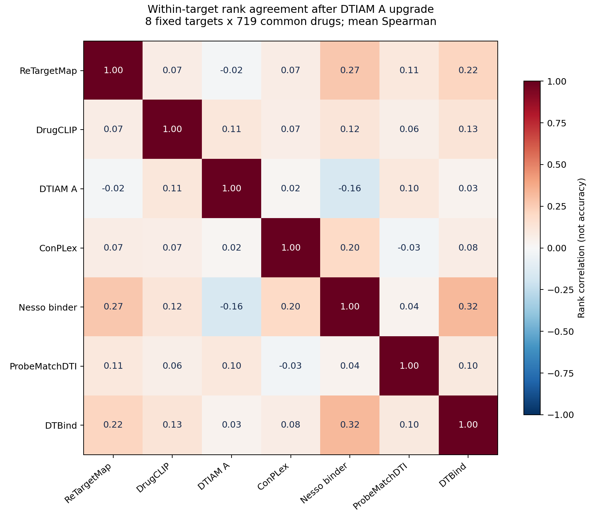

# 亲和与DTI模型为什么分歧大：近期论文与本项目复核

调研截止：2026-09-18。网站DTIAM口径为已上线的九月加强版A，`dtiam_a_kdki_inactive_20260917`。

**判断：这种程度的分歧值得警惕。“模型目标不同”只能解释一部分，不能替代对选择性、泛化和实现正确性的检验。文献已系统展示：亲和/DTI模型可能在公开测试中得到高分，却依赖分子相似性、靶点标签先验、数据重叠或理想结构输入；这些优势不一定迁移到真实目录里的逐靶点、逐药物推荐。我们已经确认分歧及若干可靠性问题，但尚未通过控制实验确定每个原因在本项目中占多大比例。**

本次重点阅读9篇2025—2026年正式发表论文，另核查1篇2026年预印本及CleanSplit补遗。没有发现直接在同一条件下比较我们这七个部署版本、720×384目录的公开论文；以下是相关问题的系统研究与我们自己的实测连接，不把外部研究当成本项目根因已被证明。

## 1. 用户的直觉哪里成立

对同一蛋白构建体、同一分子状态和同一实验条件，模型希望逼近的真实结合行为有共同基础。若两模型都能准确恢复同一真实亲和排序，它们应有相当一致性。不同模型并不存在“可以任意相反却都非常准确”的豁免。

一个数学例子：若两个预测排序与同一真实排序的Spearman都为0.9，则它们彼此的相关性至少为0.62。一般下界为 `ab − sqrt((1−a²)(1−b²))`，来自三个标准化秩向量的相关矩阵约束。因此，长期接近零相关不支持“它们都是全目录高精度亲和排序器”的解释。

但这有两个边界：

- 二分类AP高，不等于与真实连续亲和排序的Spearman高。把阳性放在阴性前面，并不要求把所有阳性或所有阴性内部排准。
- Top10不同也不必然有一方全错：若一个靶点有很多真实结合药物，两个不同Top10可能都有价值。需要实验标签判断，而不能把一致性直接当准确率。

## 2. 最相关的近期论文

### 2.1 蛋白输入可能没有真正发挥应有作用

**All That Glitters Is Not Gold: Importance of Rigorous Evaluation of Proteochemometric Models**，JCIM，2025-09-03在线发表。作者在激酶任务中比较划分、平衡和表征，并做蛋白/分子嵌入置换；蛋白嵌入的增益有限，划分和类别不平衡更显著。它支持我们检验模型是否真正利用了蛋白—分子双方信息，而非仅凭加入ESM嵌入就认定学到了结合选择性。研究限于其激酶数据与模型，不能据此断言所有蛋白编码器无效。[论文](https://doi.org/10.1021/acs.jcim.5c00395)、[作者代码](https://github.com/isayevlab/pcm_glitter)。

### 2.2 相同总体正负比例，也可能有不同程度的靶点捷径

**Semi-inductive dataset construction and framework optimization for practical drug target interaction prediction with ScopeDTI**，Nature Communications，2025-12-13。其BindingDB控制实验使两组数据总体类别比例和样本量接近，却分别加强、减弱每靶点标签偏斜，得到明显不同的AUROC。这说明“总量大”“总体正负平衡”不足以保障公平评估；必须看每个靶点内的标签与采样。作者提出的新模型也需外部验证。[论文](https://doi.org/10.1038/s41467-025-66311-9)，重点看Fig. 3B。

**TAPB: an interventional debiasing framework for alleviating target prior bias in drug-target interaction prediction**，Nature Communications，2025-12-02。通过替换一侧输入和反向构造先验倾向数据，展示BioSNAP、BindingDB版本中的靶点标签先验会驱动预测。对我们的启发是直接审计单实体先验；论文特定的随机化与因果模型假设不能原样视为我们的最佳训练方案。[论文](https://doi.org/10.1038/s41467-025-66915-1)、[代码](https://github.com/GaomingL1n/TAPB)。

### 2.3 公开高分可能部分来自重复与相似样本

**Resolving data bias improves generalization in binding affinity prediction**，Nature Machine Intelligence，2025-10-21。CleanSplit清理PDBbind与CASF间重叠和训练冗余后，一些模型成绩明显下降；未过滤时去掉蛋白输入的GEMS仍可获得有竞争力的结果。重点是区分相似案例插值和新配对泛化，不能把CASF现象直接归到我们的BindingDB模型。[论文](https://doi.org/10.1038/s42256-025-01124-5)。

已核查2026-01-27的[Addendum](https://www.nature.com/articles/s42256-025-01174-9.pdf)：主要补充对相关Leak Proof PDBBind工作的认可及方法差异，不是撤回上述实验结果。

**Auditing widely used biomolecular benchmarks reveals systematic data inconsistencies**，Chemical Science，2026-07-22在线发表，PMC另列8月收录信息。审计51个基准配置，并通过噪声注入、固定预测下重采样测试组成，展示污染、标签冲突与样本构成可以改变指标和模型名次。相似骨架本身不自动等于错误或泄漏；关键是评估宣称的是近邻插值还是新化学空间泛化。[论文](https://doi.org/10.1039/d6sc01799a)、[审计工具](https://github.com/sieber-lab/benchaudit)。

### 2.4 晶体结构成绩与部署结构成绩有差距

**Robustness of Protein–Ligand Binding Affinity Prediction Models to Docked and Predicted Structures**，JCIM，2026-06-23。在CASF-2016上比较5种可复现回归模型的晶体、对接和AF3共折叠输入，计算结构总体弱于晶体输入；共折叠在部分模型上优于向apo受体刚性对接，多姿势平均也不总有益。研究对象均为已有结合复合物，不能证明这些回归器能识别真正不结合的配对。[论文](https://doi.org/10.1021/acs.jcim.6c00592)、[代码](https://github.com/WoldringLabMSU/PLBAP_Robustness)。

### 2.5 下载了权重，也可能没有复现论文中的完整流程

**Critical Artifacts Improve Reproducibility of Protein–Ligand Binding Affinity Prediction Models on CASF-2016**，JCIM，2026-06-24。审计50个2021—2024年模型，17个满足其可运行标准，其中9个重现了原报告PCC的统计范围；问题包括权重不明确、预处理和依赖差异。其结果受单研究者复现流程与硬件条件限制，不能当成对所有未复现模型的最终否定。[论文](https://doi.org/10.1021/acs.jcim.6c01192)。

### 2.6 模型多不等于筛选更好，融合必须按预算验证

**Beyond the Score: Fixed-Budget Benchmarking of Virtual Screening Integration Strategies for Decision-Centric Drug Discovery**，IJMS，2026-08-21。比较5靶点、20种固定预算策略；在该设置中复杂组合未必优于单一QSAR或简单双方法融合。其阴性主要是生成decoy、对接未作靶点专项优化，所以不能把高命中数字外推到我们明确失活或新机制实验。[论文](https://doi.org/10.3390/ijms27167497)。

**Data driven selection of consensus docking pipelines for structure based hit identification**，npj Drug Discovery，2026-09-02。用各靶点约200个已知活性化合物选择对接、评分与融合流程，EGFR和ECF-T选出的方案不同；支持按任务验证增益。仅两靶点且组合搜索多，不能证明存在通用最优融合；文中Boltz-2比较写的是confidence score，也不能据此判定其全部亲和输出能力。[论文](https://doi.org/10.1038/s44386-026-00063-4)。

补充：2026年6月预印本[Identifying and Addressing Systematic Data Leakage in Protein-Ligand Affinity Benchmarks](https://doi.org/10.64898/2026.06.29.735309)讨论同源靶点活性镜像和按分子新颖度分层。尚不能当作同行评审定论；其中所谓ligand-only基线还包含学习的靶点索引及未见靶点近邻映射，不宜描述成“完全不使用任何靶点信息”。

## 3. 为什么会同时出现“论文高分”和“推荐分歧”

以下是结合文献的解释框架，尚非本项目的因果分解。

### 3.1 全局指标可能主要奖励实体先验

可以把预测概念性拆成：

`配对分数 = 分子的总体倾向 + 靶点的总体倾向 + 配对特异性 + 误差`

固定靶点给药物排序时，靶点常数会抵消，分子倾向仍可能左右结果；固定药物给靶点排序时则相反。我们真正需要知道的是：同一个药物为什么结合蛋白甲却不结合同家族蛋白乙，以及相近分子为何在同一靶点上活性不同。

**纯数学示例，不是本项目结果：** 两个靶点各测100药物，甲90阳性/10阴性，乙10阳性/90阴性。一个完全忽略药物、只给甲高分乙低分的模型，全局AUROC可达0.90、AP可达0.86；但在每个靶点内部，所有药物同分，完全没有选择能力。ScopeDTI和TAPB说明这类风险值得实际检验。

也不能反向推断“有靶点先验就一定错”：真实多靶点药物与可成药性差异客观存在。需要同条件阳性/失活数据和单实体基线，辨别有用先验与替代了配对识别的捷径。

### 3.2 稀疏的测量矩阵约束不了完整矩阵

数据库大量记录来自局部药物系列、少数热门靶点和不同实验室。即使测量很多，同一分子被系统测过大量靶点的完整面板仍可能不足。多个模型都能拟合已测小区域，却对未测区域作出完全不同的外推。

已批准药物再利用尤其要求跨原靶点、跨家族的选择性；“已批准”不意味着它与所有新靶点的配对都接近训练分布。增加重复近邻数据与增加覆盖新机制、困难失活的独立信息不是一回事。

### 3.3 终点相近，不等于标签完全相同

直接结合Kd、抑制Ki、IC50、细胞EC50与数据库关系标签有联系，但实验条件、功能机制和阈值不同，不能自动互换。即使都叫二分类，正负定义、未知关系如何处理、难负样本比例也会改变决策边界。

特别是“随机配对没有收录关系”不等于“实验明确失活”。若模型只学会区分阳性和容易的合成负例，未必能区分阳性和结构很近的实测失活分子。是否存在这种问题必须逐模型核对训练来源，不能臆测ProbeMatch等未完整公开的负样本生成过程。

当前七通道也并非统一Kd回归：ReTargetMap为方向排序logit，DrugCLIP为口袋检索相似度，DTIAM A为Kd/Ki与明确失活分类，ConPLex为表征匹配，ProbeMatch为DTI分类，DTBind当前用occurrence分支；Nesso当前用binder分类，另有连续IC50头。Nesso官方明确区分这些输出：[输出定义](https://github.com/recursionpharma/nesso/blob/main/docs/prediction.md)。

**这些差异解释了部分分歧，但没有证明每个模型对实验问题都同样有效。** 实验需要直接结合，就应按直接结合及相应失活证据评价各通道。

### 3.4 前10名会放大误差，校准不会自动救回排序

720药物中选10个，只取约1.4%的极端尾部。临近候选分数差小、模型误差大或概率饱和时，前10名可能对轻微扰动敏感。因此同时看全排名相关、Top10/20/50与命中富集更稳妥。

不过，本项目不只是Top10不重合，整体秩相关也偏低，不能完全用“前10名敏感”解释。严格单调变换不会改变秩；把分数统一到0—1或调整概率校准可以改善置信解释，但不会修复已有的排序颠倒。有限精度饱和产生的并列需另行处理。

## 4. 换成DTIAM A后，本项目实际是什么情况

### 4.1 固定相同目录复核，分歧仍在

为了隔离DTIAM升级影响，本次沿用2026-09-17冻结快照的精确配对，仅替换DTIAM；其他六通道逐元素一致检查通过。不是今天后台覆盖总量，也不是SPR384内排名。

共同8靶点：AR、FKBP1A、COMT、MIF、CA7、CA1、PLA2G2A、MMP7；每靶点719个共同药物，共5,752对。靶点内ReTargetMap使用反向输出；给药物排靶点使用正向输出。Spearman采用平均并列秩，Top10另导出并列随机打破的期望交集。

| 与ReTargetMap比较 | 平均Spearman | 每靶点Top10平均重合数 |
|---|---:|---:|
| Nesso binder | 0.268 | 2.500 |
| DTBind occurrence | 0.218 | 1.250 |
| ProbeMatchDTI | 0.106 | 0.750 |
| DrugCLIP | 0.073 | 0.500 |
| ConPLex | 0.072 | 0.875 |
| **DTIAM九月A** | **−0.018** | **0.625** |

从719个独立随机选10个，期望交集是0.139个；高于这个参照不等于预测已可靠。8靶点偏向早完成、较短蛋白，不能代表全384靶点。



扩大到五个全覆盖模型共有的720药×382靶点（275,040对），DTIAM A与ReTargetMap：

| 查询方式 | 等权查询数 | 平均Spearman | Top10平均交集 |
|---|---:|---:|---:|
| 固定靶点排720药物 | 382 | 0.002 | 0.764 |
| 固定药物排382靶点 | 720 | 0.248 | 1.906 |

因此弱一致性不仅发生在8个早完成靶点；两个推荐方向的行为也不同。相关性并不告诉我们哪一方正确。

### 4.2 高AP为什么还不够

仍用原固定378个共同实测标签（103阳性、275阴性，阳性率0.2725），并单列其中141个按既有身份审计判定在我们A/B训练和验证中都未见的关系（33阳性、108阴性，阳性率0.2340）：

| 模型/版本 | 全378 AP | A/B关系未见141 AP |
|---|---:|---:|
| DTIAM历史版 | 0.4152 | 0.4402 |
| **DTIAM九月A** | **0.7837** | **0.4524** |
| ReTargetMap预设正向 | 0.7069 | 0.6561 |
| Nesso binder | 0.7656 | 0.7726 |
| ConPLex | 0.4660 | 0.4166 |
| DrugCLIP | 0.4154 | 0.3170 |
| DTBind occurrence | 0.4013 | 0.3914 |
| ProbeMatchDTI | 0.3171 | 0.3337 |

需要同时保留四点解释：

1. 新A在相同378对上的改进是真实计算结果，不能继续把历史版低分贴给它。
2. 新A在A/B关系未见141对上比历史版AP高约0.0122；这比在全378上的差异小得多，值得优先审计记忆、近邻和适用范围。
3. 378与141样本组成、阳性比例和难度不同，不能把0.7837→0.4524当成严格控制下的“泄漏贡献”。没有给这0.0122做显著性胜出声明。
4. “A/B关系未见”不等于新分子、新靶点，也不等于所有公共权重未见。Nesso等公共训练重叠仍不明，不能用该列宣布公平外部冠军。此面板已多次查看，也不是新的独立测试。

进一步按实际查询方向评价，在378面板中只保留同时有阳性/阴性的查询：

| 模型 | 给靶点排药物：36查询、234有标签对，宏AP | 给药物排靶点：18查询、289有标签对，宏AP |
|---|---:|---:|
| DTIAM A | 0.8499 | 0.8192 |
| ReTargetMap对应方向 | 0.7848 | 0.9063 |
| Nesso binder | 0.8244 | 0.8290 |

这说明A并非毫无查询内能力；也说明不能只凭混池AP判断两种推荐任务。两列不是完整目录实测，小查询及阳性/阴性筛选会影响宏AP，不能外推为Top10命中率。

### 4.3 哪些问题已有证据，哪些仍是假设

| 判断 | 本项目证据状态 |
|---|---|
| 统一身份、分母与排序方向后仍有分歧 | 已确认；见本次CSV |
| 分数接近1不等于实验命中率接近100% | 已确认：固定378中，ProbeMatch≥0.99有155对、53阳性；DTBind≥0.99有120对、42阳性。这里只描述当前标签面板 |
| 同一Nesso模型的binder与连续亲和头不可直接互换 | 已确认：固定8靶点中7个的两头秩相关为负；输出符号已核对；需要真值决定各自适用性 |
| 长蛋白截断解释了全部共同集合分歧 | 不支持：这8蛋白108—920残基；更大全目录仍应单列截断分析 |
| 只是分数尺度不同 | 不支持：Spearman与TopK不依赖严格单调尺度变换 |
| 我们所有模型都主要靠蛋白/药物先验 | 未证明；需要单实体、置换和选择性实验 |
| 公共模型失败主要因为随机负样本 | 未证明；部分处理后训练数据不可得 |
| 已完全排除实现/输入错误 | 未达到：已有适配器与检查点重放仅覆盖已检查路径，不等于复现全部论文基准 |

前次审计已经核对ProbeMatch适配器、DTBind输出重复Sigmoid、Nesso输出定义等。DTBind重复Sigmoid本身是单调变换，不会造成排序颠倒。固定5,752对中6条Nesso结构置信标志异常，排除后也未改变总体低一致性结论。[本地详细记录](BIOMASTER_SEVEN_MODEL_AGREEMENT_20260917_ZH.md)。

## 5. 对我们最有价值的下一步

优先做能判定原因的实验，再决定扩大模型或改架构：

| 优先级 | 审计/比较 | 它回答什么 |
|---|---|---|
| 1 | 同数据、同划分训练分子单侧、蛋白单侧、分子/靶点频次先验、化学近邻基线；权重与超参数在验证集确定 | 双方交互建模到底比捷径多带来多少信息 |
| 1 | 保持真实嵌入边际分布的置换；分别在靶点家族内/家族间错配；配合上述重训消融 | 模型是否实质依赖正确配对；单次置换敏感不能证明理解物理，完全随机向量也可能只测到分布外异常 |
| 1 | 从现有数据挑同药多靶、同靶近似药物、同实验条件下阳性/明确失活相反的选择性面板 | 是否真能识别我们需要的新靶点选择性与活性悬崖 |
| 2 | 按Kd、Ki、功能终点及assay/document分层；时间、分子骨架、蛋白家族与双侧未见划分并列报告 | 终点混用、近邻插值、序列近邻还是跨域泛化在驱动成绩 |
| 2 | 双向查询宏AP、固定TopK命中/EF、明确失活误报；记录查询大小、阳性比例、置信区间 | 相同实验资源下哪个模型真正多找到阳性，而非只提升大池总体指标 |
| 2 | 官方案例/基准重放，并追踪构建体、口袋、质子化、截断、失败与分数饱和 | 科学局限与部署错误各占多少 |
| 3 | 在验证集比较单强模型、验证加权融合、保守交集与互补探索，再用冻结测试确认 | 新增模型是否有可测的增益；相关错误不能当独立投票 |

不建议仅因数据不平衡直接恢复每靶点150条硬截断。先比较靶点/assay分层采样与损失加权，保留明确失活和稀有化学系列；验证结果决定采样强度。也不建议通过删除困难测试样本或改分母让七模型看起来更一致。

正在进行的SPR384可提供真实前瞻性反馈：在揭盲前固定各模型版本、分数与解释；回收实验条件和有效/无效检测状态后，比较模型在这384内的命中富集与分歧分层。由于384由原流程选出，它不能公平估计新模型在全720×384空间中的召回率，也无法判断未被实验覆盖的新模型独有TopK。若后续有额外实验预算，可预先设定少量各模型独有高分及随机参照来补齐选择偏差，而不是先看结果再挑有利样本。

**当前更适合的定位：多个有不同适用范围的配对筛选模型。现有证据支持继续利用其中的排序信号，但尚不支持把任何一个通道当作全目录可信的连续亲和测量仪，也不支持七模型简单多数票。最应优先建立的是“配对特异性是否超过单实体与近邻基线”的证据。**

## 6. 本次产物与复现

- [完整一致性汇总](../outputs/model_disagreement_literature_20260918/AGREEMENT_SUMMARY.csv)、[逐查询比较](../outputs/model_disagreement_literature_20260918/PER_QUERY_AGREEMENT.csv)。
- [固定378及141实测标签成绩](../outputs/model_disagreement_literature_20260918/SAME_LABEL_METRICS.csv)、[双向宏AP](../outputs/model_disagreement_literature_20260918/QUERY_LABEL_METRICS.csv)。
- [固定七模型配对分数](../outputs/model_disagreement_literature_20260918/SEVEN_FIXED_SCORES_WITH_DTIAM_A.csv.gz)、[输入哈希和范围检查](../outputs/model_disagreement_literature_20260918/AUDIT_CHECK.json)。
- [分析脚本](../scripts/audit_model_disagreement_20260918.py)。本次只做文献调研与已有分数分析，不重训、不更改生产排名或SPR交付名单。

```bash
OPENBLAS_NUM_THREADS=2 OMP_NUM_THREADS=2 python scripts/audit_model_disagreement_20260918.py
```
