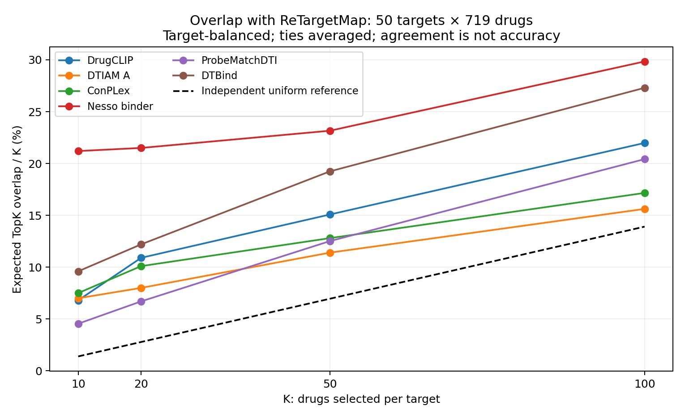

# 七模型结果再分析：有效信号、排名分歧与外推边界

快照：2026-09-20 01:47:20 UTC / 北京时间09:47:20。承接[昨日架构审计](BIOMASTER_SEVEN_MODEL_ARCHITECTURE_AUDIT_20260919_ZH.md)。本轮使用新增目录评分及既有标签做探索性分析，未新增训练、未更换生产评分，也没有新增SPR实测结果。

**判断：当前更值得研究的是“已测区域共享多少有效信号，未测区域的推荐为何不稳定”，而不仅是“哪个架构导致低相关”。新增结果收窄了昨日的两个解释：ConPLex零分没有进入Top10；Nesso两头在高binder区域恢复正相关。低目录相关仍值得重视，但需要结合输出适用范围、实体偏好和真实标签理解。**

## 1. 新增计算是否改变了现象

| 项目 | 本次快照 |
|---|---:|
| 核心目录 | 720×384＝276,480对 |
| ReTargetMap、DTIAM A、ConPLex、ProbeMatch | 各276,480对，100% |
| DrugCLIP | 275,040对，99.48% |
| DTBind | 169,400对，61.27%；235靶点完整 |
| Nesso | 91,147对，32.97%；125靶点各719药完整 |
| 七模型都有分数 | 37,285对 |
| 完整共同排名矩阵 | **50靶点×719药＝35,950对** |

共同范围从昨日37靶点扩大到50靶点；最长仍为920残基，依旧偏向先完成且输入可用的对象，不是随机代表性样本。Nesso缺quinidine、DTBind现有输入最多303靶点的限制仍在。

固定靶点排列719药，ReTargetMap与其他模型的平均Spearman分别为：DTIAM A −0.026、ConPLex 0.010、DrugCLIP 0.081、ProbeMatch 0.095、DTBind 0.180、Nesso 0.232。扩大覆盖后，弱一致性仍存在。模型与原已存配对分数没有变化，均值变化来自新增查询组成。

## 2. 前十不同，只是第十和第十一互换吗

本轮计算Top10/20/50/100重合，并追踪一个模型的Top10在另一个模型中的位置。所有比较使用相同719药，ReTargetMap采用靶点排药物对应的反向头；并列边界使用随机打破的期望权重。

| 比较 | Top10平均交集 | Top100平均交集 | 我们Top10进入对方Top100 | 我们Top10落入对方后半区 |
|---|---:|---:|---:|---:|
| ReTargetMap—DTIAM A | 0.70 / 10 | 15.62 / 100 | 27.2% | 38.6% |
| ReTargetMap—ConPLex | 0.75 / 10 | 17.16 / 100 | 26.8% | 44.9% |
| ReTargetMap—DrugCLIP | 0.68 / 10 | 21.98 / 100 | 27.6% | 36.4% |
| ReTargetMap—ProbeMatch | 0.45 / 10 | 20.42 / 100 | 30.8% | 25.4% |
| ReTargetMap—DTBind | 0.96 / 10 | 27.30 / 100 | 40.4% | 24.6% |
| ReTargetMap—Nesso | 2.12 / 10 | 29.84 / 100 | 52.6% | 22.0% |

反向看，DTIAM A的Top10进入我们Top100的比例为24.6%，落入我们后半区的比例为43.2%。因此分歧并非只发生在Top10边缘，部分优先级差异很大。

Top100的独立均匀随机交集期望为100²/719＝13.91。ReTargetMap—DTIAM的15.62只是略高于这一简单参照；这个参照不保持实体/家族偏好，不能用作显著性判断，也不代表实际命中率。后半区定义为Top359之外，边界同分做期望分配。

## 3. ConPLex：计算机制成立，但解释范围要收窄

新矩阵中有**11,200对零分，占31.15%**。昨日已经用权重和特征复现：ReLU后两侧正值维度不重叠，导致余弦为零。今天进一步发现：

- **50个靶点都没有零分进入ConPLex的Top10**；最低的Top10截断分数仍为0.1385。
- 仅在ConPLex非零配对中重新计算，其与ReTargetMap的平均相关由0.010变为0.049，仍然很低；每靶点平均剩495药。
- 昨日7药在共同37靶点上全零，扩大到50靶点后，没有药物在全部50靶点上恒定。原分数未变，新增靶点提供了非零结果。

**零分机制可以解释后段并列及部分秩分辨率损失，不能直接解释主要Top10分歧。** 非零子集是按ConPLex自身输出选择的，相关变化也不能当成修复后性能。零分不自动等于实现故障或错误生物学判断；仍须标签和匹配训练对照。

## 4. Nesso：全目录负相关掩盖了不同评分区域

保持官方输出方向：binder越高越优先；连续输出转换为`pIC50=6−affinity_pred_value`，同样越高越强。以下是每靶点等权平均。分层依据模型输出定义，分析是在既有结果已被查看后开展的探索，不是经过验证的生产筛选规则。

| 比较区域 | 配对数 | 有效靶点数 | 两头平均Spearman | 负相关靶点数 |
|---|---:|---:|---:|---:|
| 全共同目录 | 35,950 | 50 | **−0.096** | 39 |
| binder < 0.5 | 32,617 | 50 | −0.179 | 41 |
| binder ≥ 0.5 | 3,333 | 50 | **+0.320** | 3 |
| 每靶点binder前50药 | 2,500 | 50 | **+0.344** | **0** |

更严格的binder≥0.8分层共有595对，只有16靶点各自至少10药可进入相关均值；这16靶点合计424对，平均相关0.471。其余查询未被偷偷计为零相关，不能将这一均值当成全部50靶点结果。

因此，**“两头在整个目录中负相关”不能扩展为“两头在所有候选区域都互相反对”。** 结果与分类负责区分可能结合、回归在更有限范围内细排这一使用假设相容，但本轮没有证明该训练机制，也没有验证二阶段筛选能增加命中。按一个输出条件化会改变分布；0.5不是已校准的实际结合概率阈值。

在反复查看过的固定378实测标签面板上，两头混池AP为binder 0.7656、连续头0.7696；两头分数Spearman为+0.545，已标阳性103对内为+0.619。这些不是新增性能成绩，本轮复算与既有结果一致。标签面板有来源/选择及训练重叠风险，与35,950对目录的组成也不同，不能据此宣布任何头普遍更准确。

## 5. 低目录相关与已测正负区分，可以同时存在

为避免随意选择分类阈值，本轮比较“同一查询里，已标阳性是否排在已标阴性前面”。每个查询先统计全部阳性—阴性排序比较，再对查询等权平均。这评价**二分类标签约束的顺序**，不是连续亲和强弱；不同assay的可比性和标签误差仍是边界。

为了不把不同靶点集合混在一起，我将ReTargetMap—DTIAM比较固定在既有标签面板中同时有正负标签的**同一批36靶点**：

- 对这36靶点各自完整720药的排名，平均相关为**0.070**。
- 这36靶点的有标签部分只有**234对**，组成**318个阳性—阴性顺序比较**。这些比较共享药物和记录，不是318次独立实验。

| 在上述有标签部分的排序关系 | 查询等权比例 |
|---|---:|
| 两模型都把阳性排在阴性前 | **71.2%** |
| 只有ReTargetMap排对 | 8.7% |
| 只有DTIAM A排对 | 15.6% |
| 两模型都排反 | 4.5% |

两者该方向宏AUROC分别为0.799、0.868，与逐查询独立调用AUROC复算一致。固定药物排列靶点也存在类似区别：同一18药的完整384靶点平均相关仅0.101，其有标签部分共同排对比例为81.8%。

这说明两模型在已观测的正负区分上共享了相当一部分信号，同时对完整目录的推荐仍差异显著。它与“已测区域能拟合、未测区域外推欠约束”的解释相容；**训练记忆、近邻插值、标签面板选择和终点组成仍未被排除**，不能据此宣称已具备稳定的新机制发现能力。

同样不能把低相关本身当成有用互补。上述“仅某模型排对”的比例是在既有面板中观察到的，融合策略需要验证侧设计并在独立标签中确认；让两个模型投票也无法自动解决谁在具体新配对上正确。

## 6. 实体偏好是一个更具体的待检验因素

50靶点每个取Top10，共500个“药物—靶点推荐位置”。按期望权重计入边界并列：

| 模型 | Top10覆盖不同药物数 | 重复进入最多靶点Top10的药物 |
|---|---:|---|
| ReTargetMap | 188 | lacosamide：18个靶点 |
| DTIAM A | 114 | lorlatinib：38个；adagrasib：31个；elexacaftor：30个 |
| ConPLex | 159 | rucaparib：16个 |
| DrugCLIP | 246 | lusutrombopag：12个 |
| ProbeMatch | 146 | selumetinib：约34.7个位置权重，涉及35靶点 |
| DTBind | 202 | hydroxyurea：12个 |
| Nesso | 238 | clotrimazole：14个 |

这提示部分模型有更集中的药物偏好，可能影响“固定靶点找新药”的选择。多靶点性、靶点家族重复、训练覆盖及模型偏差都可能造成重复推荐；**这里没有证据判定上述药物在这些靶点上真结合或不结合，也不能把集中度等同于错误率**。

比直接判断“哪种架构更先进”更有针对性的实验，是固定数据与输入比较药物单侧、蛋白单侧、加性基线、近邻与完整配对模型；再在同家族选择性、同靶点近似分子阳性/明确失活面板上检查增量。当前ReTargetMap与DTIAM A训练成员及目标不同，不能只用这张集中度表归因于树模型。

## 7. 对系统与文章的下一步判断

当前证据优先支持以下工作顺序：

1. **保留原始输出，明确各输出的使用问题。** Nesso的binder与连续头分别评估，二阶段方案仅作为待验证假设；ConPLex记录并列范围，避免用后段并列直接解释Top10失败。
2. **把验证对象从“整体相关”推进到“同一配对哪里排对、哪里共同排错”。** 当前378/141面板已被多次查看；需要追踪原始assay/document、明确失活及训练近邻，建立来源独立且查询有足够正负测量的面板。
3. **优先分离实体先验、监督目标与架构。** 复用已有A/B多任务、多种子结果；同数据同输入比较单实体、树模型、全局融合和双线性交互。局部结构/交叉注意力作为单列输入及架构增量，避免同时更换数据和网络后无法归因。
4. **用独立标签检验固定预算决策。** 比较验证侧选定单模型、简单融合和互补选择；未知关系继续保持未知。现有SPR384只能评价被选中范围，未测的模型独有TopK仍缺真值；实验揭盲状态尚未确认，不称其为独立盲测。

对文章而言，更有力度的问题是：**哪些基准成绩能迁移到完整目录的双向选择性；哪些分歧来自输出适用范围，哪些预示真实错误；这些判断能否改善有限预算的选择？** 当前新增了可检验的线索，尚未完成受控因果实验或独立湿实验效用验证。

## 8. 产物与核验

- [最新覆盖](../outputs/model_interpretation_20260920/latest_results/SUMMARY.json)、[共同50靶点](../outputs/model_interpretation_20260920/latest_results/SHARED_TARGETS.csv)。
- [TopK重合](../outputs/model_interpretation_20260920/TOPK_OVERLAP_SUMMARY.csv)、[Top10落点](../outputs/model_interpretation_20260920/TOP10_LANDING_SUMMARY.csv)、[每药重复推荐](../outputs/model_interpretation_20260920/DRUG_TOP10_FREQUENCY.csv)。
- [ConPLex非零子集复核](../outputs/model_interpretation_20260920/CONPLEX_NONZERO_SENSITIVITY.csv)、[逐靶点零分与Top10](../outputs/model_interpretation_20260920/CONPLEX_ZERO_AND_TOP10.csv)。
- [Nesso分层](../outputs/model_interpretation_20260920/NESSO_HEAD_STRATA_SUMMARY.csv)、[原始双输出](../outputs/model_interpretation_20260920/NESSO_CATALOG_HEADS.csv.gz)。
- [标签顺序共同对错](../outputs/model_interpretation_20260920/LABELED_ORDER_AGREEMENT_SUMMARY.csv)、[同查询目录与标签对照](../outputs/model_interpretation_20260920/MATCHED_QUERY_SUMMARY.csv)、[固定标签成绩](../outputs/model_interpretation_20260920/FIXED_LABEL_METRICS.csv)。
- [分析脚本](../scripts/interpret_model_results_20260920.py)、[检查与限制](../outputs/model_interpretation_20260920/SUMMARY.json)。

核验包括固定50×719矩形、原Nesso分类分数一致、TopK权重和为K、共同对错及并列比例和为1、逐查询排序比较与独立AUROC一致、原378及141的AP复现到1e−12。图表是探索结果，未给出因果贡献、显著性优胜或独立实验命中率。
