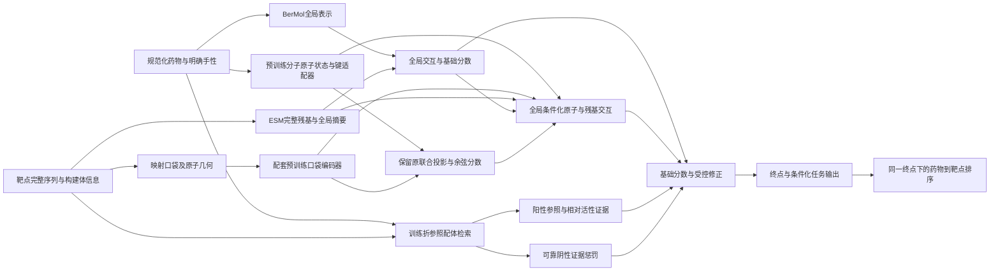

**BioMaster ODTI V4：新架构设计、模型组织与可用数据**

日期：2026-09-05。承接[当前架构与测试评估](BIOMASTER_CURRENT_ARCHITECTURE_TESTS_AND_STRENGTHENING_20260905_ZH.md)，本次交付是可实施的架构规格、配置、现有数据索引和特征补建队列。模型名称中的ODTI V4与旧物理筛选`current_pipeline_v4`无关。

**设计决策：以公共预训练的分子、蛋白与口袋表示作为能力起点，建立保留全局信息的原子—残基交互主干，再通过有明确方向约束的参照配体证据学习选择性。训练与选模直接面向每个药物的完整候选靶点列表。**

原设计阶段已生成分子、靶点、配体预训练缓存映射、口袋几何队列、历史关系来源表、BindingDB逐测量表和KIRHub功能表。随后已完成[首轮R1训练与统一测试](BIOMASTER_ODTI_V4_R1_TRAIN_TEST_20260905_ZH.md)：全量可用BerMol、完整ESM2均值、全局交互和有符号证据已实现并训练9次，但结果未达到升级目标。以下仍是完整V4的设计规格；DrugCLIP几何、原子—残基交互、端点头和新确认性切分尚未实现。[本轮实验配置](../configs/biomaster_odti_v4_r1_development.yaml)单独记录实际启用范围。

**一、需要改变的核心假设**

V3的失败不能只归因于网络规模或训练轮数。其分子编码与交互层从头训练，局部路径替换了全局分数，支持修正可自由外推，训练与选模又只约束稀疏实测列表。这些因素叠加，允许模型在实测AP接近0.95时，完整面板检索仍大幅落后近邻。

V4据此作五个取舍：

| 取舍 | 理由 | 如何证明有效 |
|---|---|---|
| 优先继承公共预训练编码器及其有效投影 | 当前通用药物/交互路径的知识来源较弱；本地已经具备权重 | 同数据比较冻结表示基础模型与当前Morgan主干 |
| 全局、序列局部和几何共同进入交互，基础分数持续保留 | V3局部替换切断了已有有效信息 | 与局部替换、只用全局的匹配消融比较 |
| 负支持独立形成扣分项 | XPO1探针确认单侧阴性支持可造成巨大正向修正 | 缺失/单侧支持与逐项分数分解测试 |
| 使用真实可比较的选择性与相对活性监督 | 关系总数远大于有效跨靶点排序查询数 | 同家族难靶点、密集功能面板和连续亲和力测试 |
| 数据、特征、支持库和分数链共用同一套实体与切分 | 旧索引跨版本变化；跨源标签能绕过单表留出 | 所有来源联合实体隔离；固定完整候选面板评价 |

更大的预训练模型提供了更好的候选起点，不保证下游任务获胜。BerMol在旧残差拼接筛选中也曾失败，因此本轮必须同时保留DTIAM的下游集成对照，不能只换输入向量后将小MLP默认视为强模型。

**二、总架构与分数流**



主推理路径无需先生成药物—受体结合姿态。姿态依赖的接触/亲和力教师可以后续加入有证据的训练子集，不作为每个候选pair都必须运行的模块。几百靶点规模下，第一版对指定面板全量打分；只有实测吞吐需要时才增加粗筛，并单独报告粗筛召回上限。

**1. 分子端：全局预训练＋几何原子状态＋手性补充**

全局通路首先使用本地BerMol768维表示。Morgan保留为训练折检索、对照和诊断输入，不再是通用模型唯一的药物知识来源。BerMol缓存缺口必须补齐或明确固定较小训练范围，不能让多数分子悄悄退回Morgan、少数分子使用预训练，从而将模态可用性与数据来源混在一起。

原子通路复用本地DrugCLIP配套Uni-Mol分子编码器的512维token状态，以及原128维联合投影。使用和检查点一致的原子词表、氢处理、几何归一化与输入顺序；另加入明确R/S、E/Z和邻居—键联合条件的两层适配器。每个原子token都须能回到规范化分子的原子索引。

需要注意一个表示问题：仅依赖原子类型与内部距离的几何输入可能对镜像构象不敏感，不能凭“用了3D”就保证能区分对映异构体。显式手性与键属性是必要补充，应做对映体、未指定手性和E/Z的输入区分检查。

初始每分子一个可复现构象；1对3构象作为独立消融。最大128重原子仅控制几何分支成本，超长分子显式走序列/全局通路，不截断成另一个分子。构象失败保留失败原因与原实体。

**2. 蛋白端：完整序列与多口袋共同保留**

首期复用ESM2-650M的1280维逐残基缓存。完整序列均值提供全局上下文，另以8个可训练摘要token读取全部有效残基，使无结构靶点仍有药物条件化的序列交互路径。长序列采用窗口拼接与残基映射，不能沿用截前1022残基后假称完整表示。

ESM-C600M作为蛋白表示替换对照，先保持其他组件固定。它已有428靶点的1152维池化缓存，但不等于843靶点的逐残基输入已经就绪。

几何通路优先使用按完整序列精确映射的P2Rank口袋，从原始受体提取口袋原子，送入与分子编码器配套的DrugCLIP口袋编码器。每个口袋的原子状态按映射聚合回残基，并与对应ESM残基状态融合。预测口袋、完整序列摘要、实验配体定义口袋保留不同来源标签；实验holo来源另行核对关系与时间边界。

每靶点最多3个去冗余口袋。口袋内部可使用相对距离和空间邻域；口袋质量、局部结构置信度、完整性进入可靠性权重。没有口袋不表示无结合能力。

**3. 公共检查点实际能够继承什么**

本次读取了本地DrugCLIP六折release的fold0权重键与形状：

| 子模块 | 权重张量元素数 | 用途 |
|---|---:|---|
| `mol_model.*` | 47,330,626 | 分子几何编码 |
| `pocket_model.*` | 47,318,152 | 口袋几何编码 |
| `mol_project.*` | 328,320 | 原分子联合投影 |
| `pocket_project.*` | 328,320 | 原口袋联合投影 |

整个检查点模型状态约99.94M元素，文件另含训练状态，不能用文件大小反推网络参数量。首期主要继承上述约95.3M元素的四条路径。代码中的距离头、分类头、融合头不能仅因存在权重就认定接受过有效训练；它们不自动成为V4的亲和力或接触教师。

保留官方联合余弦分数作为独立输出和受测基线，并将其作为新交互模块的输入。复用编码器时首先复现原分数，再开放新模块训练；不能重新随机初始化原投影后仍声称继承了原对齐空间。已有本地推理可作为回归参照，本次只读取配置与状态，没有新增模型推理。

选择本地配套DrugCLIP编码器，是基于权重和输入实现已经存在。ProFSA可作为替代口袋初始化，但本次尚未核验一份独立、兼容、可直接加载的ProFSA权重；不能将它当作已经接入的模块。公共方法与资源依据：[DrugCLIP官方项目](https://github.com/THU-ATOM/Drug-The-Whole-Genome)、[ProFSA官方实现](https://github.com/THU-ATOM/ProFSA)、[DTIAM官方实现](https://github.com/CSUBioGroup/DTIAM)。本地权重适用条款与代码条款需按对应release分别记录；本方案不涉及发布或商用部署。

**4. 交互主干：在原子—残基状态中持续保留全局上下文**

初始维度固定为：token宽256、8注意力头、pair通道64、3个更新block。每个真实口袋最多128个残基token；超过范围通过确定性空间邻域/分块处理，保留选择映射，不能将多个残基无记录地混成伪残基。

每层操作包括：

1. 从预训练原子、序列残基、口袋几何状态和全局pair上下文初始化或更新`z[i,j]`。
2. 沿原子轴、残基轴更新pair状态，使用相应分子键及口袋内部邻域作为偏置；避免构造昂贵的完整高阶复合物张量。
3. 从pair状态回写两侧token；每层继续注入全局上下文，保持药物整体、蛋白整体与局部匹配共同可见。
4. 从pair状态读出局部修正与位点证据，与全局基础分数合成。

坐标变换正确性是输入合同：分子和口袋独立平移/旋转不应改变无姿态分数。两个独立坐标系之间不能直接计算药物—残基距离。没有接触标签时，学习注意力仅称交互表征，不称已验证接触位置。

多口袋使用归一化质量加权聚合，例如：

\[
c(d,t)=\tau\log\sum_{k\in\mathcal P_t}\bar w_k\exp(c(d,p_k)/\tau),\qquad
\bar w_k\ge0,\ \sum_k\bar w_k=1.
\]

先按来源和残基集合去重再聚合，避免重复口袋改变权重。没有有效口袋时该分支严格不贡献分数。归一化减少口袋数量带来的机械加分，不保证新增低质量口袋绝对不影响排序，仍需质量消融。

**5. 支持集：从自由修正改为明确的证据分路**

建议初始分数形式为：

\[
s(d,t,e)=s_{\mathrm{base}}(d,t,e)
 +m_g\lambda_g\tanh\Delta_g(d,t,e)
 +E^+(d,t,e)-E^-(d,t,e).
\]

`e`表示终点/阈值上下文；`s_base`来自已经验证的全局模型。几何修正的最后一层从零初始化，初始幅度上限为1 logit，后续上限只能依据验证消融改变。训练初始阶段冻结基础模型保证新模块不改变基础分数；联合适配阶段基础模型可以继续学习，因此这不是“永不退化”的保证。

`E+`与`E−`均为有界非负贡献，初始各限制在2 logit以内，空集合贡献严格为0。非空分支用有界可微函数和前两轮从0增加的外部贡献系数实现初始基础分数回归；不使用“零初始化后平方”这种会使初始梯度也为0的输出。阴性支持只能进入`E−`，不进入基础头、阳性头或全局门控，避免借隐藏通道绕过符号约束。可靠性依据相似度、终点可比性、测量条件和证据冲突；没有阴性支持只代表惩罚为0，不是活性证据。符号限制也不保证全部未测候选评分正确，基础模型本身仍需要泛化验证。

阳性分支保留可解释的近邻相似性，并通过同靶点参照配体学习活性变化：

\[
\Delta f(d,r,t,e)=f(d,t,e)-f(r,t,e).
\]

同一共享势函数产生差值，可自然满足反对称性和差值循环一致性，减少自由三元头任意漂移。这里“势函数”仅指学习的评分函数，不解释为物理自由能。差值证据调节阳性贡献强度；定量差值监督只使用同终点、条件可比的测量，二元标签只提供顺序关系。

训练episode覆盖有正有负、只有正、只有负、无支持、去同骨架支持等条件。查询实体及其跨源别名全部从支持库排除。低相似度和冷靶点必须依靠独立的预训练交互路径取得增量，不能仅复制近邻然后宣称相互作用泛化成功。

**6. 任务头与跨靶点可比性**

输出分为三个语义明确的任务：

- 生化活性/结合证据：对规定终点或明确二元标签训练，输出可校准的活性分数。
- 定量亲和力：对Ki、Kd、IC50分别条件化，预测相应pActivity均值和尺度；不把混合终点均值称作Kd。
- 功能效应：对固定浓度抑制或其他有条件的读数建模，浓度、终点和构建体状态进入对应头。

如果某条观测具有明确阈值，定量分布可给出对应阈值下的概率；仅有“inactive”文本且未知测量阈值的记录，不能凭空生成pKd≤某阈值的监督。它可以保留为有来源的定性任务，或在条件不充分时仅登记。

最终同药排序使用相同终点与目标阈值。对当前367生化＋83功能的450主路由，不假定两个任务头的原始分数天然可比较；先输出分路排名，在有共同参照或实测对照后建立跨路由校准。结构或相似性分数不直接冒充亲和力。

**三、模型模块与张量合同**

以下是待实现的模块组织，不是声称这些Python文件已经存在：

```text
biomaster/odti_v4/
    assets.py          # 实体、来源、缓存版本及输入校验
    measurements.py    # 逐测量终点、单位、删失与时间快照
    encoders.py        # 公共编码器、原子/残基映射与冻结策略
    interaction.py     # 全局条件化pair更新与多口袋聚合
    evidence.py        # 有界正证据、阴性惩罚与参考差值
    heads.py           # 生化、定量亲和力与功能任务
    sampling.py        # 全覆盖、药物query与支持episode
    evaluation.py      # 固定面板、冷启动及分数分解
```

| 模块接口 | 输入 | 输出与约束 |
|---|---|---|
| 分子编码 | 规范化实体、原子/键、构象 | 全局`[D,768]`；冻结原子`[D,A,512]`；映射/手性/有效mask |
| 蛋白编码 | 完整序列、构建体、残基offset | 冻结残基`[T,L,1280]`；全局均值和8个摘要token |
| 口袋编码 | 口袋原子、内部几何、原子→残基映射 | 原子状态512维、原投影128维、质量与来源 |
| 交互 | 配对药物、靶点、有效口袋及全局上下文 | `z[B,K,A,R,64]`及局部修正；最多K=3；支持分块 |
| 参照证据 | 同训练快照的正负各≤16条支持及测量条件 | 正、负分量分别输出；禁止负支持进入正向通路 |
| 任务输出 | pair状态、终点、阈值、可用实验条件 | 分数、定量分布参数、功能预测和逐项分解 |

公共冻结token可以缓存；可训练投影与摘要只能在当前参数下计算。批内按药物/靶点去重编码并复用，跨优化步骤不复用过期的可训练特征。适配公共编码器上层时，需要改用原始输入或正确的层级缓存，不能继续对离线最终embedding声称端到端反传。

**四、训练算法与实验组织**

首期保留少量明确目标，避免同时加入大量未经验证的损失。配置起点是实测终点监督1.0、D→T排序1.0、同靶点参照顺序0.25；未知组合InfoNCE、接触辅助和教师蒸馏默认0。权重是可执行初值，不是已调优结论。

| 训练流 | 样本组织 | 学习内容 |
|---|---|---|
| 实测关系覆盖 | 每轮无放回遍历全部合格观测 | 通用表示及终点预测；保留单关系药物的训练机会 |
| 药物query | 同药不同靶点真实关系；最多32项；短query不重复填充 | 药物选择性，同家族难靶点优先但混入均匀实测负例 |
| 参照配体 | 同靶点、终点可比的已测配体 | 活性顺序及可识别的定量变化 |
| 功能面板 | KIRHub等保留浓度和构建体信息的实测列表 | 功能选择性；不与生化标签直接合并 |

每药归一化权重，避免测量多的药物支配训练。难例来自实测反例或有明确弱监督合同的数据；不能把所有未测候选设为0。

定量训练直接使用逐测量删失似然：精确值使用密度，`>`或`<`使用对应单侧CDF。`value_nM > x`转换到pActivity时方向变成`pActivity < 9−log10(x)`；重复测量的min/max是离散程度，不能直接当成删失上下界。数据表已保留这层区别。

训练分阶段进行：

1. **基础模型与编码器回归。** 复现公共编码/投影，补齐所选训练范围缓存，完成同数据DTIAM、近邻、PN和共享pair基线。
2. **固定编码器，训练新交互与证据模块。** 从零修正开始，单独验证局部路径、符号约束与缺失条件。完整验证面板逐轮评分。
3. **逐步适配上层。** 对投影、最后两层或adapter作受控消融；新模块初始学习率2e−4，解冻层1e−5，梯度裁剪1.0。
4. **终点专项与联合微调。** 在监督语义和拆分就绪后加入定量/功能流，检查是否损害一般药物检索。

预算起点为最多30轮，至少8轮后允许早停、patience=5，局部microbatch从8起做真实显存/吞吐测量。三种子固定为20260905、20260906、20260907。这些是建议配置，当前没有新的训练耗时或显存峰值成绩。

| 实验 | 唯一主要增量 | 判定 |
|---|---|---|
| R0 | 同数据的近邻、PN、DTIAM、DrugCLIP与当前系统 | 提供可靠参照，不只挑较弱神经基线 |
| R1 | 完整覆盖BerMol＋ESM的共享pair模型 | 预训练表示与下游学习器能否成立 |
| R2 | 配套预训练原子/口袋状态＋保留全局的交互 | 低相似度、同家族与冷靶点是否改善 |
| R3 | R2加入有界正负证据及参考差值 | 是否保留近邻优势并学出额外选择性 |
| R4 | R3逐步解冻公共编码器上层 | 增益是否值得新增训练成本 |
| R5 | R4加入定量与功能面板联合训练 | 连续活性及功能终点是否产生可复现增量 |

R2/R3另比较“局部替换/局部修正”“自由支持头/分路约束”“无参考差值/有参考差值”。不把模型、数据量、损失和训练曝光一次全部改变后只报告最终分数。

主开发指标为完整验证面板已知阳性AP，同时约束实测AP、Recall@20和低相似度层；Recall@20非劣容差初值0.01仅为待预注册建议。不同正例密度的AP分别报告，不能跨分母拼接。至少给出药物配对区间、家族分层和种子方差；三个种子不能弥补少量查询。

**五、本地数据盘点与本次实际整理结果**

本次以文件实际存在性、数组形状、CSV行数和精确实体映射为依据，生成[资产目录](../outputs/biomaster_odti_v4_plan_20260905/ASSET_CATALOG_V4.json)与[就绪度摘要](../outputs/biomaster_odti_v4_plan_20260905/DATA_READINESS_V4.json)。大文件引用原路径，不复制模型权重或原数据库；≤64MiB文件重新计算SHA256，大文件本轮记录大小/修改时间，历史hash另有来源，未冒充重新校验。

**1. 主体关系与候选扩容**

| 数据 | 本地实际规模 | V4角色与边界 |
|---|---:|---|
| ChEMBL37原始SQLite | 约30.48GB | 可回到activity、assay、document重建终点及时间快照 |
| 当前综合关系表 | 437,631行，含来源审计重复 | 来源与历史标签索引；不是等量独立逐测量 |
| V3去重二元关系 | 427,394行 | 开发回归；已有划分不能当成新确认性测试 |
| 当前分子与靶点索引 | 296,110分子、843完整序列实体 | 特征补建与旧资产复用的锚点 |
| BindingDB全量原文件 | 3,234,499原始记录，压缩包约593MB | 逐终点、来源、时间和构建体过滤的扩容来源 |
| BindingDB旧筛选候选池 | 670,697关系、475,725源InChIKey、2,522序列 | 有潜力扩容；旧去重基准不是当前综合表 |
| BindingDB高可信A0 | 28,797关系、20,081源InChIKey、984序列 | 优先定量训练候选，31,277逐测量已整理 |
| 当前已用BindingDB Ki/Kd | 9,778关系、10,880逐测量 | A0子集且已进入综合表，不能再作为新增独立数据叠加 |
| KIRHub扩展功能 | 30,973测量、92药物、345靶点 | 功能选择性开发，需完整嵌套折 |
| DAVIS-complete | 31,824测量、72药物、442构建体 | 保留删失与修饰信息的专项评价候选 |
| 旧DAVIS实体外部包 | 24,962关系 | 旧外部评估资产，需对当前多源训练重新查重 |
| W1湿实验输入 | 现有16行仍缺完整结果语义 | 不进入训练，不把待填模板当数据 |

BindingDB全量是原始记录计数，候选池与高可信子集是不同筛选后的关系计数，不能直接相加。DAVIS标准二手表30,056行、DAVIS-complete31,824行及旧非重叠特征包24,962行也不是三份独立测量，应按同一来源家族管理。

**2. 本次重新检查BindingDB与当前综合表的重叠**

| 候选池 | 总关系 | 当前精确关系匹配 | 尚无精确匹配 |
|---|---:|---:|---:|
| 高可信A0 | 28,797 | 12,585 | 16,212 |
| 全部旧筛选候选 | 670,697 | 83,362 | 587,335 |

这里使用源InChIKey＋完整序列SHA256精确匹配，尚未完成跨源规范化别名、文献/assay、盐型和测量重复排除。**16,212与587,335是待核查扩容候选数，不是已确认的新独立训练关系数。** 高可信子集中24,525条关系的靶点已在当前序列索引内；另有352个序列hash、10,760个源InChIKey尚未匹配当前索引，需要补身份解析与表示。这些是扩容子集的额外需求，不包含在当前843靶点的30条ESM补建队列中。

旧BindingDB筛选主要排除了早期86,674-pair集合，因此不能沿用旧“non-overlap”标志直接接入43.7万关系训练集。该复核已经落到[逐关系扩容审计](../outputs/biomaster_odti_v4_plan_20260905/BINDINGDB_PRIORITY_EXPANSION_AUDIT_V4.csv.gz)与[汇总表](../outputs/biomaster_odti_v4_plan_20260905/BINDINGDB_EXPANSION_COUNTS_V4.csv)。

**3. 预训练与局部输入覆盖**

| 资产 | 当前精确可用 | 缺口或限制 |
|---|---:|---|
| Morgan2048 | 296,110分子索引 | 作为旧检索/基线；手性需另保留 |
| BerMol768 | 62,679／296,110分子 | **233,431条补建队列**，不以不同源的行号互相替代 |
| MoLFormer768 | 61,985分子精确匹配 | 旧非异构SMILES表示，仅保留对照 |
| ESM2完整残基 | 813／843靶点 | **30条完整序列补建队列** |
| ESM-C池化 | 428／843靶点 | 额外415靶点及残基级输入未补齐 |
| P2Rank区域 | 462靶点、980个去冗余口袋 | 受体路径全部存在，仍需构建预训练几何编码器输入 |
| P2Rank与完整ESM交集 | 438靶点 | 这才是旧V3实际使用口袋token的交集 |
| 旧DrugCLIP几何输入 | 723分子/308口袋名义清单 | 实际成功推理722/307；需新范围映射，不能假称覆盖通用训练库 |

BerMol复用按完全相同的既有规范化SMILES保守匹配，合并官方、720药物和KIRHub缓存。无法精确匹配的同义结构也可能被列为缓存缺失；可以后续通过规范化证明等价再减少补建量，不能为提高覆盖率牺牲实体正确性。

843是当前训练/增强索引，495是V3二元面板，745是项目登记范围，450是主路由，384是冻结比较核心。后续模型输入可覆盖更大范围，但评价分母和支持库范围必须单独固定。

**4. 已生成的数据产品**

数据包位于[outputs/biomaster_odti_v4_plan_20260905](../outputs/biomaster_odti_v4_plan_20260905/)：

| 文件 | 本次实际完成的内容 |
|---|---|
| `CURRENT_MOLECULE_ASSETS_V4.csv.gz` | 296,110分子稳定内容键、历史索引、旧split、BerMol源数组/行号和MoLFormer映射 |
| `CURRENT_TARGET_ASSETS_V4.csv.gz` | 843序列内容键、长度、完整残基offset、ESM-C和口袋可用性 |
| `BERMOL_FEATURE_BUILD_QUEUE_V4.csv.gz` | 233,431个精确缓存缺失分子 |
| `ESM_RESIDUE_BUILD_QUEUE_V4.csv.gz` | 30个缺完整残基缓存的靶点及完整序列 |
| `POCKET_GEOMETRY_BUILD_QUEUE_V4.csv.gz` | 980个口袋的残基集合、受体路径、来源hash和待编码状态 |
| `LEGACY_RELATION_PROVENANCE_V4.csv.gz` | 437,631行来源、原记录位置、实体、旧标签、时间与终点字段；明确为聚合关系 |
| `BINDINGDB_PRIORITY_MEASUREMENTS_V4.csv.gz` | 31,277条逐测量，保留Ki/Kd/IC50等终点、单位、关系符号及来源；不自动生成阴性 |
| `KIRHUB_FUNCTIONAL_MEASUREMENTS_V4.csv.gz` | 30,973条功能测量、浓度、构建体和序列映射；剔除旧模型分数列 |
| `BINDINGDB_PRIORITY_EXPANSION_AUDIT_V4.csv.gz` | 高可信扩容关系对当前综合表的精确重叠审计 |
| `HISTORICAL_SPLIT_TARGET_COUNTS_V4.csv` | 旧V3各折、靶点、标签的关系数，仅供回归与数据设计 |
| `ASSET_CATALOG_V4.json` / `OUTPUT_MANIFEST_V4.json` | 原始输入目录、形状、行数、角色与输出hash |
| `PRETRAINED_BACKBONE_INSPECTION_V4.json` | 真实DrugCLIP检查点子模块及维度核查 |
| `RESOURCE_ESTIMATE_V4.json` | 确定性分子抽样与缓存容量估算 |

`BINDINGDB_PRIORITY_MEASUREMENTS`的记录ID包含来源文件hash前缀与原始行号，可定位原测量。该旧抽取表保留文献等来源，但没有完整assay条件，因此明确设置`quantitative_reference_delta_ready=false`；同终点或同DOI不能自动证明实验条件可比，定量参考差值仍需回查原始记录。KIRHub输出不携带旧模型logit、概率或图分数，防止它们混入实验标签和默认训练输入。

**六、数据组织原则与下一步构建任务**

训练数据应围绕以下实体与观测结构组织：

| 表 | 主键/关系 | 必须保留的语义 |
|---|---|---|
| molecule | 完整化学身份＋规范化版本 | 立体化学、来源别名、母体/盐型关系；缓存索引是局部地址 |
| target_construct | 序列hash＋构建体/修饰状态 | 同序列不必然同实验体系；突变、磷酸化和复合体分别记录 |
| measurement | source＋原activity/记录ID | endpoint、值、单位、`=/< />`、assay、浓度、文献时间、QC |
| pocket | 构建体＋结构版本＋残基集合 | 几何来源、映射、预测/实验口袋及可用时间 |
| feature | 实体＋模型revision＋预处理hash | 维度、mask、原子/残基映射、冻结层级 |
| split | 统一实体/骨架/同源组＋协议版本 | 所有监督来源共同服从划分，未知不是阴性 |
| support | split版本＋允许使用的测量集合 | 查询实体排除、终点兼容、可用时间和相似度 |

当前新生成的分子键以既有规范化SMILES内容hash为锚点，靶点键以完整序列为锚点；它们解决索引复用，但尚不代替完整跨源实体和构建体标准化。

| 顺序 | 构建任务 | 可复用输入 | 完成条件 |
|---|---|---|---|
| D0 | ChEMBL逐activity终点表与时间快照 | 本地30.48GB SQLite及当前靶点映射 | 先按原始记录截止日期过滤再聚合；保留删失和冲突来源 |
| D1 | 跨源化学实体、构建体及assay去重 | 本次分子/靶点索引、BDB逐测量、KIRHub | 相同实体不会绕过留出；旧源标签和新版标签可追溯 |
| D2 | 联合来源切分与完整候选验证面板 | D0/D1，既有骨架及同源信息 | 先冻结验证查询、候选和难度分层，再建支持库 |
| D3 | 分子与序列预训练补齐 | 233,431分子及30序列队列 | 所选训练范围覆盖完整，缓存有限值、维度、映射一致 |
| D4 | 几何输入和冻结token缓存 | 980口袋队列、原始受体、分子构象 | 词表/原子顺序/残基映射与官方编码器一致；原分数回归成立 |
| D5 | 同药选择性query与参考配体episode | 合格测量＋D2切分 | 同终点实测反例、所有来源排除query、缺失条件可训练 |
| D6 | 模型分阶段对照 | R0–R5配置和验证面板 | 组件收益、成本与完整分数链可以归因 |

D3的纯公共特征生成可以与D0/D1并行开展，不依赖标签；监督训练、支持库和教师构建则必须等切分确定。补建队列的历史split字段只是来源记录，不授权使用旧测试标签训练。

数据扩容优先使用高可信文献逐测量，再分层评估PubChem、专利等来源。来源重复的测量不能被当成独立证据反复加权；不同实验条件的冲突应保留并建模，不用全库平均掩盖。已有67万候选池可用于扩大监督，但需要来源分层权重和独立来源验证；并非所有候选都适合二元BCE。

DAVIS优先保留为外部/构建体选择性检验，不能一边并入共同训练、一边沿用其外部成绩。KIRHub明确作为功能开发数据，融合必须在每个外折中重新完成内层选模。S1–S5、旧V3的64药面板及既有时间查询均用于历史回归；新确认性留出尚未创建，不能通过重新命名旧测试获得独立性。

**七、计算与存储的可执行边界**

当前设备报告RTX4090、49,140MiB显存；本次整理后磁盘约81GiB可用。先离线提取公共编码器表示，再训练新交互，有利于将计算集中在任务适配。

对固定4096个分子的标签无关抽样，重原子均值32.85、95分位46，其中11个超过128原子。按该分布估算，296,110分子的单构象512维FP16变长原子缓存约9.28GiB；完整BerMol FP16池化缓存约0.424GiB。若全部填充到128原子，同一原子缓存约36.15GiB，三构象会超过目前可用磁盘，因此应采用变长分片和按需构象。

上述是容量估算，不含映射、图、索引和训练检查点，也不是实测吞吐。冻结缓存不保存全分子pair张量，训练只构建当前batch的pair状态；采用靶点预编码、批内去重、分块与混合精度，先测再调batch。

旧DrugCLIP运行脚本硬编码同时使用GPU0和GPU1，不能直接作为当前单卡V4数据队列入口。应复用其编码方法，改为单卡串行或明确资源调度。公共权重原样保存，V4单独存适配器/新模块，减少重复保存六折大文件。

**八、本轮完成状态与复现**

已完成：新架构选择与公式、张量接口、训练/消融方案、机器配置、本地预训练检查点核查、当前分子/靶点/关系索引、两类逐测量数据整理、BindingDB扩容精确重叠复核、特征补建队列和容量估算。

尚待下一轮模型构建完成：V4网络和训练器、公共编码器token适配、ChEMBL原始终点/时间重建、联合新切分及完整特征补齐。本次没有新模型成绩，也没有修改冻结生产合同。

复现数据整理：

```bash
python scripts/organize_biomaster_odti_v4_assets.py
```

脚本只读取现有输入并写独立V4规划数据包。它检查分子索引唯一性、靶点序列映射、完整残基offset、预训练缓存行号、非零有限表示、V3实体折一致性、测量正值与不等号转换，以及功能表不携带模型分数。执行结果和各产物hash见[输出manifest](../outputs/biomaster_odti_v4_plan_20260905/OUTPUT_MANIFEST_V4.json)。
