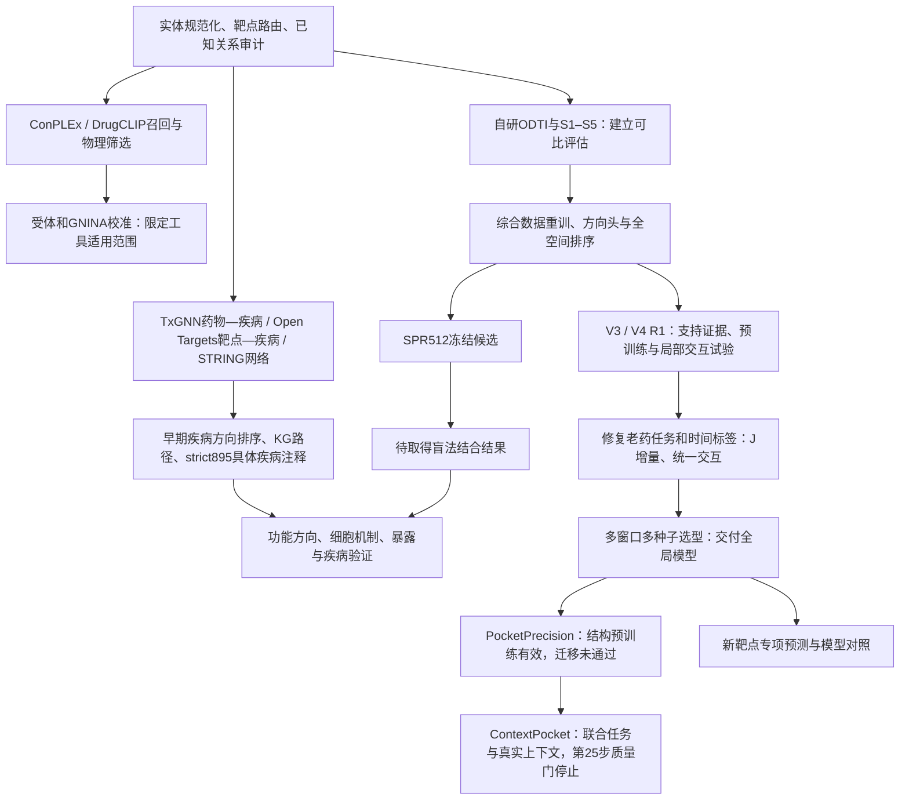

# BioMaster / ReTargetMap 各阶段路线与结果总梳理

下一阶段的项目判断、取舍和执行顺序见[项目决策与下一步建议](BIOMASTER_PROJECT_DECISIONS_AND_NEXT_STEPS_20260908_ZH.md)。

核对日期：2026-09-08。最新训练状态以当日07:58 UTC写入的运行记录为准。本文汇总本地阶段报告、交付清单、配置和运行结果，不重新训练或重选模型。历史结果沿用其原评测协议；最新ContextPocket状态已直接核对机器记录。

## 1. 现在走到了哪里

项目已经完成从实体与证据治理、外部模型筛选，到自研双向排序模型及独立推理交付的工程链路。现有证据支持部分老药检索能力，尚未完成“新结构模型稳定升级—盲法结合命中—功能机制—新用途”的验证闭环。

| 对象 | 当前身份 | 实际结果 |
|---|---|---|
| 9月1日冻结生产合同与历史独立排序系统 | 冻结评估、原候选选择的谱系 | 720×384完整评分；不能将后续模型的成绩覆盖到它上面 |
| TxGNN＋Open Targets＋STRING疾病机制线 | 曾参与疾病方向排序，后转为疾病/机制证据层；Open Targets另用于靶点准入审计 | 已完成药物—疾病推断、靶点—疾病补全、KG路径与历史候选注释；不属于当前selected神经主干 |
| 9月6日selected全局模型 | 最新已选定、独立打包交付的神经模型 | DrugCLIP＋Morgan＋ESM2，约124万参数；完成开发选型与回顾性回归 |
| 9月6–7日PocketPrecision | 已停止的结构研究候选 | 结构预训练有效；下游迁移收益未确认，原结构读出明显退化 |
| 9月8日ContextPocket正式工程 | 全量数据准备完成、训练触发质量门停止 | 25/2,532次更新；未完成首轮训练后完整排序评估；无晋级权重 |
| 9月4日SPR512 V2 | 已冻结的实验候选与对照方案 | 480个探索候选＋32个阳性对照；交付包未见KD或sensorgram结果 |
| LYVE1、SLC8A1、HGF专项 | 已完成三个模型的候选排名 | 属于新靶点外推，无完整结合标签，不能比较准确率 |

“最新交付神经模型”“原冻结生产系统”“当前研究架构”和“实验名单”是四种不同身份。架构实现和训练工程完成，不等于模型质量达标；实验清单冻结，也不等于实验已经命中。

## 2. 总路线及阶段转向

这是研究和交付路线的汇总，不表示后续每个版本都替代了前一版，也不表示已取得图中待完成阶段的结果。

## 3. 阶段一：实体、证据和物理筛选基础

**目标：** 明确哪些药、哪些蛋白、哪一种活性物种和实验体系可以比较，建立可追溯候选，而不是直接把全空间分数当作亲和力。

早期物理筛选线形成723个唯一模型配体结构、463个靶点、334,749个物理pair。历史v4完成3,000/3,000个Boltz输出和双样本姿势审计，经过final1000、review512到final384，形成169药、116靶点的交付包。该包是计算假说包；后续审计改变了候选口径，不能继续与9月SPR512并列为“当前最终结果”。

后续物理线更重视逐靶点校准：历史V7台账记录GNINA完成417个靶点的docking，349个满足评估条件，预注册四指标共识通过157个、强通过95个。实验holo与AlphaFold/P2Rank回退的通过率分别为54.5%和28.0%。同一台账记录DrugCLIP六折完成221,654个pair，形成30,000条结构发现队列；队列构建不能写成30,000条发现docking全部完成。

**得到的结论：** 受体状态、口袋和逐靶点正负校准决定结构分数能否使用。ConPLEx、DrugCLIP召回、Boltz姿势、GNINA和疾病证据分别回答不同问题，不能直接相加解释成真实结合概率。旧结构、文献、活性物种和实验可行性注释仍可按精确pair复用。

证据：[历史v4交付状态](RESULTS_STATUS_ZH.md)、[后续物理线审计与决策](FDA_OLD_DRUG_PROJECT_CURRENT_STATUS_AND_NEXT_DECISION_V7_ZH.md)。这两份是不同历史快照，数值不作为当前模型目录分母。

### 3.1 单独的TxGNN＋Open Targets疾病与机制路线

这条路线在前一版总览中被压缩得过多。它实际做过模型推断、疾病方向排序和候选级知识图谱解释，早期还直接参与候选总分；不能仅概括为“将来命中后才做的疾病注释”。

| 组成 | 本项目实际用途 | 输入输出层级 |
|---|---|---|
| TxGNN | 加载公共预训练模型，在知识图谱上运行indication推断 | 药物—疾病分数；不是指定药物—靶点的结合分数 |
| Open Targets疾病关联 | 获取疾病关联靶点及各候选靶点的具体疾病证据 | 靶点—疾病关联 |
| STRING与KG路径 | 补充靶点网络关联，生成候选解释路径 | 网络关联与路径证据 |
| CREEDS、靶点先验、文献与人工复核 | 将宽泛疾病方向细化为病种、机制和实验假说 | 药物—靶点—疾病候选表 |
| Open Targets靶点资产 | tractability、直接小分子先例和靶点类型审计 | 靶点空间与实验路线准入，仍属发现前基础工作 |

**A. 2026年5月癌症起步。** 原始元数据记录915个FDA药物中738个经保守名称精确匹配进入TxGNN图谱，177个未映射；针对cancer（MONDO_0004992）完成738行CPU推断，使用full_graph和既有TxGNNExplorer权重。这里是实际使用公共模型推断，未据此证明本项目重训过TxGNN。sigmoid后的indication score是模型输出，不是经本项目校准的临床疗效概率。

同阶段Open Targets在1,000蛋白筛选库中匹配cancer关联靶点992个、neoplasm关联靶点995个，共1,987行。两个疾病集合存在重叠，不能写成1,987个唯一靶点。

早期[Stage5合并实现](../scripts/merge_stage5_with_txgnn.py)规定：有TxGNN映射时，最终优先级＝0.80×OpenTargets/STRING原优先级＋0.20×TxGNN indication score；未映射保留原优先级。TxGNN的药物—疾病分数应用到该药的所有蛋白pair，同一疾病下不提供该药不同靶点之间的直接结合判别。这是历史启发式融合规则，不能当成当前selected模型的训练损失或评分公式，也没有在此核实到其独立预测性能增益。

证据：[TxGNN推断元数据](../data/processed/txgnn_drug_disease_scores.metadata.json)、[Open Targets早期元数据](../data/processed/opentargets_target_disease_scores.metadata.json)。

**B. 2026年6月多疾病方向与KG解释。** 6月5日生成的历史审计记录五大方向——肿瘤、感染、心血管、神经/精神、免疫/炎症——共50,000条方向Top候选；这不是50,000个唯一药靶pair。对应历史结构代表任务23,744个、完成23,707个。KG层生成28,774条解释路径；Top1000层汇总的3,921条候选记录中3,810条有路径，覆盖97.17%。这些是计算完成率和证据覆盖率，不是预测准确率或实验命中率。

仓库另保留[19方向TxGNN批量推断脚本](../scripts/run_txgnn_broad_19_inference.py)，设计为一次加载图与权重，再按疾病代理节点目录逐方向推断。本次未在其默认输出位置找到19方向合并CSV/元数据，因此只能确认实现保留，不能仅凭脚本名称宣称19方向全部推断已完成。后续strict895实际覆盖15方向，也不是19方向运行完整性的证明。

证据：[历史五方向与KG审计](archive/legacy_pre_v4/SOTA_COMPUTE_READINESS_2026_06_03.md)。

**C. strict895具体疾病落地与历史实验优先级。** 本地保留895条候选、134药、190靶点、15个方向的具体疾病注释。疾病证据分为CREEDS＋靶点先验373条、CREEDS具体疾病326条、靶点先验具体疾病89条、仅宽泛方向107条；这些属于注释证据分层。

Open Targets子疾病补全将261个候选疾病名称中的207个映射成功，869/895条候选有子疾病关联匹配，670条关联分数≥0.2、362条≥0.5。该轮每靶点获取前4,000个关联疾病，不能称无截断全疾病查询。

历史优先级复核覆盖895/895行，整理为873个唯一假说，生成Top96/192/384及严格新颖性34条清单；Top96由85个首轮优先和11个首轮/备选条目组成。这些是真实存在的历史候选交付，不是当前SPR512，也不是确认的新适应症。原始“跨大领域老药新用”等字段表示假说分类。

证据：[具体疾病注释摘要](../outputs/broad_mechanism_layer_v2/strict895_concrete_disease_completion/strict895_concrete_disease_completion_summary.json)、[Open Targets子疾病结果](../outputs/broad_mechanism_layer_v2/strict895_opentargets_child_disease/strict895_opentargets_child_disease_run_summary.json)、[历史实验优先级摘要](../outputs/broad_mechanism_layer_v2/strict895_final_wetlab_priority/strict895_final_wetlab_priority_summary.json)。

**D. 2026年7月全疾病补全与角色调整。** v4 Top3000对应215个唯一靶点，Open Targets 26.06 / API 26.6.3全部获取成功，得到231,148条靶点—疾病关联，3,000候选全部可关联疾病表。脚本和文件沿用final1000名称，但元数据的输入和实际候选行数均为3,000，不能按文件名误报成1,000。该轮分页无最大页数限制，与strict895前4,000条规则不同。

后续方法收束将TxGNN和疾病关联从结合发现主排序转为疾病/机制语境：先检验药靶结合假说，再据疾病、作用方向、组织和表达选择功能实验与新用途；Open Targets的靶点tractability与空间审计仍在发现前使用。现有疾病和路径资产可以复用，但不能用疾病关联反向证明药物结合该靶点，也不能让历史疾病加权总分替代当前老药→靶点模型。

证据：[215靶点全疾病补全摘要](../outputs/current_production_package_v2/full_untruncated_universe_v4/opentargets_top3000_target_completion_v4/opentargets_final1000_full_disease_completion_summary.json)、[方法组合与角色调整](FDA_OLD_DRUG_METHOD_COMBINATION_AND_PORTFOLIO_V5_ZH.md)、[后续物理线决策](FDA_OLD_DRUG_PROJECT_CURRENT_STATUS_AND_NEXT_DECISION_V7_ZH.md)。

## 4. 阶段二：从筛选工具组合到自研ODTI与正式基准

**路线：** Morgan药物表示、ProtBERT/ESM2蛋白表示，学习共享pair交互；再加入双线性交互、家族/结构上下文、训练配体证据和方向排序。历史生产系统还使用stack和已知关系图的每药Borda组合，不能简化成单一神经网络。

历史平衡表为86,674条有标签pair，其中86,673行特征可解析。S1–S5分别检验骨架冷启动、同源靶点冷启动、双冷启动、时间关系及老药实体冷启动。

下表是V2正式套件五种子分数平均后的药物宏AP；它不属于9月6日selected模型。

| 协议 | BioMaster V2 | 本地兼容重训DTIAM | 说明 |
|---|---:|---:|---|
| S1 骨架冷启动 | 0.8551 | 0.8413 | 新药物场景有竞争力 |
| S2 同源簇靶点冷启动 | 0.5503 | 0.5787 | 冷靶点仍是短板；汇总含跨折可比性限制 |
| S3 双冷启动 | 0.6213 | 0.6597 | 未实现优势 |
| S4 2023–2025实测时间关系 | 0.8251 | 0.8333 | 分类改善未自动转成每药排序优势 |
| S5 老药实体冷启动 | 0.7759 | 0.7365 | AP较高，但R@20仍低于DTIAM |

另一条冻结V1谱系的S5独立validation rank为0.7521，DTIAM为0.7365，差值95%区间[−0.0250,+0.0586]。含DTIAM的system rank为0.7933，不能记作独立模型成绩。V1原神经分数0.7010、独立validation rank 0.7521、V2的0.7759和生产Borda属于不同分数函数。

**阶段结果：** 建立了可复核评估和独立药物中心排序；未证明冷靶点、双冷启动或全部指标全面优于对照。

证据：[架构与各类测试总审计](BIOMASTER_CURRENT_ARCHITECTURE_TESTS_AND_STRENGTHENING_20260905_ZH.md)。

## 5. 阶段三：综合数据扩充、双向重训与靶点空间扩展

**路线：** 从平衡表扩展到ChEMBL37、BindingDB affinity-only及恢复关系；三种子重训共享主干，再训练小型双向残差头，补全登记靶点特征和矩阵。

| 资产或结果 | 数量/指标 | 正确解释 |
|---|---:|---|
| 综合唯一关系 | 437,248 | 296,108个药物、843个蛋白特征实体；包含不同监督语义 |
| BindingDB affinity-only | 9,778 | 只用于亲和力分支，不能伪造二分类标签 |
| 核心矩阵 | 720×384＝276,480 | 已完成的可比较核心 |
| 登记目录打分 | 720×745＝536,400 | 旧候选已完成覆盖评分；不是统一生产rank/745 |
| 4行采样方向头，历史20查询时间诊断 | AP 0.1521，R@20 0.4333 | 27个后发阳性；相对2行AP小幅上升，但R@10下降 |
| BindingDB冷靶点，325关系/8靶点 | 宏强弱AP约0.736–0.747；宏Spearman 0.042–0.155 | 强弱识别有信号，连续亲和力排序较弱 |

745＝450主生产路由＋42特殊体系＋8探索＋245登记；450内部为367生化路线和83功能路线。旧候选已经算出745范围分数，但跨路由校准未完成。当前selected独立包仍覆盖384靶点；“没有统一rank/450”不能误写成“项目从未计算过新增靶点”。

**重要更正：** 9月5日审计发现旧时间链先全年份聚合、再按最早年份划分，部分早期标签和均值受后续测量影响。上述0.1521等仅保留作历史诊断，不能称干净前瞻成绩。后续时间训练改为先按原始测量年份截断，再聚合标签。

KIRHub严格实测切片有2,823对、202个阳性、78药，其中33药可计算双类药物宏AP。旧独立Borda为0.4124，本地DTIAM为0.3867；区间跨零。功能专项另有扩展适配器，但历史融合0.5619存在外折标签回流路径，不能当作干净嵌套OOF成绩。KIRHub已反复查看，只是回顾性功能迁移审计。

证据：[9月1日重训报告](BIOMASTER_RETRAIN_RETEST_20260901_ZH.md)、[9月5日审计更正](BIOMASTER_CURRENT_ARCHITECTURE_TESTS_AND_STRENGTHENING_20260905_ZH.md)、[冻结合同](CURRENT_PROJECT_CONTRACT_ZH.md)。

## 6. 阶段四：9月5日V3和V4 R1，暴露训练与应用错配

**V3路线：** 六配置×两种子，分别比较全局、正负支持、排序损失和原子—局部蛋白主干，共12次训练完成。

| V3配置 | 64一般化合物×495靶点的已知阳性AP |
|---|---:|
| 全局pair监督 | 0.2361 |
| 全局＋正负支持 | 0.6630 |
| 全局＋支持＋排序 | 0.6400 |
| 局部主干＋排序 | 0.0597 |
| 局部＋支持＋排序 | 0.3553 |
| 阳性最大Tanimoto基线 | 0.9663 |

支持集有效改善神经模型，局部主路径在这套实现与预算下明显退步，耗时约为匹配全局配置的19–25倍。实测分类AP约0.95仍可能伴随完整候选检索失败。一个已定位案例是XPO1仅有阴性支持却获得大幅正向修正；“缺少反证”被模型转成了加分。

**V4 R1路线：** 补齐BerMol和全链ESM2缓存，比较Morgan、BerMol、有符号证据三配置×三种子，共9次训练及13组统一测试。1,024×495面板AP依次为0.1938、0.1870、0.2721；旧V3支持模型0.6614，阳性近邻0.9621。有符号证据修复了负证据加分问题，但未修复全局与证据的尺度失配。

**评测审计后的结论：** 这1,024个一般化合物与720老药精确匹配为0，99.73%配对无观测标签，且近邻丰富。它是稀疏已知阳性检索开发面板，既不是密集实测选择性面板，也不能代表老药发现任务。高近邻AP也不能推广为未知新靶点的高命中率。

两条路线均未晋级；R1并未训练完整V4设计中的DrugCLIP三维交互。

证据：[V3结果](BIOMASTER_V3_RESULTS_AND_NEXT_DIRECTION_20260905_ZH.md)、[V4 R1结果](BIOMASTER_ODTI_V4_R1_TRAIN_TEST_20260905_ZH.md)、[面板审计](BIOMASTER_ODTI_V4_TESTSET_AUDIT_20260906_ZH.md)。

## 7. 阶段五：9月6日修复老药任务、时间标签与统一交互

**J增量路线：** 固定V3底座，33组训练比较有界残差、已知老药关系检索、正负证据、BerMol/ESM2交互和近邻蒸馏。验证选出J；有效组合是老药检索监督＋直接证据＋预训练交互，近邻蒸馏未显示稳定双向增益。

| 冻结后回顾性范围 | 旧V3双向AP | J双向AP | 边界 |
|---|---:|---:|---|
| 54个历史未见老药 | 0.4193 / 0.4854 | 0.6274 / 0.6201 | 逆向候选仅54药；正向AP仍低于近邻0.6617 |
| 223个关系表缺席老药 | 0.3101 / 0.3178 | 0.5219 / 0.4609 | 不保证公共预训练未见 |
| 全720×384的807条已知关系 | 0.4495 / 0.3564 | 0.7290 / 0.6466 | 其中471条已用于J检索监督，只能称恢复与回归 |

**时间重训路线：** 从原始ChEMBL测量先截年份再聚合；≤2020训练、2021–2022选轮数，然后从头以≤2022数据拟合，评估2023–2025首次合格关系。风险集有71个阳性、45药查询、49靶查询，候选移除以前已测及年份不明关系。

同时间协议的V3双向AP为0.1527/0.0815，J为0.2806/0.1565，阳性近邻为0.2729/0.1535。J相对V3有明确的查询配对增益，但近邻前20召回仍更高。该“首次”是指定数据库规则下的首次合格测量，不等于人类首次发现；公共预训练年代仍未认证。

**统一交互路线：** 将全局、原子—位点残基和口袋CA几何放入共享模型，并设置G、等容量、局部和几何对照。首轮局部收益不能稳定超过等容量对照，几何扰动未支持可靠的几何增量，因此转入多窗口、多种子的正式选型。

证据：[33组增量消融](BIOMASTER_V3_INCREMENTAL_ABLATION_20260906_ZH.md)、[时间与KIRHub回归](BIOMASTER_V3_KIRHUB_TEMPORAL_20260906_ZH.md)、[统一交互首轮](BIOMASTER_UNIFIED_INTERACTION_FIRST_ROUND_20260906_ZH.md)。

## 8. 阶段六：9月6日选定并交付全局模型

完成54次全局开发比较、24次局部受控消融，共78次开发训练；再进行三个种子的≤2022回归和一个≤2025部署拟合。这些次数是本阶段账目，不能把之前所有首轮和后续运行简单相加当作独立证据数。

选中架构为DrugCLIP分子CLS512＋Morgan2048＋图均值40及可用标记，蛋白为ESM2全链均值1280；两侧投影到192维，经共享全局交互MLP输出两个方向。可训练参数1,235,604，公共编码器冻结，EMA平滑同一个网络权重，推理不融合V3/J分数。

全局开发综合分从原G的0.4002升至0.4375。同父模型继续训练、等容量MLP、位点交互和几何交互分别为0.4002、0.3980、0.3955、0.3937；局部未满足保留规则，最终交付全局父架构。

以下是≤2022训练、三个种子分别计算后取均值的回顾性双向AP，沿用历史BF16评测，不是部署权重测试：

| 范围 | selected | 原G | 旧J |
|---|---:|---:|---:|
| 2023–2025首次关系，720药风险集 | 0.3332 / 0.1804 | 0.3002 / 0.1665 | 0.2806 / 0.1565 |
| 其中594个截点前获批药 | 0.3180 / 0.1962 | 0.2693 / 0.1645 | 0.2640 / 0.1768 |
| 严格KIRHub，2,823对 | 0.4165 / 0.3926 | 0.3847 / 0.3631 | 0.3992 / 0.3378 |

selected相对G的时间AP差95%区间双向均跨零；部分逆向任务仍低于等容量模型或旧J。上述旧J是时间谱系的回归分数，不能与全年份J的KIRHub分数混用。代表种子20260921的FP32时间AP为0.3618/0.2220，亦不能替代三种子均值。

部署检查点固定5轮拟合≤2025的383,638条唯一关系。该数据量因日期、实体与标签规则不同于旧综合437,248表；不能将差额解释成无理由丢数据。部署权重已使用后期标签，因此不能继承≤2022权重的独立时间评测身份。

**交付完成：** 一个检查点、独立推理代码、720药×384靶点缓存、模型卡和ZIP。历史发布核验记录276,480对导出前后GPU FP32完全一致，项目外CPU的720对也完全一致。最新交付清单状态为COMPLETE。

证据：[选定模型报告](BIOMASTER_SELECTED_MODEL_20260906_ZH.md)、[交付清单](../outputs/biomaster_best_model_20260906/DELIVERED_MODEL.json)、[独立包](../outputs/biomaster_best_model_20260906/retargetmap_selected_v1/README.md)。

## 9. 阶段七：PocketPrecision结构预训练与迁移失败

**路线：** 用真实实验复合物训练6层原子—残基交互、接触和距离头，再将局部表示投影为192维修正，计算“冻结旧评分层(g＋delta)”。全局信息仅在最后相加，未进入局部交互内部；下游没有持续结构辅助监督。

结构预训练完成6轮、3,714次更新，选第3,000步权重。1,223个内部结构验证复合物上的全区域接触AP从约0.0941升至0.5665，结构学习本身成立。

下游第一轮的同口径FP32开发结果为：

| 指标 | 旧全局模型 | PocketPrecision第一轮 |
|---|---:|---:|
| 药→靶AP | 0.476484 | 0.478581 |
| 靶→药AP | 0.202568 | 0.209722 |
| 靶→药R@5 | 0.239316 | 0.213675 |
| 靶→药R@10 | 0.380342 | 0.341880 |
| 真实口袋接触AP，微调前/后 | 0.567126 | 0.355525 |
| 真实口袋距离MAE，微调前/后 | 1.2479 Å | 2.4593 Å |

两方向排序AP差区间均跨零，逆向前排召回下降，结构读出显著退化。结构两行的左列指结构预训练权重，不是全局模型的结构能力。

9月7日05:08:47 UTC按用户要求停止；下游第二轮未完成，最后完整检查点10,400步，最后日志10,480步。第一轮指标不能归给最后检查点；未完成新候选的多种子、2023–2025或KIRHub回归，也未替换交付模型。

**已定位问题：** 老药关系只占通用训练1.64%，查询排序过稀疏；同assay数据未消费；实验真口袋与AlphaFold预测口袋存在输入差异；结构到评分的连接未获结构预训练；下游缺少能力保持约束。各项因果贡献尚未被独立消融确定。

证据：[停止与复盘](BIOMASTER_STOP_AND_RETROSPECTIVE_20260907_ZH.md)、[旧架构](BIOMASTER_CURRENT_ARCHITECTURE_20260907_ZH.md)。

## 10. 阶段八：ContextPocket正式工程与最新停止结果

**这轮实际修了什么：** 全局任务编码器和6层局部交互从第一步共同训练；真实全局上下文进入交互，多口袋门控与新排序头共同学习；每步使用完整老药排序查询、老药/通用实测关系、同assay对比和结构监督。公共DrugCLIP/ESM2仍是冻结缓存编码器。总可训练参数36,154,261。

预测口袋在去配体的实验受体上独立生成，再映射实验接触标签；部署排序使用AlphaFold/P2Rank口袋。实验受体/预测受体、预测口袋、occupancy/pLDDT等语义已分开。尚未完成真实apo或AlphaFold受体到holo接触标签的配对监督。

**全量准备已完成：** 9,903训练复合物、1,223验证复合物，合计11,126；准备状态FULL_DATA_READY，记录23,380个预测口袋、1,198个排除口袋、684个无预测记录，耗时约3.58小时。没有预测的情况仍进入覆盖率分母。

原计划6轮、每轮422查询，共2,532次优化更新。实际上于9月8日07:58 UTC在第25次更新停止：

| 状态/消费量 | 实际记录 |
|---|---:|
| 训练器状态 | STOPPED_STRUCTURAL_RETENTION_GATE |
| 监督进程状态 | TRAINING_EXITED，exit_code=0 |
| 完成更新 | 25 / 2,532（约0.99%） |
| 唯一老药实测关系消费 | 400 |
| 唯一通用实测关系消费 | 3,200 |
| 唯一结构复合物消费 | 100 |
| 完成训练 / 可晋级 / 选中模型 | false / false / null |

退出码0表示流程按质量门正常退出，不表示模型训练成功完成。

**直接触发停止的是原生结构距离误差。** 固定64个验证复合物的保持检查如下，不能写成训练后全1,223个复合物成绩：

| 固定结构检查 | 初始化 | 第25步 | 判定 |
|---|---:|---:|---|
| 原生口袋接触AP | 0.495996 | 0.493121 | 下降0.002875，未越过允许下降0.03 |
| 原生口袋距离MAE | 1.466636 Å | 2.078296 Å | 增加0.611659 Å，超过允许增加0.25 Å |
| 预测口袋条件接触AP | 0.249251 | 0.266058 | 有改善；仅51个接触阳性复合物参与条件AP |
| 预测口袋距离MAE | 7.376512 Å | 6.764151 Å | 有改善；不能抵消原生保持门失败 |
| 预测口袋位点Top1命中 | 0.546875 | 0.656250 | 分母64，包括无预测记录 |

这说明两类结构任务出现不同变化；是否由损失冲突、条件投影、距离分布或其他因素造成，还需诊断，不能仅凭25步确定因果。

**排序评测必须区分初始化和训练后。** 新模型初始化已完成整个开发风险集推断，AP为0.235717/0.030643；匹配旧模型为0.476484/0.202568。新任务评分头不保留旧头，所以这些是初始能力而非训练成果。第25步因结构门停止，目录没有第一轮训练后完整排序结果；不能声称排序已经提高，也不能把初始化差距当作训练收敛后的最终差距。

原“首轮12–18小时、全程60–84小时”的ETA已失效。训练器也拒绝直接resume这个质量失败状态；应保留本次失败记录，完成原因诊断后再决定新运行协议，不能把继续运行作为默认下一步。

证据：[正式版设计](BIOMASTER_CONTEXT_FULL_20260908_ZH.md)、[数据准备状态](../outputs/biomaster_context_full_20260908/data/STATUS.json)、[根状态](../outputs/biomaster_context_full_20260908/STATUS.json)、[实际训练结果](../outputs/biomaster_context_full_20260908/training/cutoff_2020/seed_20260921/RESULT.json)、[基线](../outputs/biomaster_context_full_20260908/training/cutoff_2020/seed_20260921/BASELINE.json)、[第25步结构检查](../outputs/biomaster_context_full_20260908/training/cutoff_2020/seed_20260921/sentinel_25_structures.json)、[预设门槛](../configs/biomaster_context_full_20260908.json)。

## 11. 实验候选与新靶点专项：已经有清单，还没有命中结论

9月1日先形成12药×8靶点首轮方案，9月3日形成SPR512初版，9月4日冻结当前独立模型V2方案。现行名单为32靶点×16对：320高排、96中排、64低排背景、32阳性对照。480候选来自120药，与当时437,248条FULL_FIT关系精确交集为0。

20个核心组靶点的300候选使用rank/384；12个扩展路线靶点的180候选使用rank/367。32靶点全部训练已见；药物77已见、43未见，对应316双端已见候选与164药物冷启动候选。外部DTIAM未参与选样；当前selected模型和ContextPocket均不能事后接管这批名单的推荐谱系。

9月8日复核12项选样检查通过，但冻结包未发现KD结果或sensorgram。32个阳性对照中14个有Kd、15个仅有Ki而无Kd、3个只有IC50；对照适用性仍需实验验证。低排名组不是已确认阴性，离线AP也不是SPR命中概率。

LYVE1、SLC8A1、HGF另完成各720药的BioMaster、DTIAM兼容模型及DrugCLIP真实推断。三靶点均无三模型共同Top20；HGF的DrugCLIP两种口袋来源Top20仅重合1项，排名相关0.3367。它们暴露新靶点外推和口袋敏感性问题，但无完整标签，不能给出模型胜负或高亲和力结论。BioMaster使用已交付全局权重，未使用ContextPocket。

证据：[首轮方案](RETARGETMAP_FIRST_WETLAB_EXPERIMENT_PLAN_20260901_ZH.md)、[现行SPR冻结方案](RETARGETMAP_SPR512_OURS_FROZEN_FINAL_SELECTION_20260904_ZH.md)、[候选质量复核](BIOMASTER_SPR_CANDIDATE_QUALITY_20260908_ZH.md)、[三个新靶点模型对照](BIOMASTER_LYVE1_SLC8A1_HGF_COMPARATORS_20260908_ZH.md)。

## 12. 从现有结果约束下一阶段路线

| 优先级 | 下一项工作 | 必须回答的问题 | 当前状态 |
|---|---|---|---|
| 1 | 复核ContextPocket第25步距离误差与各任务梯度/分布 | 为何预测口袋改善、原生距离退化；是否可在保持要求下联合学习 | 原因尚未确定，本次未启动新训练 |
| 2 | 真实短程迁移与完整候选排序验证 | 结构能力能否保留，新排序头能否达到匹配父模型 | 初始化全量分数已有，训练后完整结果缺失 |
| 3 | 受控消融、重复种子、固定后回归 | 增益是否来自结构内容，是否超过等容量/继续训练对照 | 新ContextPocket未完成 |
| 4 | 预测受体到实验标签的映射与输入域审计 | 实验受体上学到的交互能否迁移到真实部署结构 | 当前只有部分任务迁移路径 |
| 5 | SPR盲法结果回收、实验质量核验与分组统计 | 高排名是否富集真实结合，核心/扩展及冷热药物是否不同 | 候选已冻结，未见结果文件 |
| 6 | 结合阳性的功能、细胞与疾病验证 | 是否有正确作用方向、有效暴露及可解释的新用途 | 尚无已完成闭环证据 |

新模型晋级应同时满足匹配FP32双向AP要求、前5/10召回守门和结构保持，再以重复实验及独立证据确认。开发集bootstrap不能代替新确认集；KIRHub和2023–2025已被多次查看，继续使用时须称回顾性回归。

现阶段最有把握的资产是规范化实体与路由、可追溯关系与结构缓存、已交付全局排序模型、成体系的成功/失败评估记录，以及冻结SPR对照设计。最缺少的结果是稳定的结构迁移收益和真实湿实验闭环。
