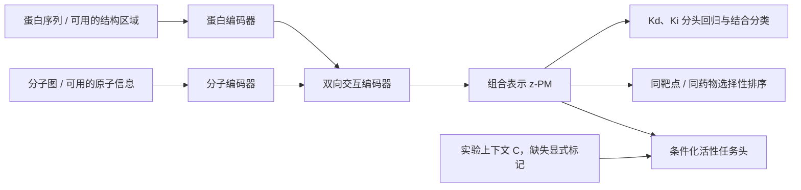

# 蛋白—分子组合 JEPA 设计草案（2026-09-14）

用户明确的建模对象是组合 `(P,M)`：学习可复用的交互表征 `z(P,M)`，再用它预测亲和力及相关性质。此前优先替换单独分子编码器的建议不作为本项目主路线；Mol-JEPA 等仅是可选输入编码器。此文件是架构草案，尚未实现或启动训练，也未冻结超参数；现有 DTIAM 继续完成原协议。

同一分子遇到不同蛋白、同一蛋白遇到不同分子，应允许得到不同的交互表示。未结合/来源失活的配对同样有表示，不假定所有输入配对都能形成物理复合物。

现有 BioMaster 已有联合隐层：`UnifiedInteraction` 融合 `d,t,d*t,|d-t|`，再返回共享 representation；`AuxiliaryInteraction` 由这个表征输出分类和端点回归。新的工作是让该表征本身接受 JEPA 的上下文预测训练，并加强原子/残基或区域层次的交互，不能声称旧模型完全没有组合表示。

**建议架构**

`z_PM = F_theta(E_P(P), E_M(M))` 是共享组合表征。活性观测更合理地写为 `y_e = h_e(z_PM,C)`；Kd/Ki 也受构建、温度、pH 等条件影响，可在这些信息可靠时条件化。共享表征不保证所有端点存在相同物理含义。

交互编码器初步采用残基/区域与原子/子结构 token 的双向 cross-attention 或现有 InteractionBlock 的受控扩展，再汇聚为固定维度的组合表示。初始可考虑 256—512 维、少量交互层，实际配置由资源探测和预先定义的对照确定。注意力权重仅是模型内部相关性，不当作已验证物理接触。

**JEPA 预测的是什么**

教师与学生都处理同一 `(P,M)`，教师目标来自交互融合之后：

- 教师分支：完整可用组合视图 → EMA 更新的组合编码器 → `z_PM_teacher`，以及可选的 `residue|M` / `atom|P` 条件化局部表示；目标停止梯度。
- 学生分支：遮蔽部分蛋白/分子输入信息，但保留双方足够上下文 → 组合编码器 → predictor，预测教师的组合或被遮蔽局部条件化表示。
- 推理时只保留学生编码器及任务头，对完整可用的 `(P,M)` 输出组合表示。

全局目标可写为 `L_pair_JEPA = D(q_phi(z_PM_context,mask), stopgrad(z_PM_teacher))`；局部扩展则逐个预测被遮蔽位置的融合后表示，而非孤立蛋白/孤立分子表示。教师不读取亲和标签、失活标签或测试关系；真实测量通过独立监督损失约束组合表征。

这是拟议的混合训练方案，不宣称是某篇现成 Pair-JEPA 论文的原样复现。原始 I-JEPA 为上下文预测潜在目标提供方法依据，但不直接证明本项目的亲和收益。[I-JEPA](https://arxiv.org/abs/2301.08243)

对一个组合遮蔽信息，不意味着改变分子的原子、键或蛋白残基后活性应保持相同。初版不使用随机换药、换靶点作为正视图，也不把整个一方删除后要求另一方唯一还原它；多靶点/多配体关系使该目标不适定。真实结构/构象只在身份和实验条件可靠的子集提供补充视图，预测构象单独标记来源。

遮蔽也必须防止捷径：若先用完整序列生成上下文 token，再在末端遮蔽，而学生仍看得到包含被遮蔽信息的完整全局向量，这至多是特征去噪，不能宣称严格的缺失序列预测。严格原始输入遮蔽应在相应编码前发生，或采用明确隔离信息的局部视图；两种版本分别定义和对照。不能直接从现有池化向量恢复出真实残基/原子 token。

**让表示包含交互特异性**

仅用同一对的表示一致性，仍可能主要记住蛋白身份或分子身份。计划同时使用：

1. 已测阳性与明确阴性的端点适用监督；数值弱结合、来源失活分别保留上下文。
2. 同一靶点内的已测药物排序，以及同一药物内的已测靶点排序；优先同端点、可比实验条件，避免把跨实验差值当相同量纲的真差异。
3. EMA / stop-gradient 与显式防塌缩正则和诊断；监控方差、有效秩及教师—学生差异，不能只看 JEPA loss 变小。
4. 蛋白单支、分子单支、配对身份条件打乱/置换等诊断。未知换配对不直接标为阴性；只在已有测量对应的比较中计监督误差。完整交互模型需要在双向查询任务上超过单方模型。

同一阳性标签不代表这些配对应聚成同一个点；回归与细粒度排序负责保留作用强度和选择性差异。表示距离也不直接等于物理亲和力。

**数据足以组织受控实验，但应看组合覆盖**

| 训练池 | 配对 | 分子 | 蛋白序列 | 至少测过两个靶点的分子 | 同分子内兼有已测两类 |
|---|---:|---:|---:|---:|---:|
| A | 337,570 | 140,064 | 2,290 | 47,041（33.6%） | 8,211 |
| B | 1,116,270 | 690,439 | 3,647 | 181,182（26.2%） | 48,036 |

B 中同时有已测两类的靶点为 2,288 个。多数分子在训练表中只测过一个靶点，因此需要利用已有交叉覆盖做温和的靶点/类别/查询平衡，而非永久截断数据或生成未测阴性。这里的两类沿用原 A/B 合并标签；实施新端点分头监督时，应重新按端点和实验可比性审计可排序成员。

已准备的回归辅助视图：A 有 192,469 条配对—端点记录，对应 191,189 个配对；B 有 799,246 条，对应 766,314 个配对。B 分项为 Kd 20,749、Ki 172,012、IC50 530,921、EC50 75,564。它们可以训练性质头，但不是 799,246 个独立复合物结构，也不是每个组合均测齐所有端点。

已有 assay 解析、数值删失界限、来源和冲突审计可复用。当前训练特征缓存以蛋白均值和分子全局表示为主；仓库已有局部 InteractionBlock 代码，但全量 token 缓存及可用覆盖需另行核对/补建。冻结全局特征的模型可作为廉价的组合表示基线，不替代局部交互版本的有效性验证。

**性质头与缺失监督**

| 目标 | 本项目中的处理 |
|---|---|
| Kd / Ki | 独立端点回归；精确值用回归，`>`/`<` 等删失值用相应约束，不当精确数值 |
| 结合强弱 / 失活 | 使用适用的已测标签；注释失活不自动视为任意条件下绝对不结合 |
| IC50 / EC50 | 端点分头，并在可靠时加入实验上下文；不与 Kd/Ki 直接混为同一个回归标签 |
| 选择性 | 同药物跨靶点及同靶点跨药物的可比测量排序 |
| kon / koff 等动力学 | 只有取得实际相应标签才能监督，不能由一个 Kd 唯一推出 |
| 溶解度、清除率等 | 主要属于分子及环境的性质，按任务设计分子支路/条件头，不强迫依赖任意蛋白 |

总体损失为表示预测、防塌缩、适用分类、端点回归和可比排序的加权组合；缺失字段不产生监督，权重在实验开始前冻结。由于此前辅助目标没有稳定整体超过 A，必须做消融，不能预先认定所有损失一起加最优。

**最小可判读实验**

| 方案 | 配对编码器 | 监督 | 用途 |
|---|---|---|---|
| S0 | 相同组合编码器 | 分类＋分端点回归，另固定排序开关 | 判断仅改交互架构的收益 |
| S1 | 与 S0 相同 | 相同监督＋组合 JEPA | 判断表示预测的增益 |
| S2 | 与 S0 相同 | JEPA 预训练后相同监督微调 | 判断先学表示再学性质是否更好 |

三种子、同一划分、端点与成员；同时记录训练曝光和实际算力，设置同计算预算的监督继续训练对照，避免 JEPA 的额外计算被误认为目标本身更好。先做小规模数值/资源探测，再决定全量 A 与 B 分端点方案的正式运行顺序。现有 DTIAM 是外部方法参照，S0 才是归因 JEPA 损失的直接对照。

核心评估为低失活误报条件下的召回、双向 Top-K、端点回归和严格来源/新骨架/蛋白冷启动诊断，以及最终 SPR。固定一个表征后以相同简单性质头比较，可作为表征可迁移性的辅助证据。蛋白冷启动需要单独构造同源簇划分，不能把当前骨架划分改名成冷蛋白测试。

训练标签不得通过教师、图谱、文字描述或预训练活性模态泄漏验证/测试；SPR 留出继续保留。可使用真实负配对参与 JEPA 视图训练，JEPA 不需要对比负样本与分类仍需真实负证据是两件事。

相关研究支持学习依赖相互作用伙伴的联合表征；例如 Communications Chemistry 的组成式表示讨论和实验涉及 cross-attention 与蛋白—配体组合。这提供设计背景，不是对本草案 JEPA 的直接验证。[Learning physical interactions to compose biological large language models](https://www.nature.com/articles/s42004-025-01883-7)

后续实现的主交付应是可导出的 `encode_pair(P,M)` 及其性质头，而非仅一个分子编码器或单一分数。具体实现、资源预算与训练 ETA 尚未测定；本次不改变正在运行的 DTIAM。
