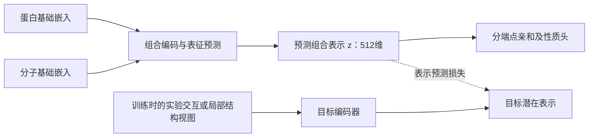

# 组合 JEPA：现有模态、目标表示与可训练范围

2026-09-14 本地实查。结论：现有资源支持“基础嵌入 → 组合表示 → 亲和”的受控训练；最值得优先研究的昂贵目标是实验结构提供的交互表示，其次是可扩展的口袋—分子局部表示。我们有足够的监督配对，但昂贵模态只覆盖部分成员。不能把百万条亲和/活性标签写成百万个已知复合物。

本次完成文件存续、身份交集和资源审计，没有启动 JEPA 训练、下载结构大包或改变 DTIAM 队列。可复查：[训练模态覆盖](../outputs/biomaster_pm_jepa_design_20260914/TRAIN_MODALITY_COVERAGE.csv)、[模态与资源审计](../outputs/biomaster_pm_jepa_design_20260914/RESOURCE_MODALITY_AUDIT.json)、[实验结构存续核验](../outputs/biomaster_pm_jepa_design_20260914/EXPERIMENTAL_STRUCTURE_ASSETS.json)。

**一、最有价值的发现：真实昂贵模态已有库存**

旧 PLINDER 结构路线保留了以下资产，已逐成员检查文件是否仍在：

| 项目 | 训练 | 内部结构验证 |
|---|---:|---:|
| 实验复合物系统 | 9,903 | 1,223 |
| 内部簇 | 489 | 162 |
| 原始接触/距离映射文件仍在 | 9,903 | 1,223 |
| 全局输入缓存仍在 | 9,903 | 1,223 |
| 原生口袋大编码缓存仍在 | 0 | 0 |
| 预测口袋大编码缓存仍在 | 0 | 0 |

结构预训练权重 `STRUCTURAL_PRETRAINED.pt` 仍在，约 129 MiB。之前清理了可再生成的大特征，没有删除这批实验映射。这意味着能重建教师输入，不必先购买新数据或从头下载全库。

这些系统可以提供配体原子—残基接触、距离和局部环境，信息量比单个亲和值丰富。原始数据是结合态结构；独立配体构象和实验结合态坐标在旧流程中已有区分。PLINDER 官方也提供受体、配体、序列、聚类和 apo/预测结构关联，但本地并未补齐后两类与实验结构的成对训练视图。[PLINDER 数据说明](https://plinder-org.github.io/plinder/dataset.html)

库存不等于新版训练就绪：最大训练簇有 5,279 个系统，占 53.31%，必须按簇控制曝光；旧身份排除面向当时项目，尚未核对新版 A/B 留出成员；同一复合物的多链、构建、配体与基本嵌入需重新对齐。旧全局分子缓存是 DrugCLIP 等输入，不能直接冒充 BerMol。9,903 是现存训练系统数，最终新版适用成员数需经过这些检查。

进一步核对来源注释（同日）：按系统 ID 与精确配体 SMILES 一对一连接，训练 9,903 个系统全部为 X 射线衍射；其中 4,525 个（45.69%）标为辅因子，5,378 个标为非辅因子。验证集相应为 191 / 1,032 个。非辅因子也不自动等于药物、人体靶点或野生型。这批数据适合研究通用交互表示，但不能整批等权当作药物亲和训练；新版应分别评价非辅因子主集与辅因子辅助集。详见[结构来源质量审计](../outputs/biomaster_pm_jepa_design_20260914/STRUCTURAL_SOURCE_QUALITY_AUDIT.json)。

来源还有已公布的修订事项：PLINDER 官方 README 提醒原始发布日期需要通过接口修正，且因 BindingDB 解析问题停用了亲和查询。旧项目筛选代码直接读取原始 `entry_release_date`，所以“≤2020”目前表示当时元数据筛选，重用前需核验日期；结构附带亲和值也不能直接导入。新版亲和监督继续使用我们单独清洗的测量库。[官方已知问题](https://github.com/plinder-org/plinder#-plinder-versions)

原结构预训练学过接触，但其后关系微调曾退化，未证明是更好的亲和教师。复用时应从结构预训练权重评估，不使用退化后的下游权重，也不直接把未经训练的残差投影当作目标 z。[旧结构路线复盘](BIOMASTER_STOP_AND_RETROSPECTIVE_20260907_ZH.md)

效果预期的现有证据：同一 1,223 个内部验证系统、原生与远端区域合并的接触 AP，从初始化 0.0941 提高到预训练后 0.5665；这是结构读出指标，不是亲和或实验命中率。原生口袋单独复测时，关系微调使接触 AP 从 0.5671 降到 0.3555，32 Å 截断距离 MAE 从 1.2479 Å 升至 2.4593 Å，且旧双向排序增益置信区间均跨零。故合理预期是尝试获得可迁移的交互约束，尚无依据承诺亲和预测提升百分比。

**二、与 A/B 训练集的实测交集**

以下只读 TRAIN 文件，没有打开当前门控 TEST 标签；旧索引与新索引先按精确蛋白序列匹配，不能直接复用整数编号。

| 数据/特征 | A：Kd/Ki＋明确失活 | B：全端点＋明确失活 | 实际含义 |
|---|---:|---:|---|
| 训练配对 | 337,570 | 1,116,270 | A/B 为不同训练臂，不相加 |
| 分子 / 蛋白序列 | 140,064 / 2,290 | 690,439 / 3,647 | 不是部署的 720×890 轴 |
| ESM2＋BerMol 已完成配对 | 337,570 | 1,116,270 | 可直接作为基础输入 |
| 有 DrugCLIP 分子表示的配对 | 331,227 | 1,099,941 | 剩余是显式缺失/图特征回退，不能视为真实 DrugCLIP 表示 |
| 现有残基 token 对应靶点覆盖的配对 | 216,129 | 717,627 | 缓存共 813 个旧靶点索引；不是每对都有姿态 |
| 有实验参考口袋图的靶点覆盖的配对 | 98,242 | 486,230 | 同一靶点模板可服务多个分子 |
| 上行中参考配体重对接 PASS 的靶点覆盖 | 96,664 | 466,499 | 这是模板质控，不是候选结合验证 |
| 口袋图和分子图都已有缓存 | 38,371 | 91,534 | 分子采用精确规范 SMILES 文本交集，是保守覆盖数 |
| 上行且参考配体重对接 PASS | 37,854 | 87,807 | 适合首先准备局部教师对照 |
| Boltz 文件存在且按规范身份映射的训练配对 | 7,963 | 13,079 | 两条历史路线去重后的交集，仍需构建/姿态质量复核 |

现有参考口袋图为 326 个旧靶点，其中 307 个通过历史参考配体重对接检查。当前 B 可以先从约 8.8 万对具有两侧图缓存且模板 PASS 的成员组织局部表示试验；补分子图后可把目标侧有 PASS 模板的范围扩到约 46.6 万对，实际数取决于分子图准备成功率。分子图可从 SMILES 生成，不要求先给几十万对逐个对接。

但“参考口袋＋候选分子图”仍没有该候选的真实跨分子坐标。该教师可学习条件化交互，不能直接构造虚假的原子—残基真实距离标签。序列 token、口袋图和真实配对姿态的覆盖必须分别记录。

**三、其他昂贵信息应放在哪里**

| 资源 | 当前实有内容 | 建议用途 |
|---|---|---|
| 精确亲和/活性 | B 有 799,246 条配对—端点记录、766,314 个不同配对 | 为 z 提供任务监督；Kd/Ki/IC50/EC50 分头 |
| 实验上下文 | B 有 639,511 条实验—配对—端点记录、28,855 个实验组 | 做可比实验内的强弱约束，避免混合条件 |
| 历史 Boltz | 校准路线 16,982 条、探索路线 14,468 条的 CIF、置信度和亲和 JSON 仍在 | 作为有来源和质量标记的弱结构视图；不是实测标签 |
| LINCS | 720,216 个签名×12,328 个基因的 GCTX，约 33.1 GiB；元数据有 21,869 个不同 InChIKey | 药物＋细胞＋剂量/时间的响应分支 |
| LINCS 与 B | 2,372 个 B 训练分子匹配化合物元数据，涉及 63,101 对 | 不是 63,101 个配对的独立实验；尚非经过签名质控的有效覆盖 |
| HiQBind | 31,572 条小分子结构元数据，17,725 个不同 PDB；完整结构包未入库 | 后续补真实结构；要与 PLINDER/BindingDB 按结构和来源去重 |
| Platinum / MdrDB | 本地目录分别记录 1,008 条突变记录、4,292 条 CoreSet 行 | 可研究突变导致的亲和变化，需用突变后蛋白身份，不能直接当野生型标签 |
| Open Targets / TxGNN / DepMap | 疾病关联、图谱预测、基因依赖等已有项目资源 | 疾病/细胞意义任务；不直接等价于物理亲和目标 |

B 的精确回归配对中，只有 31,852 对具有两个及以上不同端点，约 4.16%；A 只有 1,280 对。因此把现有标签拼成“高维实验模态”会非常稀疏。可以研究有观测掩码的实验潜变量，但不能只把单个 Kd 扩成 512 维，再声称学到了丰富的联合物理表示。

昂贵还必须带来有用信息。Mol-JEPA 的方法允许以实验性质和计算表征构成目标模态，并从可用模态预测其潜在表示；这提供方法参考，不是对本项目配对教师性能的证明。[Mol-JEPA 方法](https://arxiv.org/html/2608.22642v1)

本地旧 Boltz 的大量探索结果原就未达到对应靶点的支持门槛。用它们时保留质量分层；不能将低分当作明确阴性，也不直接蒸馏其单一亲和分数来替代实验监督。昂贵模型的输出可以包含可利用的结构先验，也可能带来共同偏差。

外部 GatorAffinity 提供 456,526 个带 BindingDB Kd/Ki 的预测复合物，但官方库总大小约 4.03 TB，当前还要求访问申请。其标签主要是既有测量，不是新增独立实验。当前更合理的是利用本地资产，后续按身份检索需要的子集。[GatorAffinity 官方数据卡](https://huggingface.co/datasets/AIDD-LiLab/GatorAffinity-DB)

**四、最终 z 的建议形式**

建议第一版保留一个 512 维组合向量，256 维作为容量对照。这是工程起点，不是已确定的最优维度。各维不预先命名为“氢键数”“真实自由能”，其意义通过任务读出和独立验证体现。

用户接口保持 `encode_pair(e_P,e_M) → z`，再调用性质头。教师只在训练阶段需要；学生的表示预测模块保留在推理路径。亲和头始终在学生预测的 z 上训练。

最有物理依据的目标视图是实验接触、距离与原子/残基化学环境，经结构编码器汇聚为组合潜在表示。绝对 xyz 及不相关的晶体细节不作为必须精确恢复的目标；以对刚体旋转平移不敏感的相互作用信息为主。多口袋/多构象可能存在多种解释，第一版 z 应理解为对其可预测部分的任务表示，而不是唯一真实结合构象。

对只有模板的成员，目标编码器读取口袋和候选分子共同产生局部表示；对有真实复合物或可靠预测姿态的成员，可以增加相应视图。模态缺失时不计算对应预测损失。将来增加不同模态时用各自的目标编码器和预测头，避免把不兼容的实验条件强行平均成一个“真值 z”。

最稳妥的首个实现可先训练/适配结构教师、固定它，再让学生预测教师潜在表示，同时用 A/B 测量监督学生。它属于 JEPA 式跨视图预测与监督蒸馏的混合方案，不宣称无标签自监督。若改用联合学习的目标编码器，必须明确防塌缩与更新规则。旧权重的任意隐藏层也不是天然正确的教师目标，需要新的池化/投影及验证。

结构几何保真和亲和任务收益分别检验：真实结合态结构通常缺少实测不结合对，不能只用结构数据训练后就宣称掌握结合/不结合。两臂各有 105,368 对来源明确失活监督，应继续按原身份/端点规则使用；不存在结构或未测关系不补成阴性。

**五、机器实际支持什么**

实查时间约 2026-09-14 05:00 UTC；可用空间和内存随现有训练变化。

| 资源 | 实际条件 | 对方案的含义 |
|---|---|---|
| GPU | 驱动报告 RTX 4090，49,140 MiB 显存，检查时空闲 | 支持冻结基础编码器后的组合网络与有限局部教师；按实际显存判断，不按型号猜 24 GiB |
| CPU | cgroup 限额相当于 20 核 | 主机显示 208 线程不等于本容器可用额度 |
| 内存 | cgroup 上限 90 GiB，快照占用约 39 GiB | 主机显示约 1 TiB 不可用于预算；DTIAM 正在共享 CPU/内存 |
| 磁盘 | 系统盘约 10.6 GiB 可用；数据盘约 64 GiB 可用 | 大缓存放数据盘；给 DTIAM 后续模型留余量 |
| 软件 | 主环境 PyTorch 2.10.0＋CUDA 12.8，CUDA 可用；RDKit、LMDB、h5py 已有 | 可以实现并做资源探测，无需更换当前 DTIAM CPU 环境 |

建议学生先控制在约 5–20M 可训练参数，教师使用冻结编码器和有限原子/残基预算。该规模是设计预算，尚未对新实现进行显存/吞吐实测。现有约 34–36M 参数结构模块在此前已运行过，但长查询逐项计算曾非常慢，不能由“装得下”推断整轮很快。

缓存账本：B 的 1,116,270 个配对若各保存一个 512 维 FP16 z，纯张量约 **1.06 GiB**；当前 5,086 条注册蛋白若保存全长 1,280 维 FP16 残基表示，理论约 **7.62 GiB**。这是存储算术，未含激活、优化器、索引或多个检查点。应按实体存基础/局部特征，按需算交互；不把百万个原子×残基张量全部展开保存。

一个值得优先排查的输入问题：DTIAM 的 ESM2 按官方接口只取前 1,022 个残基。B 中 237,739 对（21.30%）涉及更长蛋白。数据量增加不会自动补回这些蛋白后半段；可先补全链/分窗或口袋汇聚的视图，检查任务增益。此项目前只是明确的输入覆盖限制，不能据此归因过去模型分歧。

**六、推荐的实施顺序**

1. 统一学生输入及新版划分：基础输入优先 ESM2＋BerMol，可单独比较低成本 Morgan；给结构系统补相同口径输入，审计多链、构建、同源、配体及文献重叠。历史结构验证 1,223 个系统保留，不能因有文件就并入训练。
2. 以现有实验映射构建/恢复结构目标编码器，按簇采样，先验证结构任务和输入适配。约 8.8 万个两侧图缓存且模板 PASS 的 B 配对可作为局部交互对照；这两种目标分别评估，不把模板数据当实验复合物。
3. 在全 A/B 监督范围训练学生，只有存在昂贵视图的成员计算表示预测损失。先比较相同网络的监督基线、加入局部表示目标、再加入实验结构目标；Boltz 弱目标和细胞模态随后单独消融。全 B 多端点预训练与 A 亲和任务适配也应与 A 直接训练比较，不预判全 B 必胜。
4. 以相同划分、输入和可比计算预算评估：Kd/Ki 误差、同靶点/同药物排名、低失活误报下召回、结构能力保持。表示预测损失下降或教师更昂贵都不构成晋级依据。

目前最适合的是“真实结构子集提供交互约束、局部模板扩大覆盖、百万配对提供性质监督”的中等规模研究模型。资源可以支持这条路线的准备与试验；完整训练 ETA 应在恢复小批真实数据、测得吞吐后给出，本次没有启动训练。

复查入口：`OMP_NUM_THREADS=2 OPENBLAS_NUM_THREADS=2 python scripts/audit_pair_jepa_resources_20260914.py`；只核查结构存续可加 `--structure-only`。

来源辅因子与实验方法复查：同一脚本加 `--structural-quality-only`，只读取结构元数据并输出汇总。
