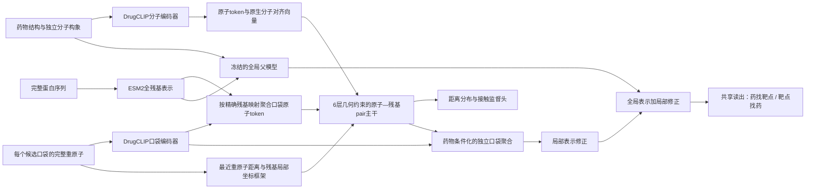

# BioMaster：以预训练口袋与精细交互为核心的架构重建

> **后续实测更新**：[正式结构预训练与原子级诊断](BIOMASTER_STRUCTURAL_PRETRAINING_FOLLOWUP_20260906_ZH.md)。数据适配与训练执行器已补齐；9,903个复合物训练、1,223个验证，400次更新后结构接触AP为0.4599。下文“尚未实现”的描述是首次创建时的状态，以跟进报告更新为准；老药排序AP仍待下游评测。

此前局部实验把快速、低成本的增量验证作为主要实现约束，采用单层32维pair、混合口袋残基和CA距离聚合。这可以回答一个小模块有没有增益，却不足以代表高质量结构交互模型的能力。将它作为架构升级的主要候选，是技术路线上的不足。

本次按更完整的表示、监督和训练要求重建开发架构。**代码、独立口袋特征和工程验证已经完成；真实复合物预训练尚未完成，也没有新的AP成绩。新架构当前不是已选中的最佳模型。**旧交付包仍作为可复现基线。

## 1. 已实现的模型

| 部分 | 上一版局部实现 | 本次实现 |
|---|---|---|
| 预训练匹配 | DrugCLIP分子token＋ESM2，局部映射随机初始化 | 同一fold的DrugCLIP分子/口袋编码器及原生128维对齐投影；口袋重原子token与ESM2残基对齐 |
| 口袋 | 最多3个口袋取并集，再以全序列残基补点至96 | 保留所有通过质量阈值和多样性筛选的口袋；每个口袋独立编码与交互；不补背景残基 |
| 局部主干 | 1层、pair宽32、单标量交互注意力 | 6层、node宽384、pair宽128、8头注意力；外积更新、两类几何三角路径、轴向pair注意力及双向交互 |
| 几何 | CA距离的标量邻域聚合 | DrugCLIP完整口袋重原子编码；残基间CA距离、最近重原子距离、局部N–CA–C坐标框架的方向和相对旋转 |
| 口袋聚合 | 不区分口袋的残基池化 | 药物条件化的口袋集合聚合，保留配对预训练余弦信息、预测口袋概率及结构质量 |
| 局部训练输出 | 全局修正 | 全局修正＋64类距离分布＋接触概率；后两项有独立监督接口 |
| 全局保护 | 父主干和共享头从第一步同时更新 | 初始训练阶段冻结父主干与共享头；局部末层小幅非零初始化，首步可回传至局部上游 |
| 检索训练 | 每查询约64个候选 | 完整384靶点/720老药候选；两次前向计算精确查询梯度，避免保存整张候选图的激活 |

局部主干为**33,652,451个参数**，另保留1,235,604参数的全局父模型。DrugCLIP/ESM2公开预训练底座不计入这两个数字，它们当前通过缓存提供表示。参数增加是容量变化，不能单凭它判断模型质量。

几何路径分别通过“原子–原子–残基”和“原子–残基–残基”传播已有分子内部几何，再更新跨分子pair。该实现借鉴几何约束交互的研究方向，不是TANKBind的忠实复现，也没有声称提供严格三角不等式保证。[TANKBind原论文](https://papers.neurips.cc/paper_files/paper/2022/hash/2f89a23a19d1617e7fb16d4f7a049ce2-Abstract-Conference.html)

当前模型预测跨分子距离分布，不生成配体结合姿态。配体独立构象与蛋白坐标不在同一坐标系，代码不将两者直接相减。侧链重原子已进入口袋编码与最近距离，但显式氢键方向、质子化微状态、金属配位、柔性侧链和共价反应建模仍需后续实现；不能把当前版本描述为已经完成全原子结合构象建模。

## 2. 已生成的实际输入

对原有384靶点注册空间，保留352个具有合格预测口袋的靶点，共**1,187个独立口袋、24,793个口袋残基记录、202,988个重原子记录**。不同口袋可以包含相同残基，因此后两个数字不是全蛋白去重计数。

- 每个口袋完整保留被选残基及其重原子，无96残基截断，无全序列背景补点。
- 当前最大口袋为99个残基；重原子数最大的口袋有803个重原子。二者不一定是同一口袋。
- 依据精确序列、链A、PDB残基号和氨基酸一致性映射；保留原子名、坐标、残基归属及质量值。
- 原生DrugCLIP分子/口袋投影头使用相同fold。分子CLS复用既有缓存，口袋重新完整编码；没有随机替换原有匹配空间。
- 32个没有合格口袋的靶点走全局父模型；分子构象/原子缓存不满足局部要求的配对也明确走全局。当前没有宣称结构覆盖达到100%。

配对预训练是DrugCLIP框架的关键组成，本次接入恢复了两侧表示和原生投影；这仍需与原版检索基线在统一任务下比较。[DrugCLIP原论文](https://proceedings.neurips.cc/paper_files/paper/2023/hash/8bd31288ad8e9a31d519fdeede7ee47d-Abstract-Conference.html)

数据：[特征清单](../outputs/biomaster_pocket_precision_20260906/features/MANIFEST.json)；生成器：[prepare_biomaster_pocket_precision.py](../scripts/prepare_biomaster_pocket_precision.py)。

## 3. 真实结构监督数据已经开始整理

已下载并固定PLINDER官方`2024-06/v2`的完整注释表和划分表。官方划分有409,726个体系，其中309,140个标为train。原始注释表有1,357,906条配体注释，不能把注释行数当成独立训练复合物数。

先保留官方train、官方质量/统计标准通过、已知发布日期、分辨率≤2.5Å、非共价非伪影配体、解析原子数匹配、单个主要配体、5–128重原子、配体RSCC≥0.8、占有率≥0.9、无未解析配体重原子的候选，然后按照官方冗余标识保留确定性代表。

| 发布截止年份 | 候选体系 | 官方cluster数 | 与项目靶点UniProt精确重叠 |
|---|---:|---:|---:|
| ≤2018 | 17,556 | 998 | 2,887 |
| ≤2020 | 20,016 | 1,108 | 3,353 |
| ≤2022 | 22,938 | 1,212 | 4,116 |

这些是**待准入的结构候选**。目前只下载了注释/划分，尚未下载这些候选的完整结构集合，未完成原子/键级/立体化学映射、项目配对和近似口袋/序列/骨架重叠审计，也未生成可训练的接触标签。UniProt重叠是审计标记，不自动等于泄漏，也不代表已经排除泄漏。

候选包含多蛋白链体系：≤2020的20,016个候选中有6,719个。不能在提取接触时只保留一条链；此项必须在结构数据适配中解决。5–128重原子限制是本批小分子数据的明确准入范围，不是把大型配体截断后假装完整。

PLINDER提供基于蛋白—配体交互相似度的训练/验证/测试划分。本项目还需要叠加自己的时间和评测实体审计。[PLINDER官方数据说明](https://plinder-org.github.io/plinder/tutorial/dataset.html)、[官方仓库](https://github.com/plinder-org/plinder)。

数据：[结构候选清单与筛选级联](../outputs/biomaster_pocket_precision_20260906/structural_data/MANIFEST.json)；生成器：[prepare_biomaster_structural_pretraining_index.py](../scripts/prepare_biomaster_structural_pretraining_index.py)。

## 4. 已完成的验证及其边界

1. **7项性质测试通过**：口袋集合排列不变性、原子/残基排列等变性、padding不影响有效输出、缺口袋精确回到父模型、首步上游梯度、未知接触不产生负标签、残基坐标框架刚体不变性、全候选查询梯度与直接反传一致、双向风险集评测接口。部分性质在同一测试中验证。
2. **完整尺寸真实数据GPU检查通过**：使用6层384/128维正式配置，执行12个真实测量训练样本的前向/反向/优化器更新；原子、残基、几何和第6层交互均有首步梯度。父模型权重未变化，完整检查点FP32重载输出一致。这是工程检查，不是质量训练。
3. **训练器恢复检查通过**：真实开发训练集为292,408条关系；执行2个32样本更新后保存，再恢复到第3个更新。状态明确为`INTERRUPTED_ENGINEERING_LIMIT`，没有标记正式训练完成。
4. **全部1,187个口袋文件检查通过**：校验哈希、token形状、原子—残基归属和有限值。另用3组配对与原版DrugCLIP前向比较，缓存余弦最大误差约0.000138；复用的分子CLS原先采用不同数值设置，不能声称全量逐位复现。口袋刚体变换后，128维表示最大误差约0.00000214。

完整尺寸工程检查所测样本的峰值GPU分配约2.03GiB、单步中位数约0.135秒，包含模型恢复检查的占用；这不是所有分子/口袋大小的显存上界，也不是全数据训练耗时承诺。

验证产物：[模型工程检查](../outputs/biomaster_pocket_precision_20260906/engineering/RESULT.json)、[预训练资产检查](../outputs/biomaster_pocket_precision_20260906/ASSET_AUDIT.json)。这些工程步骤均没有报告AP，也没有读取2023–2025/KIRHub的新评测标签。

## 5. 正式训练与验收标准

训练顺序为：真实复合物映射与重叠审计 → 配对结构监督预训练 → 冻结全局父模型的老药双向排序训练 → 有证据后再检验分组低学习率/预训练编码器适配。后两种解冻策略尚未实现或执行，不能作为本轮已完成项。

正式关系训练入口默认要求经过审计的结构预训练检查点。单独从关系标签训练新主干只能以`--relation-only-control`的明确消融身份执行。本次执行过的3个更新属于训练器工程检查。当前脚本提供结构预训练检查点接入和接触/距离损失接口，完整结构数据适配和结构预训练执行器仍待实现。

关系训练已经实现：父模型全程冻结；AdamW、预热、梯度裁剪、梯度检查点；全384/720候选双向查询监督；每轮开发集评测与早停；完整模型/优化器/调度器/随机状态恢复及输入身份校验。查询梯度的两遍前向均关闭dropout，以保证缓存梯度与实际求导一致。

不能仅与旧弱局部模型比较。正式消融至少包含同配对预训练输入的全局模型、当前最佳父模型、去掉pair交互、去掉重原子/方向几何、打乱几何以及口袋集合控制，并记录容量/曝光差异。最终按两个开发窗口、三个种子的双向AP/R@20和查询级差异区间判断增益。2023–2025及KIRHub保持回顾性回归用途，不用于选最大分模型。

公开预训练资源的下游关系重叠与年代未获完整认证。原子数、网络层数和结构细节均不替代模型增益证据。

代码：[交互主干](../biomaster/pocket_precision.py)、[特征装载](../biomaster/pocket_precision_features.py)、[受保护训练与完整候选梯度](../biomaster/pocket_precision_training.py)、[开发训练入口](../scripts/train_biomaster_pocket_precision.py)、[配置](../configs/biomaster_pocket_precision_20260906.json)。
