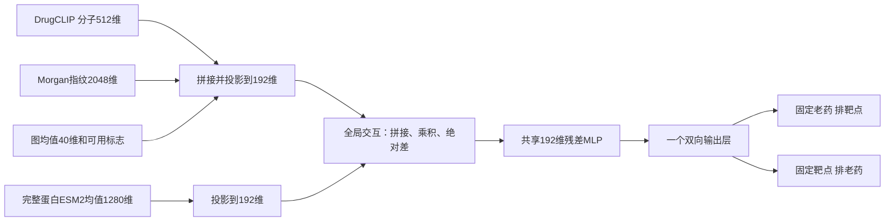

# 本轮选定模型与独立交付

本轮选定并交付 **DrugCLIP＋Morgan＋ESM2 全局交互模型，训练使用EMA**。一个共享神经网络、两个方向输出，1,235,604个可训练参数。完成54次全局开发比较、24次局部受控消融、三种子≤2022重训及固定回归，再拟合一个≤2025部署检查点。这里的最佳限定于本轮开发协议和实际比较的候选。

直接入口：[独立模型包与用法](../outputs/biomaster_best_model_20260906/retargetmap_selected_v1/README.md) · [下载ZIP](../outputs/biomaster_best_model_20260906/retargetmap_selected_v1.zip) · [完整模型卡](../outputs/biomaster_best_model_20260906/retargetmap_selected_v1/MODEL_CARD.md) · [当前模型配置](../configs/biomaster_selected_catalog_20260906.json)。解压后约14.6 MB，ZIP约8.0 MB。

## 最终架构


[高清PNG](presentations/selected_model_20260906/RETARGETMAP_SELECTED_ARCHITECTURE_20260906_ZH.png) · [可编辑SVG](presentations/selected_model_20260906/RETARGETMAP_SELECTED_ARCHITECTURE_20260906_ZH.svg) · [矢量PDF](presentations/selected_model_20260906/RETARGETMAP_SELECTED_ARCHITECTURE_20260906_ZH.pdf)。图按实际交付配置绘制，表示冻结编码器的特征来源与可训练主干；独立包直接读取缓存。

<details>
<summary>Mermaid结构描述</summary>



</details>

公共编码器在本轮保持冻结，EMA只平滑同一个网络的训练权重。推理没有V3/J/近邻分数融合，也不调用研究训练脚本。输入、共享表示和两个方向输出均已明确；打包时只保留选中的网络类别和必要目录缓存。

## 为什么本版没有保留局部交互

新增[局部失败原因的专项诊断](BIOMASTER_LOCAL_INTERACTION_FAILURE_ANALYSIS_20260906_ZH.md)：36项BF16干预与18项FP32复核表明，主要退步保留在共同训练后的全局通道，几何对当前老药排序几乎不敏感；同时识别了预测口袋与背景token混合、位点身份未进入注意力等具体问题。没有更改本轮选型或交付权重。

使用两个早期时间窗口、三个种子比较，综合分为`0.35×正向AP＋0.35×逆向AP＋0.15×正向R@20＋0.15×逆向R@20`。全局方案从原G的0.4002提升到0.4375；统一取第6轮时仍为0.3796→0.4264，支持分子表示带来的增益。

| 同父模型的局部阶段 | 综合分 | 药物→靶点 AP | 靶点→药物 AP |
|---|---:|---:|---:|
| 选中的全局父模型 | **0.4375** | **0.4211** | **0.2867** |
| 再训练4轮 | 0.4002 | 0.3867 | 0.2589 |
| 再训练＋等容量MLP | 0.3980 | 0.3836 | 0.2570 |
| 再训练＋原子—位点残基 | 0.3955 | 0.3847 | 0.2506 |
| 再训练＋受体口袋CA几何 | 0.3937 | 0.3892 | 0.2459 |

四组初始化时与对应父模型的FP32预测完全相同，额外训练曝光一致，均取第4轮最终EMA。Site相对继续训练在三个种子的两窗口平均综合分上都下降；Geometry也未达到逐窗口、逐种子的保留规则。额外训练本身造成退步，局部模块没有纠正这一问题，因此最终回到选中的全局父架构。

这不证明原子—残基或口袋信息无用。当前局部方案只有预测位点、独立分子构象和受体内部几何，没有共同配体—受体坐标系或真实接触监督；这些信息和现有优化方法尚未带来可重复的净增益。完整[全局消融](../outputs/biomaster_best_model_20260906/ALL_GLOBAL_CANDIDATES.csv)、[局部消融](../outputs/biomaster_best_model_20260906/ANCHORED_CANDIDATES.csv)、[冻结选型规则及结果](../outputs/biomaster_best_model_20260906/FINAL_ARCHITECTURE_SELECTION.json)均保留。

## 2023–2025与KIRHub回归

下表是**≤2022训练权重**的双向AP，顺序为药物→靶点／靶点→药物。selected、G、capacity均为三个种子分别评估后的指标均值，不是分数集成；J为历史冻结单次分数。架构、固定5轮训练和代表种子均在读取本轮回归结果前冻结。

| 评测范围 | 本轮选定方案 | 原G | capacity | 旧J |
|---|---:|---:|---:|---:|
| 2023–2025新关系，720药风险集 | **0.3332 / 0.1804** | 0.3002 / 0.1665 | 0.3117 / 0.1915 | 0.2806 / 0.1565 |
| 同期新关系，594个截点前获批药 | **0.3180 / 0.1962** | 0.2693 / 0.1645 | 0.2780 / 0.1721 | 0.2640 / 0.1768 |
| 严格KIRHub，2823对 | **0.4165 / 0.3926** | 0.3847 / 0.3631 | 0.3872 / 0.3931 | 0.3992 / 0.3378 |
| 单构建体且历史未见KIRHub，3914对 | **0.4106 / 0.4438** | 0.4059 / 0.3777 | 0.4052 / 0.4387 | 0.4650 / 0.3966 |
| 同期一般化合物实测候选 | **0.8654 / 0.7803** | 0.8549 / 0.7922 | 0.8527 / 0.7860 | 0.8743 / 0.8257 |

主表沿用开发时的bf16推理口径。720药时间双向AP的种子标准差为0.0346／0.0363；严格KIRHub为0.0307／0.0379。[全部分年、R@20、种子波动](../outputs/biomaster_best_model_20260906/regression/METRICS_SEED_SUMMARY.csv)及[配对查询区间](../outputs/biomaster_best_model_20260906/regression/PAIRED_COMPARISONS.json)提供完整证据。

优势有明确边界：时间逆向AP仍低于capacity，一般化合物逆向仍低于G和旧J，扩大KIRHub集合的正向AP低于旧J。时间风险集相对G的AP差95%配对区间，正向为[−0.0257, 0.0886]、逆向为[−0.0421, 0.0705]，均跨零。不能宣布稳定全面胜出，更不能据此证明超过完整DTIAM/DrugCLIP系统。

预先选定的代表种子为20260921，其≤2022版本在FP32下：时间720药AP **0.3618／0.2220**，严格KIRHub **0.3846／0.3681**。它与三种子均值不同；时间正向AP也比该种子bf16的0.3724低约0.0106，精度敏感性已单列，未据此重选权重。

720药时间风险集有71条新合格阳性、45个药物和49个靶点查询。风险背景不是实测阴性；KIRHub则只在实际测量候选中计算AP，阳性为1μM残余活性≤30%。这两个任务的AP不能直接横向比较。上述测试在先前研究中已被查看，仍属于回顾性回归；公共编码器的预训练时间与关系重叠未认证。

## 实际交付与验证

部署权重以固定种子和5轮训练，拟合≤2025的383,638条唯一实测关系，其中301,637条阳性、266,135个分子；目录老药5,014条关系、875条阳性。先截日期再聚合标签，没有因特征覆盖而丢弃训练样本。**这份全量权重使用了2023–2025数据，没有独立测试成绩；上表属于≤2022版本。**

使用范围是720个目录老药×384个匹配靶点；745个登记靶点不是统一排名分母。当前API接受目录中的完整InChIKey与UniProt编号，新分子或新蛋白需要另行完成特征扩展。

```bash
python outputs/biomaster_best_model_20260906/retargetmap_selected_v1/infer.py \
  --drug AAOVKJBEBIDNHE-UHFFFAOYSA-N --top-k 20
python outputs/biomaster_best_model_20260906/retargetmap_selected_v1/infer.py \
  --target Q16236 --top-k 20
```

全目录输入、28个权重张量和276,480个配对的导出前后GPU FP32分数完全一致；独立导出代码在项目外CPU运行，720个覆盖全部实体的配对也与原模型完全一致，最大误差均为0。重新加载、双向排名、错误输入拒绝和ZIP完整性均通过。见[发布核验](../outputs/biomaster_best_model_20260906/retargetmap_selected_v1_RELEASE_VALIDATION.json)、[独立CPU数值核验](../outputs/biomaster_best_model_20260906/EXPORTED_CPU_PARITY.json)、[交付清单](../outputs/biomaster_best_model_20260906/DELIVERED_MODEL.json)和[完成审计](../outputs/biomaster_best_model_20260906/COMPLETION_AUDIT.json)。

下一轮的重点应由这些结果约束：先在开发窗口解决继续训练的性能退化和逆向排序退步；再检验更可信的位点/接触监督能否让局部模块提供增量。当前结果不足以支持继续堆叠局部模块，也不支持将一次时间或KIRHub最高分替换为最终选择。
