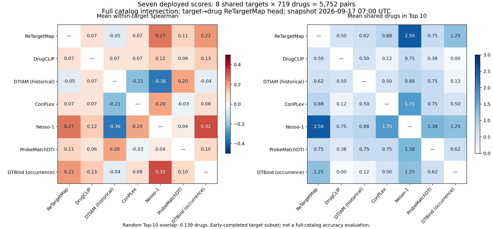

# 七模型相对一致性、评分含义与实测对照

冻结计算快照：2026-09-17 07:00 UTC。七模型全目录补算仍在继续；本报告使用固定快照，避免把不同时间、不同覆盖范围的分数混合。

**结论：分歧确实较大，统一配对与排名方向后仍存在。但现在比较的是不同目标、不同输入、不同训练分布的七个评分通道，并非七个统一定义、统一校准的Kd回归器。不能按多数票判断实验真伪，也不能用“模型不同”掩盖实际泛化不足。**

## 1. 这次比较了什么

- 网站原七模型比较核心：720药物目录条目 × 384靶点 = 276,480对；不混入888登记靶点或890靶点单模型扩展。
- 七模型共同接近完成的靶点共8个：AR、FKBP1A、COMT、MIF、CA7、CA1、PLA2G2A、MMP7。每靶点先要求每模型至少覆盖719/720，再取精确配对交集，最终均为719对，合计5,752对。缺少的quinidine在Nesso构象预处理失败，不计为阴性。
- 每个靶点分别给药物排名，再对靶点等权平均。ReTargetMap使用靶点→药物反向输出；给固定药物排靶点则使用正向输出。不把全局混池相关性充当查询内相关性。
- Spearman用平均并列秩。Top10沿用稳定身份顺序打破同分，另导出随机打破边界并列时的期望交集，避免同分制造假精度。
- 不限定SPR384、不排除已知关系、不按新模型高分挑样本；这是原目录排名一致性审计，不是新实验选样。
- 8个靶点长度108–920残基，受执行顺序和特征覆盖影响，不能代表所有384靶点。全五模型补充对照有382靶点×720药=275,040对；缺2个DrugCLIP未覆盖靶点。

快照成功评分数：ReTargetMap 276,480；DrugCLIP 275,040；DTIAM 276,480；ConPLex 276,480；ProbeMatchDTI 276,480；Nesso 20,899；DTBind 56,504。评分完成数不等于全部属于已完成整靶点。

## 2. 一致性有多低

以下各行使用相同8靶点、相同5,752配对，与当前网站ReTargetMap比较：

| 另一个评分通道 | 平均Spearman | 每靶点Top10平均重合数 | Top10重合比例 |
|---|---:|---:|---:|
| Nesso binder | 0.268 | 2.50/10 | 25.0% |
| DTBind occurrence | 0.218 | 1.25/10 | 12.5% |
| ConPLex | 0.072 | 0.875/10 | 8.75% |
| ProbeMatchDTI | 0.106 | 0.75/10 | 7.5% |
| DTIAM网站历史版 | −0.054 | 0.625/10 | 6.25% |
| DrugCLIP | 0.073 | 0.50/10 | 5.0% |

Spearman接近1表示排序相近，接近0表示整体单调关联弱，负值表示整体存在反向趋势；不是准确率。随机独立挑10个的期望交集为100/719≈0.139个。高于随机并不意味着排序已经可靠，也不证明有统计显著差异。



七模型两两平均相关性最高的是Nesso–DTBind（0.325），仍不高；DTIAM历史版–Nesso为−0.362。Top10的一致性与全排名相关性不是同一件事，不能只用其中一个概括。

扩大到各模型与ReTargetMap各自已完成的靶点，结论仍为一致性偏低，但下表靶点集合不同，不能作为等范围模型优劣比较：

| 与ReTargetMap比较 | 完整或719/720靶点数 | 平均Spearman | Top10平均交集 |
|---|---:|---:|---:|
| Nesso | 27 | 0.200 | 1.30 |
| DTBind | 78 | 0.191 | 0.86 |
| DrugCLIP | 382 | 0.081 | 0.63 |
| DTIAM历史版 | 384 | 0.052 | 0.90 |
| ConPLex | 384 | 0.009 | 0.82 |
| ProbeMatchDTI | 384 | 0.071 | 0.26 |

例如AR的719共同药物中，testosterone在ReTargetMap排8、Nesso排5、ConPLex排2、DTIAM历史版排236。这里只陈述排序差异，不把某个模型名次作为实验结论。逐模型Top10和逐对排名已导出。

## 3. 为什么“都是亲和模型”却不同

### 实际评分任务不同

| 通道 | 本次实际用的分数 | 能否直接当Kd或实测结合概率 |
|---|---|---|
| ReTargetMap | 查询方向相关的神经排序logit | 不能；不同查询之间也未统一校准 |
| DrugCLIP | 口袋–分子嵌入余弦相似度 | 不能 |
| DTIAM网站历史版 | public_retrained_v1的二分类输出 | 是分类分数，未证明在当前目录校准；不是九月重训A/B |
| ConPLex | 蛋白–分子表征匹配分数 | 不能当Kd |
| Nesso-1 | affinity_probability_binary，即binder分类输出 | 不是其连续亲和输出，也不是已验证的实验命中概率 |
| ProbeMatchDTI | All_Model的融合正类分类输出 | 不是Kd/Ki回归 |
| DTBind | occurrence_model.pth的结合发生分类输出 | 不是affinity_model.pth的复合物亲和回归 |

Nesso另有连续输出`affinity_pred_value = log10(IC50/μM)`，本项目统一强弱方向时用`6 − value`得到预测pIC50。DTBind的affinity分支需要蛋白–配体复合物坐标；本次全目录没有跑该分支。见[Nesso官方输出说明](https://github.com/recursionpharma/nesso/blob/main/docs/prediction.md)、[DTBind官方任务说明](https://github.com/liqy09/DTBind)。

甚至同一Nesso检查点的两种输出也不能互换：AR上binder与pIC50的Spearman为0.669，Top10重合7个；其余7个共同靶点上，两头相关系数为−0.209至−0.448。这是已核对输出定义后的实际现象，值得进一步按靶点验证，不能凭模型名把两头都称为同一亲和排序，或选择更符合预期的一头冒充原协议成绩。

**单纯分数范围不同解释不了低排序相关性。** 严格单调变换不会改变名次。本次分歧是模型对配对的相对判断不同；未经校准的高分还会额外误导读者对置信度的理解。

### 训练分布、监督与输入不同

ReTargetMap的[实际模型卡](../outputs/biomaster_best_model_20260906/retargetmap_selected_v1/MODEL_CARD.md)记录了实测二分类与方向排序监督，输入是冻结DrugCLIP分子特征、Morgan、图摘要和完整蛋白ESM2均值。它没有预测真实复合物坐标；全局表示也可能丢失局部结合选择性。

ProbeMatchDTI的All配置联合BindingDB、DrugBank、Human、C. elegans；它们与我们的目录筛选和明确失活面板并非相同分布。作者未公开全部处理后训练集，因此无法把此次分歧精确归因到某类负样本、某个数量或某一训练关系。见[官方训练数据说明](https://github.com/developer-hq/ProbeMatchDTI)。

输入方面，DrugCLIP依赖口袋定义，ConPLex/ReTargetMap依赖全局表征，Nesso有共同折叠及口袋处理，DTBind使用作者蛋白图和结构特征，ProbeMatch保留作者1200蛋白位置与100个SMILES词元窗口。不同信息和监督可能造成不同偏差；**不是知道结构就必然更准**。上述8靶点均短于1200残基，因此不能把本次共同集合上的分歧全部归咎于长蛋白截断。

### 部分模型分数极端，却不够可靠

AR共同719条目中，ProbeMatch有250条（34.8%）分数≥0.99，11条精确等于1；DTBind有204条（28.4%）≥0.99。ProbeMatch这11条之间没有可由其保存概率区分的强弱，稳定排序只是在并列中确定显示顺序。

在下节相同378条实测标签中：

- ProbeMatch分数≥0.99的155条，53阳性、102阴性，观察到的阳性比例34.2%。
- DTBind分数≥0.99的120条，42阳性、78阴性，观察到的阳性比例35.0%。
- Nesso分数≥0.90的39条，32阳性、7阴性，观察比例82.1%；≥0.99仅5条，不足以证明其真实精确率100%。

这些都是固定阈值的诊断，没有用测试集寻找最佳阈值。它们说明当前分数不能按字面当作目录实验命中概率；也可能包含标签终点、训练分布和负类定义的差异，并不单凭这一项定位根因。

## 4. 用相同实测标签判断，谁更可信

原预设BindingDB479面板中，七模型成功共同覆盖378对，103阳性、275阴性。阳性率参照0.2725；AUROC随机参照0.5。这里是已有标签的回顾性比较，不是SPR384湿实验结果。

| 模型 | AP | AUROC |
|---|---:|---:|
| Nesso binder，预设主通道 | 0.7656 | 0.8945 |
| ReTargetMap，预设正向分数 | 0.7069 | 0.8576 |
| ConPLex | 0.4660 | 0.6366 |
| DrugCLIP | 0.4154 | 0.6199 |
| DTIAM网站历史版 | 0.4152 | 0.6372 |
| DTBind occurrence | 0.4013 | 0.6418 |
| ProbeMatchDTI | 0.3171 | 0.6098 |

辅助通道Nesso pIC50的AP为0.7696、AUROC为0.8499；ReTargetMap反向分数的AP为0.7161。辅助结果单独报告，没有事后取最好值替换预设主通道。

Nesso与ReTargetMap正向AP差+0.0588；按靶点配对重采样1,200次，95%区间约[−0.0289, +0.1417]，包含0。该重采样没有解决跨靶点重复药物的全部依赖，区间只是阶段性不确定性描述，不能宣布普遍胜出。

还需按实际查询方向评价，而不是只看混合AP：

| 固定查询方向 | 同时有阳性和阴性的查询数 | 实际有标签配对数 | ReTargetMap宏AP | Nesso binder宏AP | Nesso pIC50宏AP |
|---|---:|---:|---:|---:|---:|
| 给药物排靶点 | 18药物 | 289 | 0.9063 | 0.8290 | 0.8373 |
| 给靶点排药物 | 36靶点 | 234 | 0.7848 | 0.8244 | 0.9228 |

上述查询内只对**已实测且共同覆盖的配对**排序；两行来自同一378面板的不同子集，不能相加，也不是完整720或384候选空间的命中率。小查询面板和只保留两类标签的查询会影响宏AP。它支持按用途分别评价，并不支持直接宣布某个模型全面替代另一模型。

本面板与公共检查点训练数据的重叠没有排除。A/B训练和验证未见的共同子集是141对（33阳性、108阴性），也只证明未见于我们A/B，不能证明未见于Nesso、ProbeMatch、DTBind或旧部署模型。详细成绩见CSV。

## 5. 排除了哪些实现问题，还有哪些没排除

- 当前比较保持精确身份、同一配对、同一分母和正确方向；缺失不记0，不再用SPR候选池名次冒充完整靶点排名。
- 现有ProbeMatch官方pack/predict五样本复核最大差异2.38e−7；完整目录补算重放通过。DTBind补算重放误差小于1e−15。详情见[接入与验证记录](BIOMASTER_FRONTIER_DTI_BENCHMARK_20260916_ZH.md)。这证明已检查样本的适配器复现一致，不证明上游模型本身正确或所有输入均无问题。
- DTBind作者测试脚本的重复Sigmoid已在接入时识别，正式评分使用模型本身输出。重复Sigmoid是单调变换，本身也不能解释如此大的排序分歧。
- Nesso官方说明`entropy_crop_pl=0`时结构定位不可信。本共同集合发现6/5,752对，已导出身份与分数。排除这6对后，ReTargetMap–Nesso平均Spearman仍约0.268，不能解释整体分歧。网站当前未把这些完成输出当作失败，本报告也没有擅自修改生产结果。见[官方置信说明](https://github.com/recursionpharma/nesso/blob/main/docs/prediction.md)。
- 没有量化拆分各因素对分歧的因果贡献；训练集偏差、表示能力、监督目标和数据质量还需同数据/同划分的消融或独立验证。

## 6. 当前适合怎样使用

1. 保留当前ReTargetMap作为目录排序基线，Nesso作为值得优先验证的补充。实际选择或融合应分别服务“给药找靶”与“给靶找药”，不由混合AP一个数决定。
2. ProbeMatch和DTBind当前版本暂作为辅助意见；没有足够实测表现支持它们凭接近1的分数否决其他模型。DTIAM历史版的结果不能归咎于或冒充新训A/B。
3. 不把七模型等权投票或原始分数平均当作新命中概率。模型共享公共训练来源或表征，一致意见也不是七份独立证据。
4. 对新实验选择，先用直接结合与明确失活证据核查，再看同靶点的排序、结构适用条件及实验可测性。对争议对保留不确定性；模型分歧既不能证明原384全错，也不能证明原384足够好。
5. 后续模型优选应有时间/身份/关系去重的验证与测试，按Kd/Ki、功能终点分层；融合权重和阈值在验证集确定。现有378面板已多次查看，不再包装成新的独立确认集。

本次仅增加分析与文件，未改生产评分、融合权重或原实验表；后台全目录补算继续。

## 7. 文件与复现

- [全模型一致性汇总](../outputs/model_agreement_20260917/AGREEMENT_SUMMARY.csv)：七共同靶点、全五模型双向、各两模型完整靶点四种范围。
- [逐查询一致性](../outputs/model_agreement_20260917/PER_ENTITY_AGREEMENT.csv)、[AR逐对分数与排名](../outputs/model_agreement_20260917/AR_719_SCORES_AND_RANKS.csv)、[AR各模型Top10](../outputs/model_agreement_20260917/AR_TOP10.csv)。
- [同集实测成绩](../outputs/model_agreement_20260917/COMMON_LABEL_METRICS.csv)、[查询方向成绩](../outputs/model_agreement_20260917/QUERY_LABEL_SUMMARY.csv)、[阈值诊断](../outputs/model_agreement_20260917/BINARY_THRESHOLD_DIAGNOSTIC.csv)。
- [Nesso两头与置信诊断](../outputs/model_agreement_20260917/NESSO_HEAD_AND_CONFIDENCE_DIAGNOSTIC.csv)、[六个结构置信标志](../outputs/model_agreement_20260917/NESSO_CONFIDENCE_FLAGS.csv)。
- [快照来源与哈希](../outputs/model_agreement_20260917/SNAPSHOT_META.json)、[结果摘要](../outputs/model_agreement_20260917/SUMMARY.json)、[范围与算术检查](../outputs/model_agreement_20260917/ANALYSIS_CHECK.json)。

```bash
OPENBLAS_NUM_THREADS=2 OMP_NUM_THREADS=2 python scripts/analyze_model_agreement_20260917.py
OPENBLAS_NUM_THREADS=2 OMP_NUM_THREADS=2 python scripts/render_model_agreement_20260917.py
```

脚本复用本地固定分数与标签快照；原始全矩阵gzip和原始标签快照保留在输出目录，不重复纳入Git大文件。若要更新到后续计算时间，应另建快照版本，不能悄悄更换本报告分母。
