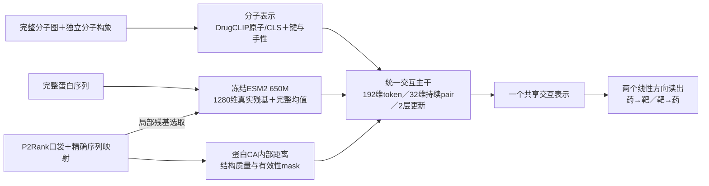

# 统一交互主干：实现与首轮受控训练测试

2026-09-06。状态：**五组单种子开发对照与三个早期选定模型的时间重训回归已完成；未替换生产/V3＋J。**

这轮已实现共享交互表示，并完成训练与测试。各表为本次实际输出。单种子、已观察过的测试集合及公共预训练来源限制了结论：不能据此宣称超过DTIAM/DrugCLIP或获得新的前瞻验证。

早期验证的总体优胜者是 **capacity**，局部方案中优胜者是 **geometry**；总体选择来自2021–2022验证分数，未在后期测试中重选。

capacity的2023–2025双向AP为0.2997/0.1633；相对global为-0.0725/-0.0195，相对temporal_J为+0.0191/+0.0068，相对positive_nearest为+0.0268/+0.0098。

geometry的2023–2025双向AP为0.2550/0.1789；相对global为-0.1172/-0.0039，相对temporal_J为-0.0256/+0.0224，相对positive_nearest为-0.0178/+0.0254。

**本轮主要发现：预先纳入的简单G对照在时间回归取得0.3722/0.1828双向AP，原J为0.2806/0.1565；完整geometry为0.2550/0.1789，没有超过G。KIRHub的逆向提升也能由等容量全局模型达到，不能归因于口袋几何。几何对应被打乱后早期老药检索AP没有下降，尚不能证明几何匹配对目标任务有稳定益处。** G在后期测试表现较好属于结果观察，不回改已冻结的早期选择。

## 1. 实际架构

下图为已实现并训练的geometry完整候选；global/capacity仅使用同源全局输入。公共分子与蛋白编码器保持冻结，训练的是共享交互模块和读出。



全局摘要每层参与原子—残基pair更新，pair状态再更新两侧token与全局状态；分子消息绑定具体邻居的键类型和立体信息。口袋模块只用蛋白内部CA距离，未使用分子—蛋白跨坐标系距离。缺失口袋时几何增量严格为零。近邻和旧J只作为独立对照，不是该网络的必加分数。

G使用同源CLS、全分子化学摘要和完整蛋白均值；局部版增加逐原子化学特征和同源预训练token。原子数超过128的分子保留完整图摘要并回退，不截断后冒充完整分子。所有标签行继续参与训练。

五组都使用由分子构象产生的DrugCLIP全局表示，G也包含分子内部三维预训练信息。本轮比较的是增加显式局部交互和蛋白口袋几何的增量，不是“三维对纯二维”的实验。

## 2. 数据与表示覆盖

- 必需化合物：266,747；成功DrugCLIP预训练表示：264,042；保存真实重原子状态：8,542,254。
- 384/384个靶点有完整逐残基ESM2，补齐了原先缺失的24个；352个靶点有严格映射的759个预测口袋，32个靶点走序列回退。
- 720个目录老药全部保留局部完整重原子图，其中719个具备DrugCLIP三维预训练表示，1个使用化学图回退。
- 局部上限96个真实残基，完整蛋白摘要始终保留；352个有口袋靶点中334个保留整个口袋残基并集，其余18个显式子采样。覆盖率记录在TARGET_COVERAGE.csv，不能把局部96个token宣称为整条蛋白逐残基交互。
- 构象采用ETKDGv3＋最多50步MMFF/UFF；263,855个优化返回未收敛标志，因此是可复现的初始构象，不能称为已充分优化的低能构象。2,042个构象失败与663个超限分子使用明确的图/全局回退。
- 开发训练292,408条≤2020年实测二元关系，其中720目录有770条阳性；验证使用2021–2022首次合格测量，老药53条阳性、34个药物查询和39个靶点查询。最终重训351,620条≤2022关系，老药815条阳性。

## 3. 首轮消融：早期验证集

global＝G；capacity＝等参数量全局对照；sequence＝G＋真实序列残基局部交互；site＝改用预测口袋残基，无三维几何；geometry＝site＋内部CA几何和质量。参数量对照与几何版仅相差78个参数。site到geometry仍额外增加约15万参数，因此几何特异性还需后续局部容量对照及复现，不只看一个AP差值。

| variant | parameters | trained_epochs | selected_epoch | d2t_ap | t2d_ap | d2t_r20 | t2d_r20 | seconds |
| --- | --- | --- | --- | --- | --- | --- | --- | --- |
| global | 838292 | 7 | 3 | 0.4026 | 0.3026 | 0.6804 | 0.6325 | 56.6505 |
| capacity | 2711508 | 10 | 6 | 0.3728 | 0.3419 | 0.6877 | 0.7094 | 88.7467 |
| sequence | 2562052 | 8 | 4 | 0.4100 | 0.2372 | 0.6010 | 0.5299 | 845.0084 |
| site | 2562052 | 8 | 4 | 0.3472 | 0.3542 | 0.5495 | 0.6368 | 857.0870 |
| geometry | 2711430 | 10 | 6 | 0.4026 | 0.2885 | 0.6980 | 0.5812 | 1311.3439 |

各公共轮次的逐样本曝光SHA256完全一致；每轮完整覆盖292,408条观测，并使用相同种子抽取老药检索查询。BCE只接收实测0/1；额外检索分母包含未知关系，保留查询的全部已知阳性。此检索目标仍会受到未标注真阳性的影响，不能解释成把未知关系证实为无活性。

补充列出固定第6轮（协议预设的最小训练轮数），观察相同累计标签曝光下的表现。此表不假定各架构已同等收敛；主选择仍按各自早期验证最佳轮次。

| variant | epoch | d2t_ap | t2d_ap | d2t_r20 | t2d_r20 |
| --- | --- | --- | --- | --- | --- |
| global | 6 | 0.4420 | 0.2623 | 0.6039 | 0.5620 |
| capacity | 6 | 0.3728 | 0.3419 | 0.6877 | 0.7094 |
| sequence | 6 | 0.3704 | 0.2012 | 0.6147 | 0.4786 |
| site | 6 | 0.3486 | 0.2518 | 0.5667 | 0.5598 |
| geometry | 6 | 0.4026 | 0.2885 | 0.6980 | 0.5812 |

训练上限12轮，至少6轮、验证4轮无改善早停；最终从头重训到开发选定轮数。达到上限不等于充分收敛，训练时间和验证轨迹一并保存。这里没有同条件连续亲和力或复合物接触标签监督。


早期验证预先规定的AP/R@20复合目标选择局部候选 **geometry**；最终仅重训global、capacity和该局部候选，未用后面的测试成绩回选。

## 4. ≤2022重训，2023–2025首次合格测量回归

同一720药×384靶点目录，移除截止2022已测或无日期的关系；未知候选仅为检索背景。此处71条新阳性，45个药物查询、49个靶点查询。所有模型均按相同下游年份比较。

| model | direction | macro_ap | macro_recall_20 |
| --- | --- | --- | --- |
| global | d2t | 0.3722 | 0.6370 |
| global | t2d | 0.1828 | 0.4456 |
| capacity | d2t | 0.2997 | 0.6370 |
| capacity | t2d | 0.1633 | 0.4915 |
| geometry | d2t | 0.2550 | 0.6333 |
| geometry | t2d | 0.1789 | 0.5374 |
| temporal_v3 | d2t | 0.1527 | 0.4056 |
| temporal_v3 | t2d | 0.0815 | 0.2874 |
| temporal_J | d2t | 0.2806 | 0.5444 |
| temporal_J | t2d | 0.1565 | 0.4473 |
| positive_nearest | d2t | 0.2729 | 0.6833 |
| positive_nearest | t2d | 0.1535 | 0.4830 |

G对照相对J及近邻的AP差与查询bootstrap 95%区间：药→靶下界略高于0，靶→药区间跨0。它们是单种子、已观察过回归集上的未校正区间，不等于独立确认；G的药→靶R@20仍低于近邻。

| control | direction | delta_ap | ci_low | ci_high |
| --- | --- | --- | --- | --- |
| temporal_J | d2t | 0.0916 | 0.0028 | 0.1843 |
| positive_nearest | d2t | 0.0993 | 0.0008 | 0.2029 |
| temporal_J | t2d | 0.0263 | -0.0491 | 0.1104 |
| positive_nearest | t2d | 0.0293 | -0.0478 | 0.1137 |

局部候选geometry相对对照的AP差与查询bootstrap 95%区间（不是跨种子区间，也未作多重比较校正）：

| control | direction | delta_ap | ci_low | ci_high |
| --- | --- | --- | --- | --- |
| global | d2t | -0.1172 | -0.2121 | -0.0287 |
| capacity | d2t | -0.0447 | -0.1458 | 0.0495 |
| temporal_J | d2t | -0.0256 | -0.1239 | 0.0651 |
| positive_nearest | d2t | -0.0178 | -0.1171 | 0.0796 |
| global | t2d | -0.0039 | -0.0669 | 0.0645 |
| capacity | t2d | 0.0156 | -0.0420 | 0.0756 |
| temporal_J | t2d | 0.0224 | -0.0613 | 0.1121 |
| positive_nearest | t2d | 0.0254 | -0.0589 | 0.1166 |

594个可确认2023年前获批药物的敏感性分析（54条阳性、34个药物查询、40个靶点查询）：

| model | direction | macro_ap | macro_recall_20 |
| --- | --- | --- | --- |
| global | d2t | 0.3088 | 0.5686 |
| global | t2d | 0.1737 | 0.4875 |
| capacity | d2t | 0.2694 | 0.5980 |
| capacity | t2d | 0.1660 | 0.5083 |
| geometry | d2t | 0.2455 | 0.5637 |
| geometry | t2d | 0.1477 | 0.5625 |
| temporal_v3 | d2t | 0.1509 | 0.3652 |
| temporal_v3 | t2d | 0.0936 | 0.3167 |
| temporal_J | d2t | 0.2640 | 0.5343 |
| temporal_J | t2d | 0.1768 | 0.4417 |
| positive_nearest | d2t | 0.2415 | 0.6103 |
| positive_nearest | t2d | 0.1566 | 0.4417 |

分年、实测候选AP及有结构共同范围的结果见TEST_METRICS.csv。各范围分母不同，不能直接横向比较其AP高低。

## 5. KIRHub回归与几何敏感性

历史严格2823条关系，标签为1μM下残余活性≤30%。本表的V3、J、NN也使用≤2022时间版，与此前全时段J的KIRHub数字不是同一组权重。逐项记录了与早期已测关系的重叠，另列单构建体且截止2022未测的范围；KIRHub是功能抑制测量，不是统一Ki/Kd亲和力。

| model | direction | macro_ap | macro_recall_20 |
| --- | --- | --- | --- |
| global | d2t | 0.3604 | 0.6759 |
| global | t2d | 0.3542 | 0.8664 |
| capacity | d2t | 0.3815 | 0.7134 |
| capacity | t2d | 0.4543 | 0.9000 |
| geometry | d2t | 0.4055 | 0.6498 |
| geometry | t2d | 0.4589 | 0.8805 |
| temporal_v3 | d2t | 0.3781 | 0.6806 |
| temporal_v3 | t2d | 0.2893 | 0.8657 |
| temporal_J | d2t | 0.3992 | 0.6583 |
| temporal_J | t2d | 0.3378 | 0.8856 |
| positive_nearest | d2t | 0.4011 | 0.6771 |
| positive_nearest | t2d | 0.3098 | 0.8509 |

geometry相对同时间J与等容量全局对照的AP差与查询bootstrap 95%区间：逆向相对J为正，但相对capacity接近0且区间跨0。容量和交互输入的贡献不能混为一谈。

| control | direction | delta_ap | ci_low | ci_high |
| --- | --- | --- | --- | --- |
| capacity | d2t | 0.0241 | -0.0354 | 0.0960 |
| temporal_J | d2t | 0.0063 | -0.0559 | 0.0705 |
| capacity | t2d | 0.0047 | -0.0405 | 0.0499 |
| temporal_J | t2d | 0.1211 | 0.0585 | 0.1889 |

geometry开发权重的早期验证坐标打乱检查（保持口袋选择、残基状态、质量与mask，仅打乱几何对应）：

| input | d2t_ap | t2d_ap | d2t_r20 | t2d_r20 |
| --- | --- | --- | --- | --- |
| original | 0.4026 | 0.2885 | 0.6980 | 0.5812 |
| shuffled | 0.4141 | 0.2902 | 0.6833 | 0.6068 |

扰动只用于观察模型是否利用几何；敏感性不等于已学到真实接触，不能替代有复合物真值的验证。

主实验采用BF16 autocast、保存FP32分数，固定候选ID处理并列。早期G权重的额外全FP32推理诊断不回改选模：BF16双向AP=0.4026/0.3026，FP32=0.4028/0.3020。微小差异需结合数值精度和跨种子复现解释。

## 6. 结论边界与下一轮

本轮总体验证优胜者capacity与局部候选geometry的成绩均保留；整套方案的变化不能全部归因于三维交互。G的时间排序改善、geometry的KIRHub逆向改善、以及geometry未超过等容量对照，是不同层面的结果。

早期验证只含53条老药阳性，选择capacity而后期G表现更好，提示需要更早的滚动时间验证和跨种子检查来评估选择稳定性。尚不能据此把G事后改写成预先选定的优胜模型。

本轮回答“统一交互能否训练、哪些信息在首轮有增量”。生产候选不自动晋级。下一轮先复现20260922/20260923种子并加入局部等容量/几何打乱训练对照；只对可重复增益部分继续投入。若局部版未超过简单G，应先定位优化目标、原子/残基对齐和预训练失配，不能靠继续叠评分分支解释。

当前训练是全体实测BCE＋老药已知关系的均匀候选检索，没有同assay的实测难阴性/相近靶点选择性排序，也没有局部接触真值。现有结果只约束这套训练方案，不能否定原子—残基或三维信息本身。优先验证两项算法改动：由本轮G初始化共享全局表示，再逐步开放局部层并联合优化；加入同条件实测选择性排序，检验局部特征是否终于被用于区分相近候选。前者须配套“G继续训练相同步数”的对照，不固定添加旧模型分数。

当前交互仅受关系标签监督；冻结公共编码器＋CA口袋几何不等于训练过真实复合物接触。值得进一步检验的是复合物接触/结构对比预训练、口袋侧配套预训练、可靠的构象与结构质量、部分编码器微调，以及对未标注阳性更稳健的双向检索目标。每项先做来源重叠审计，再进行独立消融。

**时间声明只针对下游标签。** 当前DrugCLIP发布权重和ESM2语料尚未证明早于2020/2022，DrugCLIP还是分子—口袋对比预训练，可能存在训练复合物重叠；完整预训练年代与重叠审计未完成。当前目录本身也不是历史冻结目录。本轮与先前已打开的2023–2025/KIRHub都只能作回顾性开发/回归，不作严格历史前瞻或新SOTA结论。

## 7. 实现与复现

- 模型：`biomaster/unified_interaction.py`；特征接口：`biomaster/unified_features.py`。
- 特征：`scripts/prepare_biomaster_unified_interaction.py`；官方接口核验：`scripts/verify_biomaster_unified_pretrained.py`。
- 训练：`scripts/train_biomaster_unified_interaction.py`；顺序运行：`scripts/run_biomaster_unified_round.py`。
- 协议：`configs/biomaster_unified_interaction_20260906.json`；产物：`outputs/biomaster_unified_interaction_20260906/`。
- 20项模型/时间/排序测试通过；完整特征、残基索引、相同曝光、预训练接口及旧V3/J源码哈希检查通过。大特征和权重只存本地，Git保留紧凑审计文件。

```bash
python scripts/prepare_biomaster_unified_interaction.py all --workers 48
python scripts/verify_biomaster_unified_pretrained.py
python scripts/run_biomaster_unified_round.py
```
