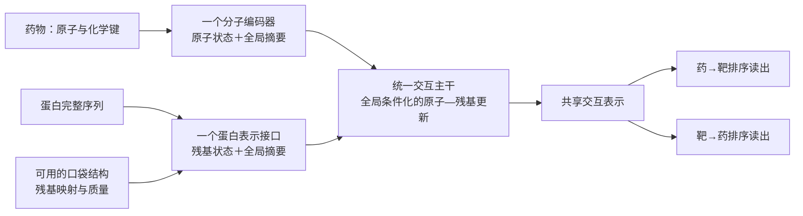

# 统一交互主干修订：收敛当前 V3＋J 的结构

2026-09-06。状态：**原始架构评审与实验规格；统一主干已实现并完成首轮训练/回归，未替换当前 J。** 实际实现、五组对照及结果见[首轮报告](BIOMASTER_UNIFIED_INTERACTION_FIRST_ROUND_20260906_ZH.md)。本轮未证实局部/几何相对全局对照的可靠净增益。下文保留设计时的判断，尺寸建议不代表最终选优。

设计目标是让全局上下文、原子—残基匹配和口袋几何共同形成一个可学习的交互表示。当前 J 继续保留为已验证的增量基线；本次不把新的分支继续叠加到冻结 J 的末端。

## 1. 当前结构中已经确认的问题

| 代码事实 | 对能力的限制 | 证据状态 |
|---|---|---|
| J 固定两个 V3 的平均分数，并用有界残差修正 | 交互损失不能更新旧底座；旧分数是必加项 | 已核对 `odti_v3_incremental.py` 和训练入口 |
| J 的 BerMol、完整 ESM2 是池化全局向量，各压到48维后进行积/差交互 | 后续网络无法从这个接口访问逐原子、逐残基或空间位置 | 已确认当前输入接口；不能据此断言池化模型必定弱 |
| 同一支持库既影响底座注意力/门控，又影响 J 的有符号证据项 | 存在相关的多条分数路径；是否必要、何时冲突仍需逐项消融 | 路径已确认，不能把重复使用等同于已证实的错误双计数 |
| 六专家、两底座、三adapter并存 | 集成可降低方差，但模块增多不能证明单模型交互能力增强 | 复杂度已确认；没有证据把集成本身判为性能下降原因 |
| 旧 `LocalInteractionBackboneV3` 有原子图、残基状态和持续pair张量；当前J未启用 | 已有可复用的局部交互代码，但不能把它写成当前J的能力 | 已确认 |
| 旧局部路径在可用时替换全局分数；口袋坐标主要用于映射核验，局部网络没有接收内部距离 | 既丢失共同全局上下文，也没有真正利用口袋几何 | 已确认旧实现；其历史失败不能代表所有局部/几何模型 |

时间外推已经证明J相对同时间V3有增益：720目录首次合格测量的双向AP由0.1527/0.0815升至0.2806/0.1565。但其药→靶R@20为0.5444，低于阳性近邻0.6833；相对近邻的AP增量区间仍跨0。由此支持“保留J作为基线，检验更强交互”，不能推出“缺少三维就是全部差距的原因”。详见[时间与KIRHub报告](BIOMASTER_V3_KIRHUB_TEMPORAL_20260906_ZH.md)。

## 2. 收敛后的主路径

**一个模型、一个交互表示、两个轻量排序读出。** 全局表示持续参与局部更新；口袋改变残基表示及几何关系。主路径不要求先得到药物—受体结合姿态。

### 分子端

保留逐原子token、键类型和明确手性；由同一套原子状态读出全局摘要。首先核验本地配套的预训练分子编码器能否无损导出token和原子映射，再确定初始化。DrugCLIP/Uni-Mol是已有资产中的候选，不把“存在权重文件”当作token接口已就绪。Morgan留在近邻基线和化学相似度分层，初版不再作为额外加分分支；不默认再叠一个BerMol评分头。

### 蛋白与口袋端

逐残基ESM状态与完整序列摘要共同保留。口袋必须映射回同一序列的真实残基；结构分支提供口袋内部邻接、距离编码和质量mask，再融合到对应残基状态。几何特征与序列表示不是两个互相替代的评分头。

缺失口袋时，统一主干仍使用序列残基及全局上下文。长序列通过覆盖完整序列的分块和摘要控制计算；不能截去尾部后宣称完整，也不能把序列窗口称为真实口袋。多个口袋需去重和归一化聚合，避免口袋数量机械抬分。

分子构象与蛋白结构通常处于独立坐标系。无姿态模型可以使用各自内部几何，**不能直接把两者坐标相减当作原子—残基接触距离**。交互注意力也不自动等于真实接触图。

### 共享交互主干

初始小规模实现建议沿用V4设计中的token宽256、pair通道64、3个block，作为待验证的起点。维度不是已选优超参数。

每个block用原子状态、残基状态和两侧全局摘要更新pair状态 `Z[atom,residue]`，再由pair状态更新两侧token。分子键与蛋白/口袋内部空间邻域分别约束各自一侧的消息传递；有几何和无几何走相同交互接口。所有block结束后形成一个共享pair表示，再由两个小读出输出方向分数。

不固定加回旧J或旧V3分数。模型选择仍可选择原基线；无需把“永远加旧分数”当作防退化的唯一方式。公共编码器可先冻结，待交互头有效后再验证小范围微调；冻结预训练特征和永久冻结旧任务评分函数是不同的选择。

## 3. 从初版主干移出的部分

| 当前部件 | 修订处理 |
|---|---|
| V3平均分＋三adapter残差的部署组合 | 完整冻结为比较基线，新主干不依赖其输出 |
| 六个专家头 | 初版使用共享交互主干；只有匹配实验有增益再考虑路由 |
| 两次支持证据融合 | 初版从主模型移出，近邻与PN继续独立评估 |
| 多个池化表示分别生成分数 | 尽量由同一编码器产生局部token与全局摘要，在表示层融合 |
| DrugCLIP另加一个输出分数 | 首先作为配套分子/口袋预训练与独立基线；不默认追加到新模型输出 |
| 三种子输出集成 | 首先报告单模型性能及种子分布，集成收益最后单列 |

移出支持路径是检验独立交互能力的实验取舍，不意味着否定上一轮证据增益。若统一主干仍不能胜过近邻，直接报告失败。后续若重加检索信息，只允许一个明确接口，单独检验收益及缺失证据行为。

## 4. 最小消融及训练约束

| 实验 | 唯一主要改动 | 要回答的问题 |
|---|---|---|
| G | 同源预训练全局摘要＋简洁共享交互 | 统一且简单的预训练基线能到哪里 |
| G＋L | 增加原子—残基token/pair更新，无真实口袋几何 | 局部交互是否有可重复的增益 |
| G＋L＋P | 加入映射口袋的内部几何和质量mask | 结构信息是否带来独立增益 |
| G＋L＋P＋R（后续） | 只增加一个训练期参照证据接口 | 超过主干的增量是否值得复杂度 |

G/G＋L/G＋L＋P使用相同化合物/靶点、监督来源、候选范围、种子和标签曝光。口袋缺失不能改变训练样本名单；同时报告共同有结构子集和完整候选结果。显式区分“多训练参数/更多计算”与“增加局部/几何输入”的影响；增加匹配容量的G对照，并报告训练时间与实际收敛曲线，不以同样六轮当作同样充分收敛。

全局分子—靶点标签只能直接监督配对结果，不能凭空提供原子—残基接触真值。若加入接触监督，必须来自有来源及重叠审计的复合物子集；功能抑制与Ki/Kd/IC50也不能混成一个统一物理亲和力标签。同条件测量负责相对活性/选择性约束，双向检索损失负责候选排序，未知关系不作为实测阴性。

2023–2025和本轮KIRHub已用于结果分析，后续开发只能将其作为回归测试。先在更早的滚动时间验证与同条件选择性数据上设计/选择，正式新增外推结论需要另行冻结未用于选择的时间或外部集合。

## 5. 现有代码如何复用

- `biomaster/odti_local_v3.py`：复用持续pair状态和mask处理；改造键—邻居联合消息、加入全局条件化和几何输入。不是原样重跑旧局部替换路径。
- `biomaster/odti_local_features_v3.py`、`biomaster/odti_pockets_v3.py`：复用映射与缺失数据处理，先核验残基/原子索引、真实几何和可用性。
- `biomaster/ranking_audit.py`、时间原始测量提取/切分工具：复用评估分母、首次合格测量判定和双向排名。
- 当前V3/J的权重、训练源码和已冻结产物不修改。已有V4文档中多层分数相加的路线，由本修订中的统一表示主干取代为下一轮候选设计。

参考方法提供的是不同的交互归纳偏置：[DrugBAN原论文](https://eprints.whiterose.ac.uk/id/eprint/195230/)用药物图、蛋白序列与局部双线性注意力；[DrugCLIP原论文](https://proceedings.neurips.cc/paper_files/paper/2023/hash/8bd31288ad8e9a31d519fdeede7ee47d-Abstract-Conference.html)用对比学习对齐分子和口袋表示。它们支持研究局部交互与结构预训练，不保证把模块拼接后能胜过本项目基线。
