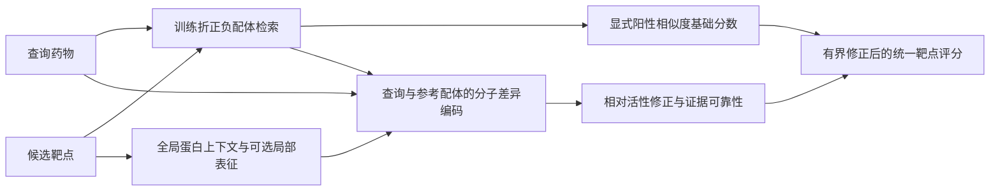

**BioMaster V3：完整训练结果、失败机制与下一步模型方向**

日期：2026-09-05。六个配置、每配置两个种子、每次六轮完整训练，共12个正式任务，已于09:32 UTC全部完成。本文根据保存的检查点、训练历史和预测重新汇总；本次分析没有重训、重新选检查点或在测试集上拟合融合权重。

**结论：工程构建完成，核心模型能力尚未升级成功。** 支持集使神经模型的完整靶点检索显著改善，但仍未超过直接阳性近邻。当前排序目标没有显示检索增益；把局部原子—蛋白交互升为主评分路径，在本轮预算下明显失败。下一步应把“保留已有化学证据、学习有实测参照的活性差异、约束跨靶点评分”放到架构中心。

这也修正了[上一版方案](BIOMASTER_ARCHITECTURE_ALGORITHM_UPGRADE_20260905_ZH.md)的判断：支持集值得保留；“局部交互作为主干就会提高能力”没有得到支持，不能继续把它作为已验证方向。

**全部结果**

神经模型报告两个种子各自选中检查点的指标均值；括号是两个种子的最小值和最大值，不是置信区间，也不是集成模型。

| 配置 | 实测药物宏AP | 完整面板已知阳性AP，均值（范围） | 完整面板Recall@20 | 单次训练及评估平均耗时 |
|---|---:|---:|---:|---:|
| A：全局模型，pair监督 | 0.9313 | 0.2361（0.2265–0.2458） | 0.5658 | 1.9分钟 |
| B：全局模型＋正负支持集 | 0.9496 | **0.6630（0.6515–0.6746）** | **0.8727** | 3.0分钟 |
| C：全局模型＋排序损失 | 0.9348 | 0.2072（0.2048–0.2096） | 0.5191 | 3.0分钟 |
| D：全局模型＋支持集＋排序 | 0.9511 | 0.6400（0.6054–0.6746） | 0.8355 | 4.1分钟 |
| E：局部主干＋排序 | 0.9278 | 0.0597（0.0534–0.0660） | 0.2293 | 75.2分钟 |
| F：局部主干＋支持集＋排序 | **0.9517** | 0.3553（0.2914–0.4192） | 0.7867 | 79.1分钟 |
| 阳性最大Tanimoto基线 | 0.9209 | **0.9663** | **0.9844** | — |
| 正负相似度Logistic基线 | **0.9574** | 0.8797 | 0.9578 | — |


实测AP只在有明确正负标签的772个测试药物上计算。完整面板AP在固定64个测试药物、495个候选靶点、84条已知阳性上计算；未标注组合是检索背景，不能视为实测阴性。两个AP衡量的对象不同。这里的“完整”指495个本轮候选靶点，不代表项目全部目标宇宙。

所有神经配置和基线使用相同候选、相同训练折支持信息。实体哈希留出协议不是时间前瞻，也不是旧S5协议；不能与历史AP直接相减报告升级幅度。耗时来自每次运行的训练及评估计时，不含公共缓存构建和队列全部开销。

证据：[原始12次结果](../outputs/biomaster_v3_20260905/experiments/EXPERIMENT_RESULTS_V3.csv)、[聚合CSV](reports/v3_results_20260905/AGGREGATE_RESULTS_V3.csv)、[指标与曝光复核](reports/v3_results_20260905/RESULTS_VERIFICATION_V3.json)。

**这轮实验确实回答了什么**

1. **支持集包含重要增量。** B相对A，完整面板AP增加0.4269；D相对C增加0.4328。按药物计算、先对固定两个种子取均值后，B在59/64个药物上优于A。模型应继续使用训练配体证据，但当前注意力和门控没有把证据利用好：最好的神经配置B仍比直接阳性近邻低0.3032。
2. **当前排序损失未解决全靶点任务。** C相对A平均下降0.0289；D相对B下降0.0231。两项药物配对bootstrap区间都跨0，不能泛化成“排序学习无效”。D的第一个种子选中warm-up第1轮，尚未启用排序，检查点与同种子B逐张量相同；不能把该结果归功于排序损失。
3. **当前局部主干的收益为负。** E相对C完整面板AP下降0.1475，F相对D下降0.2847；两个种子方向一致。F相对D的药物配对bootstrap区间为[−0.3518, −0.2194]，而实测AP只增加0.00059。其计算耗时却分别增加25.5倍和19.1倍。
4. **不宜宣布局部模型已训练收敛。** E两种子都选第6轮，验证实测AP仍在上升；F均选第5轮。当前结论是这套实现、目标和六轮预算的组合不划算，尚不能证明所有局部模型都不适合该任务，也没有证据表明单纯长训就能补回巨大检索缺口。

上述bootstrap为10,000次完整药物配对重采样，只描述当前64个查询、固定两个模型种子的查询抽样不确定性，不包含训练种子、家族或模型选择不确定性。两种子不足以估计完整训练方差。

**根本问题一：训练任务和选模指标允许模型“实测分类很强、全靶点排序很弱”**

训练有233,730个药物，但只有6,450个同时拥有实测正负靶点，约2.76%；186,301个只有一个实测靶点。即使在6,450个可排序查询中，也有3,718个只有两条记录，4,940个只有一个阴性靶点。查询排序每药最多使用16条实测关系，而实际评分面对495个靶点。把稀疏实测查询排好，不会自动使未测候选的分数可比较。

验证选模同样只看实测药物宏AP。F在这个指标上几乎追平D，但面板AP丢失0.285，说明当前选模目标无法可靠约束用户关心的行为。由于没有逐轮保存完整验证面板分数，不能事后声称某个未选轮次一定更好。

补充诊断中，E在64药物上的靶点平均分与训练靶点阳性率的Spearman相关为0.655/0.659，A为0.420/0.376，B为0.078/0.115。它与“局部模型更多依赖靶点总体活性倾向”的解释一致，但相关性不证明因果，也不是靶点关系条数越多分数就越高。计算排除了3个没有训练记录的靶点，详见[靶点先验关联](reports/v3_results_20260905/TARGET_PRIOR_ASSOCIATIONS_V3.csv)。

**根本问题二：证据缺失和负证据被混入绝对分数，容易在新候选上外推失控**

当前[支持模型](../biomaster/odti_support_v3.py)把最大/平均相似度、支持可用性和注意力表征共同输入门控及修正头，再加到主分数上。直接有效的阳性最大Tanimoto没有作为基础分数保留；网络可以学习出任意重排。

神经模型存在一个集中出现的外推现象：F的seed 20260905中，47/64个查询的Top1落在本轮训练表只有阴性、没有阳性记录的靶点上，XPO1（索引830）单独占33个Top1；另一个种子的对应数字为18/64和0/64。本轮XPO1二元训练记录只有一条明确失活证据；“没有阳性”仅指这份训练快照，不代表XPO1没有已知活性配体。这个模式说明单侧稀疏支持条件下存在需要定位的过高评分和种子不稳定性，不证明这批未测药物对XPO1一定无活性。

进一步对冻结F检查点执行64条XPO1评分分解，与原预测最大差仅`1.91e-6`：XPO1全部走**缺失局部输入的全局回退**，不是它的局部口袋直接产生高分。每条只有1个阴性支持、0个阳性支持，支持门控中位数0.9979，支持项实际加分中位数**+5.4266 logit**；最终logit中位数8.2585。只在机制探针中去掉XPO1这一项支持修正、保留全部候选和其他分数，它的Top1次数从33变为0。由此可以把这个具体异常定位到“全局回退＋单侧阴性支持仍产生巨大正向修正”。这项归因只适用于该检查点和案例，不能替代其他配置的分解，也不是按靶点人工修改生产分数的方案。见[分数分解摘要](../outputs/biomaster_v3_20260905/analysis_algorithm/XPO1_SCORE_DECOMPOSITION_SUMMARY.json)。

只作为诊断，移除32个训练无阳性的候选靶点后，F第一个种子的AP从0.2914变为0.5771，仍远低于阳性近邻。这解释了部分下降，不能解释全部，也不能据此把可能存在新作用的靶点从生产面板删除。原始全495靶点结果始终是本文正式结果。证据：[逐运行/逐查询诊断及复算入口](../outputs/biomaster_v3_20260905/analysis_algorithm/SUPPORT_EXTRAPOLATION_SUMMARY.json)。

简单PN Logistic也暴露了同类问题：它在实测AP上最强，但完整面板AP从阳性近邻的0.9663下降到0.8797。相对阳性近邻，12个药物变差、2个变好。逐项分析发现，727次背景候选越过已知阳性的排名反转中，背景候选的阴性近邻都更远；对“阴性不相似”的奖励抵消了它们更弱的阳性相似度。727个组合均未测，不能称为已确认假阳性，但这种评分行为确实妨碍已知阳性检索。548次反转来自一个药物，因此不能把727项当作727个独立案例。

具体例子：药物索引231071的已知阳性靶点73，阳性最大Tanimoto为0.8133，近邻基线排第1，PN却排第20。一个未测候选靶点833只有0.2478的阳性相似度，但没有阴性支持，PN分数反而比该已知阳性高1.6098。这直接展示了“缺乏反证”在当前分数中变成相对优势。

因此负支持不是无用；需要区分“有可靠的相似阴性证据”和“没有可比阴性证据”。缺少阴性支持不能直接成为高活性证据。这是评分函数和学习目标的设计问题。

**根本问题三：当前局部主干并没有获得足以替代全局与近邻的交互知识**

代码核查确认以下限制：

- 局部输入可用时，`local_head(local_hidden)`直接替换全局分数和交互隐状态。Morgan、ProtBERT、pooled ESM和家族上下文没有共同进入局部主路径。F的支持分支仍能使用Morgan分子编码，但不等于全局交互已经融合。这与原设计图中“全局上下文进入局部交互”的目标存在差距。
- P2Rank口袋选择是真实接入的，但CA坐标只用于映射核验，网络没有使用口袋内部距离、接触图或方向；也没有配体—受体姿态。它目前属于原子—局部序列交互模型，不能当作完整几何结合模型。
- 口袋置信度、区域类型未进入模型；随机初始化的分子消息传递把邻居表示汇总后另加键类型计数，无法充分表达“哪个邻居通过哪种键连接”。需要升级消息函数，而不仅增加层数。
- 完整序列上下文被压缩；但438个有口袋输入的靶点中，927个有效口袋仅136个超过32残基，不能把所有失败都归咎于口袋分箱。

实现证据：[主路径选择](../biomaster/odti_support_v3.py)、[局部编码与消息函数](../biomaster/odti_local_v3.py)、[局部特征](../biomaster/odti_local_features_v3.py)。上述限制已确认；每一项分别造成多少下降，尚需消融验证。

**如何理解0.9663的强近邻结果**

64个查询的84条已知阳性中，最近训练阳性配体的Tanimoto中位数为0.8174，80.95%至少为0.7，61.90%的最近阳性具有相同骨架。9条有完全相同的Morgan指纹，其中8条对应仅立体化学不同的分子；没有发现查询自身实体进入支持集。这个结果也提示无手性Morgan的表示局限。

整个测试折32,649条阳性的最大Tanimoto中位数为0.8113，与这64个查询相近。因此强近邻并非主要来自64个查询特别偏向高相似度，而是当前实体留出整体就包含丰富的化学近邻。剔除涉及精确Morgan匹配的7个查询药物后，剩余57个查询的阳性近邻AP仍为0.9636，优势不是主要由这几条指纹碰撞造成。

但64只占25,038个有阳性测试药物的0.256%，涉及57个阳性靶点；家族比例也不完全代表测试集。它足以暴露当前严重退化，却不足以证明0.9663能推广到新骨架、低相似度或所有家族。详见[支持证据诊断](../outputs/biomaster_v3_20260905/analysis_support/SUPPORT_ANALYSIS_V3.json)。

**下一步的主架构：以配体证据为基础，学习相对活性与选择性变化**

建议V3.1采用以下结构，先回答“能否保留强证据并学出额外价值”，再扩大局部网络：



一种可检验的形式是：

\[
s(q,t)=h\bigl(S^+_{\max}(q,t)\bigr)
       +\lambda g_\theta(q,t,S^+)\tanh\bigl(\Delta_\theta(q,r,t)\bigr)
       -c^-_\theta(q,t,S^-)\,\psi_\theta(q,t,S^-),
\qquad
\Delta_\theta(q,r,t)=F_\theta(q,t)-F_\theta(r,t).
\]

`h`使用所有靶点共享、严格递增的映射；初始基础排序等价于阳性近邻。`r`是有实测证据的参考配体，可扩展为多个参考的可靠性加权。修正头从零输出开始，幅度受控；原子/键编码、证据读取、靶点条件和相对活性头共同训练。没有阳性支持时显式表达缺失，由训练过相同缺失条件的全局/局部专家推断，不删除该靶点。

负支持项单独规定`psi >= 0`，以可比性和相似度决定`c_minus`，缺失时为0；它可以对可靠反证施加惩罚，不能独立产生正向加分。该项也应从零贡献开始训练。相对活性修正分支必须另有阳性参照或经过单独训练的无参照路径，不能通过混用负支持的隐状态绕过符号约束。这是待实现、待消融的结构约束，不是本轮模型已经具备的能力。

这项设计的学习对象是“相对于已测参考分子，哪些化学变化改变该靶点的活性”，而不是再次从稀疏标签估计不受约束的绝对logit。约束只限制初始和修正幅度；不同靶点的修正仍可能改变排序，不能承诺数学上永不退化。

第一阶段使用同靶点已测正负分子对训练相对强弱。后续只有在endpoint、单位和实验条件可比时才加入定量活性差值；当前二元标签不能凭空生成可靠的亲和力差。

**算法需要同步改变**

| 改动 | 要解决的具体问题 | 是否已有收益证据 |
|---|---|---|
| 阳性基础分数直达输出，负证据独立可靠性建模 | 强近邻被注意力和绝对分数破坏；负证据缺失抬分 | 问题已观察到，改法待验证 |
| 训练折内部交叉留出query，构造只有正支持、只有负支持、无近邻等episode | 支持缺失条件和候选扩展下外推 | 待验证 |
| 对完整候选分数加入置信度加权的近邻软排序蒸馏 | 实测排序没有约束未测候选的相对尺度 | 待验证；教师只是先验，不是真标签 |
| 保留明确实测正负监督及同靶点参考差异监督 | 模型需要学习超过近邻的活性变化 | 待验证；不把未知组合全设成阴性 |
| 每轮用完整验证面板选模，同时观察实测AP和近邻难度分层 | 当前选模指标奖励了与目标不一致的模型 | 本轮指标错配已确认 |

蒸馏教师必须由训练折内部生成，排除query实体；外部验证和测试标签不参与构建。强近邻条件下要求少破坏教师，低相似度条件下降低教师权重，给模型学习增量的空间。只蒸馏原近邻并不足以突破其能力上限。

**局部与预训练方向放在第二阶段，以增量证据决定去留**

优先升级为邻居—键联合消息函数，保留全局分子和蛋白上下文，再加入口袋内部几何、区域类型和置信度。分子与口袋预训练值得作为独立变量：Uni-Mol提供分子及口袋的几何预训练路线，DrugCLIP提供分子—口袋对比对齐路线。[Uni-Mol官方实现](https://github.com/deepmodeling/Uni-Mol/blob/main/unimol/README.md)、[DrugCLIP原论文](https://proceedings.neurips.cc/paper_files/paper/2023/hash/8bd31288ad8e9a31d519fdeede7ee47d-Abstract-Conference.html)。

这些工作支持“先学习化学与相互作用表示”的方法方向，不证明其检查点直接适合本项目D→T选择性排序。需要检查输入兼容性和预训练数据重叠，并在低相似度验证查询上测出增量。蛋白口袋内部几何不依赖已有结合姿态；显式药物—受体接触距离则需要姿态来源，不能从两个未对齐坐标系直接计算。

计算上应先预建紧凑分子图、批内按药物去重编码、复用靶点初始投影。当前分子图LRU只有8,192个药物，而训练覆盖233,730个药物；局部模型每轮持续耗时很长，不能仅归因于首轮初始化。需要实际profiler再分配CPU、特征组装和pair张量计算的优化工作。

**建议的下一轮实验与决策顺序**

| 顺序 | 实验 | 核心判定 |
|---|---|---|
| 1 | 完整验证面板与支持缺失诊断；冻结近邻和PN基线 | 看清单侧支持靶点的过高分数；验证集决定后续配置 |
| 2 | 显式阳性基础分数＋小型参考差异头；与同训练协议的自由评分头对照 | 完整面板不再大幅退化，并在实测困难分子上出现增益 |
| 3 | 在同一结构上比较有/无候选软排序蒸馏 | 收益是否来自训练目标对齐，而不是只靠强基础分数 |
| 4 | 加入键条件分子编码或预训练表示，分别消融 | 低相似度和新骨架子集有稳定增量 |
| 5 | 加入具备几何与置信度的局部参考差异分支 | 超过前一阶段后再扩大训练预算 |

先固定至少三个训练种子以及相同训练曝光。完整验证面板可先固定分层1,024个有已知阳性的验证药物，覆盖近邻相似度、支持缺失和家族，再扩展；测试集只在方案固定后评分。当前64个测试药物已用于开发分析，应继续作为回归样本；扩展本轮测试药物仍属于开发评估，正式泛化结论需要新的、未参与模型选择的留出证据。

建议预先约定进入下一阶段的开发门槛：总体完整面板AP相对阳性近邻的配对差异区间下界不低于−0.01，同时在低相似度或实测正负困难子集出现跨种子增益；具体阈值是建议，不是本轮已达成的成绩。若模型只复制近邻而没有新增能力，就不因参数更多而晋级。

**交付与核验**

本轮已具备训练折支持库、全局/支持/局部模型、训练与恢复、独立评分、实测及完整面板评估、固定基线比较。此前实现阶段全项目207项测试通过，项目合同检查通过，见[构建记录](BIOMASTER_V3_BUILD_TRAIN_TEST_20260905_ZH.md)；这次汇报新增的是离线分析与文档，没有更改模型实现。

本次重新核对了12次运行全部完成、每轮覆盖342,031条训练关系、同种子六配置的逐轮曝光hash一致、所有面板药物/靶点/标签一致，且从NPZ重算的全部面板指标与原摘要一致。可用以下命令重新生成聚合、配对比较和图表：

```bash
python docs/reports/v3_results_20260905/aggregate_v3_results.py
```

GPU训练队列已经结束。本轮没有模型晋级生产，也没有自动启动下一轮长训。
