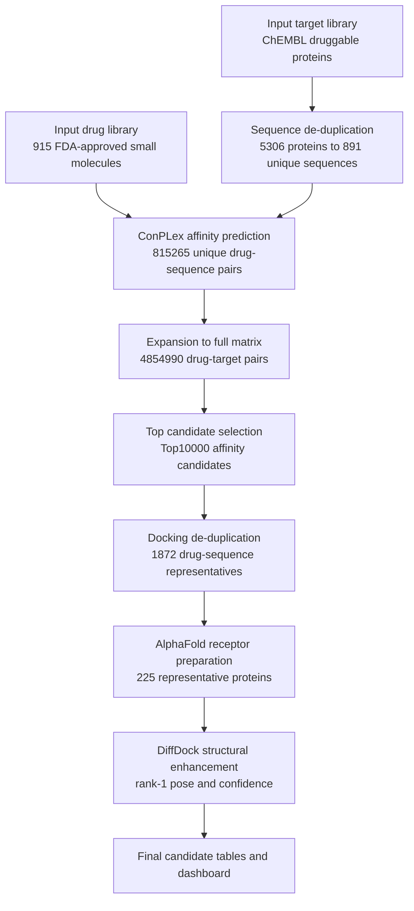

# BioMaster Druggable Proteome Screening Overview

Updated: 2026-05-25

## 1. Executive Summary

This work builds a computational prioritization workflow for drug-target discovery and drug repositioning. Instead of screening every protein in the human proteome, the current strategy uses the ChEMBL druggable target table as the protein scope. This makes the screen more biologically and pharmacologically relevant, because the candidate proteins already have druggability context or historical drug-target annotations.

The workflow has three main stages:

1. Standardize the FDA-approved small-molecule library and the ChEMBL druggable protein library.
2. Use ConPLex to score all drug-protein pairs for predicted drug-target affinity.
3. Select high-priority candidates, collapse duplicated protein sequences, and run DiffDock on representative structures.

The outputs are computational candidate rankings. They should be interpreted as prioritization evidence for expert review and experimental design, not as proof of clinical efficacy.

## 2. Why Use the ChEMBL Druggable Proteome

The previous broad screen considered a much larger human protein space. That is useful for exploration, but it creates two practical problems:

- Many proteins have limited pharmacological relevance or no direct druggability context.
- Running docking on every high-scoring pair across a very large protein set is computationally expensive and produces many redundant sequence-level results.

The new input file, `druggable_proteome_chembl(1).xlsx`, provides a curated drug-related protein set. The current parsed library contains:

| Item | Count |
| --- | ---: |
| Valid protein records | 5306 |
| Unique protein sequences | 891 |
| Usable FDA-approved small molecules | 915 |
| Full affinity matrix | 4854990 drug-target pairs |
| Unique-sequence ConPLex predictions | 815265 drug-sequence pairs |

The key optimization is sequence de-duplication. Many UniProt records share the same protein sequence or represent closely duplicated target records. ConPLex affinity only needs to be computed once per unique sequence, then expanded back to all represented protein records.

UniProt accession is a database record identifier, not a binding site. The workflow does not merge different drugs against the same protein. It only merges the same drug against identical protein sequences, then maps the representative structural result back to the corresponding UniProt accessions.

## 3. What Each Model Does

### 3.1 ConPLex

ConPLex is the AI-DTI model used for the primary screen. It takes a drug representation and a protein sequence representation, then predicts whether the drug and protein are likely to interact.

In this workflow, ConPLex answers:

> Among FDA-approved small molecules and druggable proteins, which drug-protein pairs are most likely to have direct affinity?

The ConPLex score is not a measured binding constant. It is a computational ranking signal used to reduce millions of pairs to a smaller candidate set.

### 3.2 AlphaFold

AlphaFold provides predicted protein structures. DiffDock needs a receptor structure as input, so AlphaFold models are used to prepare receptor PDB files for the selected high-priority candidates.

Long receptors are cropped only when needed for DiffDock feasibility. These crops are computational receptor preparations, not experimentally validated binding-domain definitions.

### 3.3 DiffDock

DiffDock is used after the affinity screen. It predicts a ligand pose inside or near a receptor structure and reports a confidence score for the generated pose.

In this workflow, DiffDock answers:

> For a high-priority drug-target candidate, can the model generate a plausible rank-1 binding pose against the selected receptor structure?

DiffDock confidence is used as structural supporting evidence. It does not replace affinity prediction, disease biology, or experimental validation.

## 4. Current Workflow

## 5. Main Completed Outputs

| Output | Description |
| --- | --- |
| `outputs/druggable_proteome/protein_library_druggable_chembl.csv` | Parsed ChEMBL druggable protein library. |
| `outputs/druggable_proteome/protein_sequence_representatives.csv` | Unique protein sequence mapping table. |
| `outputs/druggable_proteome/conplex_affinity_scores_druggable.csv` | Full expanded affinity matrix for 4854990 pairs. |
| `outputs/druggable_proteome/stage4_affinity_candidates_druggable_top10000.csv` | Top10000 candidates by ConPLex affinity priority. |
| `outputs/druggable_proteome/top10000_druggable_diffdock_seed_manifest_diffdock_ready.csv` | 1872 structure-ready docking representatives. |
| `outputs/druggable_proteome/diffdock_top_unique_run/` | Completed DiffDock run directory for representative docking. |
| `outputs/druggable_proteome/stage6_druggable_top_unique_diffdock_consensus.csv` | Final representative table with affinity, DiffDock, and consensus scores. |
| `outputs/druggable_proteome/stage6_druggable_top10000_with_diffdock.csv` | Top10000 table with representative DiffDock scores mapped back to full candidates. |
| `docs/assets/biomaster-external-report.pdf` | Formal English PDF report for external review. |

## 6. Representative Early Affinity Results

The current Top affinity set contains known pharmacological relationships and plausible rediscovery examples. These cases provide positive-control evidence that the workflow can recover biologically interpretable drug-target pairs. Representative high-scoring examples include:

| Drug | Representative target | Interpretation |
| --- | --- | --- |
| Naloxone Hydrochloride | OPRK1 | Opioid receptor relationship recovered by the affinity screen. |
| Doxazosin Mesylate | ADRA1A | Adrenergic receptor relationship recovered by the affinity screen. |
| Cyclosporine | PPIA | Known immunophilin-binding biology recovered by the screen. |
| Gefitinib | EGFR | Kinase inhibitor-target relationship recovered by the screen. |

These examples do not by themselves validate all novel predictions, but they show that the ranking is capable of recovering biologically interpretable drug-target pairs.

The representative audit separates results into known pharmacology recovered, family-consistent extension candidates, and high-affinity rescue candidates with missing docking output. This makes the current output more useful for expert triage than a raw score table alone.

## 7. How to Interpret Open Targets in This Project

Open Targets is a target-disease association resource. It does not mean that every protein has a cancer-specific binding site, and it does not mean that a drug is effective for cancer.

The earlier cancer-oriented workflow used Open Targets to rank targets by disease relevance. The current druggable-proteome workflow is different: it first screens pharmacologically relevant proteins for predicted drug affinity, then uses docking to add structure-level support. If the next question is a specific cancer type, mutation, or molecular subtype, the disease evidence layer should be reintroduced with the corresponding disease ID and variant context.

## 8. Current Computing Status

Primary ConPLex affinity screening and representative DiffDock docking are complete for the current druggable-proteome run:

| Item | Value |
| --- | ---: |
| Docking representatives | 1872 |
| Input chunks | 8 |
| GPUs used | 2 |
| Receptor-ready pairs | 1872 / 1872 |
| Processed representative pairs | 1872 / 1872 |
| Completed DiffDock outputs | 1370 |
| Missing or failed DiffDock outputs | 502 |
| Representative output rate | 73.18% |
| Top10000 rows mapped to completed structures | 7216 |

Missing outputs are expected for some ligands or receptor-ligand graph constructions. They are retained in the audit table instead of being silently dropped, so the final candidate table distinguishes completed structural evidence from affinity-only candidates.

## 9. Next Steps After This Run

After this run, the workflow should:

1. Review the structure-enhanced Top100 candidates and select 20-50 candidates for expert review.
2. Prioritize candidates with strong ConPLex affinity, completed DiffDock poses, interpretable target biology, and practical drug availability.
3. Review high-value missing-output cases and decide whether to run a small rescue pass with adjusted docking parameters.
4. If the next question becomes disease-specific, add the corresponding disease ID, cancer subtype, mutation, or variant context before re-ranking.
5. Select a smaller 5-20 candidate set for literature review, orthogonal docking, or experimental validation design.

The recommended experimental-review shortlist should prioritize candidates with strong ConPLex affinity, completed DiffDock poses, interpretable target biology, and practical drug availability.
