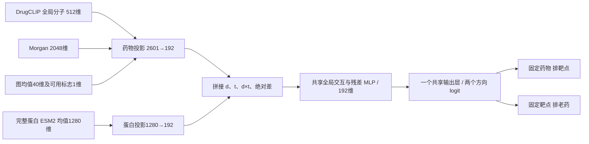

# ReTargetMap 2026-09-06 目录模型

交付一个可独立运行的神经检查点，用于720个目录老药与384个匹配靶点的双向排序。选型范围是本轮明确比较的候选；不作通用最优、SOTA或前瞻验证声明。

架构为 `molecular_control` / `global`，分子输入 `drugclip_morgan`，**1,235,604** 个可训练参数。EMA只在训练时平滑同一网络权重，推理使用一个检查点。两个方向共用交互表示和输出层；没有V3/J/近邻模型分数集成。

## 实际架构

DrugCLIP和ESM2提供缓存的冻结表征，本轮未端到端微调这些公共编码器。Morgan、图均值与分子CLS一次拼接后投影；蛋白输入来自完整序列均值。两侧192维表示的拼接、逐元素乘积和绝对差进入共享MLP。输出为两个方向logit，不能当作亲和力、结合概率或跨不同查询已校准的数值。

本次保留全局模型。局部原子—残基与口袋几何已实际训练并经过同父权重、同额外曝光、近似等容量对照，但未达到预定保留规则或未超过父模型。 这不证明局部相互作用不重要，只限定当前的残基选择、训练监督与优化方案。局部对照使用独立分子构象与受体内部CA距离，没有配体—受体共同坐标系或真实原子接触监督。

## 开发选择和消融

54次全局训练覆盖9候选、两个时间窗口和三个种子；随后24次同父模型局部消融。窗口为≤2018训练/2019–2020验证和≤2020训练/2021–2022验证。三个种子为20260921、20260922、20260923。以下均先对每个种子平均两个窗口，再求种子均值；种子波动见随包CSV。

预设选择分为 `0.35×正向AP + 0.35×逆向AP + 0.15×正向R@20 + 0.15×逆向R@20`。第一组分子结果出现后追加Morgan单独与DrugCLIP＋Morgan对照，该开发扩展已记录；不将整个比较伪称一次预注册。2023–2025与KIRHub不参与本轮架构、轮次或部署种子选择。

| 全局候选 | 综合分 | 药物→靶点 AP | 靶点→药物 AP |
|---|---|---|---|
| global | 0.4002 | 0.3566 | 0.2733 |
| capacity | 0.4063 | 0.3496 | 0.2772 |
| global_ema | 0.4103 | 0.3579 | 0.2932 |
| global_query | 0.4123 | 0.3517 | 0.3136 |
| global_assay | 0.4103 | 0.3495 | 0.3004 |
| bermol | 0.3690 | 0.3504 | 0.2406 |
| bermol_morgan | 0.4092 | 0.3908 | 0.2630 |
| morgan | 0.3704 | 0.3526 | 0.2551 |
| drugclip_morgan | 0.4375 | 0.4211 | 0.2867 |

统一取所有全局候选第6轮的曝光诊断，DrugCLIP＋Morgan＋EMA综合分0.4264，原G为0.3796，G＋EMA为0.3928。同种子/窗口的实测BCE与既有关系检索曝光一致，输入增益不只来自不同早停轮次。该诊断未重新选型。

| 局部阶段 | 参数 | 综合分 | 药物→靶点 AP | 靶点→药物 AP |
|---|---|---|---|---|
| capacity | 2447390 | 0.3980 | 0.3836 | 0.2570 |
| geometry | 2447205 | 0.3937 | 0.3892 | 0.2459 |
| global | 1235604 | 0.4002 | 0.3867 | 0.2589 |
| parent | 1235604 | 0.4375 | 0.4211 | 0.2867 |
| site | 2372516 | 0.3955 | 0.3847 | 0.2506 |

局部四组均从同种子/同窗口的实际父模型启动，初始化时FP32预测完全相同；额外训练4轮、取最终EMA，不能在这4轮之间挑最好结果。等容量对照与geometry相差185个参数。局部保留要求同时超过继续训练与容量对照，并满足逐窗口、至少两个种子的重复性条件；geometry还须稳定超过site。

双向存在权衡：全局实测查询排序方案的逆向AP均值更高。DrugCLIP＋Morgan相对G＋EMA在≤2020窗口的逆向AP差为−0.0740，未校正配对查询95%区间为[−0.1544, −0.0046]；它并非每个窗口、每个方向都提升。开发查询少、多个比较未作多重校正，不能把选择分优势等同于统计上全面优胜。

## 固定时间与KIRHub回归

下表神经候选使用**≤2022标签重新训练**的三个检查点，按种子分别计算后报告均值±样本标准差；不是先平均模型分数再评估。G/capacity沿用各自早期验证选择的轮次，selected固定全局5轮、局部0轮。V3/J/近邻为冻结的历史单次分数，没有伪造种子标准差。

主结果沿用开发的bf16 autocast（保存float32分数）；部署推理默认FP32，代表种子的精度敏感性另列。所有本轮时间预测先冻结权重和分数，再读取回归标签。这些测试在以前研究轮次中已经看过，属于回顾性回归，不能称为新的外部确认。

### 2023–2025 新关系 / 当前720药

| 模型 | 药物→靶点 AP | 靶点→药物 AP | 药物→靶点 R@20 | 靶点→药物 R@20 |
|---|---|---|---|---|
| selected | 0.3332 ± 0.0346 | 0.1804 ± 0.0363 | 0.6617 ± 0.0672 | 0.5539 ± 0.0333 |
| global | 0.3002 ± 0.0720 | 0.1665 ± 0.0194 | 0.5778 ± 0.0559 | 0.4836 ± 0.0359 |
| capacity | 0.3117 ± 0.0560 | 0.1915 ± 0.0285 | 0.6821 ± 0.0414 | 0.5130 ± 0.0543 |
| temporal_J | 0.2806 | 0.1565 | 0.5444 | 0.4473 |
| positive_nearest | 0.2729 | 0.1535 | 0.6833 | 0.4830 |
| temporal_v3 | 0.1527 | 0.0815 | 0.4056 | 0.2874 |
### 2023–2025 新关系 / 截点前获批594药

| 模型 | 药物→靶点 AP | 靶点→药物 AP | 药物→靶点 R@20 | 靶点→药物 R@20 |
|---|---|---|---|---|
| selected | 0.3180 ± 0.0301 | 0.1962 ± 0.0283 | 0.6275 ± 0.0509 | 0.5583 ± 0.0182 |
| global | 0.2693 ± 0.0414 | 0.1645 ± 0.0383 | 0.5245 ± 0.0441 | 0.5125 ± 0.0232 |
| capacity | 0.2780 ± 0.0418 | 0.1720 ± 0.0079 | 0.6185 ± 0.0197 | 0.5236 ± 0.0823 |
| temporal_J | 0.2640 | 0.1768 | 0.5343 | 0.4417 |
| positive_nearest | 0.2415 | 0.1566 | 0.6103 | 0.4417 |
| temporal_v3 | 0.1509 | 0.0936 | 0.3652 | 0.3167 |
### KIRHub严格2823对

| 模型 | 药物→靶点 AP | 靶点→药物 AP | 药物→靶点 R@20 | 靶点→药物 R@20 |
|---|---|---|---|---|
| selected | 0.4165 ± 0.0307 | 0.3926 ± 0.0379 | 0.6931 ± 0.0315 | 0.8484 ± 0.0412 |
| global | 0.3847 ± 0.0451 | 0.3631 ± 0.0438 | 0.6992 ± 0.0209 | 0.8885 ± 0.0193 |
| capacity | 0.3872 ± 0.0160 | 0.3931 ± 0.0547 | 0.7036 ± 0.0254 | 0.8885 ± 0.0165 |
| temporal_J | 0.3992 | 0.3378 | 0.6583 | 0.8856 |
| positive_nearest | 0.4011 | 0.3098 | 0.6771 | 0.8509 |
| temporal_v3 | 0.3781 | 0.2893 | 0.6806 | 0.8657 |
### KIRHub单构建体且历史未见3914对

| 模型 | 药物→靶点 AP | 靶点→药物 AP | 药物→靶点 R@20 | 靶点→药物 R@20 |
|---|---|---|---|---|
| selected | 0.4106 ± 0.0143 | 0.4438 ± 0.0131 | 0.7567 ± 0.0256 | 0.7276 ± 0.0170 |
| global | 0.4059 ± 0.0277 | 0.3777 ± 0.0511 | 0.7582 ± 0.0318 | 0.7907 ± 0.0472 |
| capacity | 0.4052 ± 0.0150 | 0.4387 ± 0.0300 | 0.7877 ± 0.0056 | 0.7991 ± 0.0172 |
| temporal_J | 0.4650 | 0.3966 | 0.7819 | 0.7751 |
| positive_nearest | 0.3977 | 0.3868 | 0.7151 | 0.7017 |
| temporal_v3 | 0.4448 | 0.3542 | 0.7726 | 0.7590 |
### 2023–2025 一般化合物实测候选

| 模型 | 药物→靶点 AP | 靶点→药物 AP | 药物→靶点 R@20 | 靶点→药物 R@20 |
|---|---|---|---|---|
| selected | 0.8654 ± 0.0200 | 0.7803 ± 0.0029 | 1.0000 ± 0.0000 | 0.4827 ± 0.0059 |
| global | 0.8549 ± 0.0245 | 0.7922 ± 0.0041 | 1.0000 ± 0.0000 | 0.4848 ± 0.0030 |
| capacity | 0.8527 ± 0.0127 | 0.7860 ± 0.0141 | 1.0000 ± 0.0000 | 0.4870 ± 0.0040 |
| temporal_J | 0.8743 | 0.8257 | 1.0000 | 0.4913 |
| positive_nearest | 0.8370 | 0.8228 | 1.0000 | 0.4940 |
| temporal_v3 | 0.8714 | 0.8205 | 1.0000 | 0.4871 |

密集新关系检索排除≤2022及无日期的既有测量；其余候选是未报告背景，不等于实测阴性。2023–2025当前720药有71条新合格阳性、45个药物和49个靶点查询；594个可确认早期获批药子集有54条阳性、34个药物和40个靶点查询。年份来自文献年份与本地合格测量，并不等于关系的生物学首次发现。720目录还包含48个较晚获批药与78个获批日期缺失药。

KIRHub严格集合为2823对/202阳性，单构建体且≤2022未见集合为3914对/322阳性；两者历史测量重叠均为0。阳性定义为1μM残余活性≤30%，这是功能抑制迁移评估，不是Kd/Ki亲和力排序。KIRHub和一般实测表只在实际测量的候选内计算宏AP；不能与全目录新关系AP直接比较。配对查询区间在 paired_regression.json，各种子先在同一查询内平均AP再做查询重采样，不把重复种子当成独立样本。

### 预先选定代表种子 20260921

代表种子取开发综合分最接近三种子中位数者。以下为其**≤2022重训版本**，与本包部署权重属于相同训练方案、不同训练数据。

| 范围 | 精度 | 药物→靶点 AP | 靶点→药物 AP |
|---|---|---|---|
| 2023–2025 新关系 / 当前720药 | bf16 | 0.3724 | 0.2216 |
| 2023–2025 新关系 / 当前720药 | fp32 | 0.3618 | 0.2220 |
| 2023–2025 新关系 / 截点前获批594药 | bf16 | 0.3517 | 0.2149 |
| 2023–2025 新关系 / 截点前获批594药 | fp32 | 0.3377 | 0.2150 |
| KIRHub严格2823对 | bf16 | 0.3831 | 0.3680 |
| KIRHub严格2823对 | fp32 | 0.3846 | 0.3681 |
| KIRHub单构建体且历史未见3914对 | bf16 | 0.4000 | 0.4372 |
| KIRHub单构建体且历史未见3914对 | fp32 | 0.4017 | 0.4369 |
| 2023–2025 一般化合物实测候选 | bf16 | 0.8431 | 0.7769 |
| 2023–2025 一般化合物实测候选 | fp32 | 0.8455 | 0.7771 |

## 部署拟合数据与范围

本包 `model.pt` 使用≤2025合格测量拟合：383,638条唯一实测二分类关系，301,637条阳性，266,135个分子；目录老药5,014条关系、875条阳性。先截断日期再聚合标签，均值pChEMBL≥6为阳性，≤5或合格明确inactive为阴性；跨阈值冲突排除，未知不进入实测阴性BCE。既有关系检索将未报告项作为排序背景，不宣称其生物学无活性。无日期测量不进入此次日期拟合。

固定训练方案为 `global_ema`，全局5轮，选中后局部0轮，种子20260921。所选部署阶段训练日志耗时52.7秒，峰值已分配GPU显存1.28GiB；这些数字使用已缓存的公共表征，不包含离线编码/数据准备。局部开发由两个GPU进程并行运行，其墙钟时间不作为隔离的算法速度比较。**全量部署权重使用了2023–2025关系，没有独立测试分数。** 上述时间回归评价的是≤2022版本，不能转贴为这份全量权重的独立成绩。

包中保存一个网络与所需目录缓存，默认目标候选数384、老药候选数720。745是完整登记目录，450主路由还需覆盖和跨体系校准；不扩大本包排名分母。新SMILES或新蛋白不属于当前API，需先完成一致的特征扩展与验证。公共编码器的预训练年代、关系重叠未认证；DrugCLIP表征取自所记录的2026权重来源，不冒称严格的2022年前预训练体系。上游来源和使用条款见 provenance.json。

## 使用与验证

安装 requirements.txt 后运行 README.md 的 infer.py 命令。Python接口为 `CatalogRanker`，提供 `score_pairs`、`rank_targets`、`rank_drugs`；返回目录名称、分数、排名及实际候选数。默认CPU FP32，支持CUDA。

发布验证程序逐项比较全部720药/384靶点的模型输入和全部权重；全局架构进一步检查276480配对的导出前后FP32输出。另测目录外独立CPU导入、双向查询、重载一致性和错误输入拒绝。局部架构才适用的可选结构缺失检查会显式关闭几何。最终验证记录保存于模型目录旁的 `_RELEASE_VALIDATION.json`，不以少量随机配对替代全目录映射核验。

原始检查点SHA256：`7f2c3a4bd5187c3a564ece7dbde9f4248c10834bebe288d549604e9f898b9bfc`。本包不包含优化器状态、不在推理时调用研究训练脚本或下载编码器。范围内最佳仅指本次开发协议；模型预测仍需后续实验检验。
